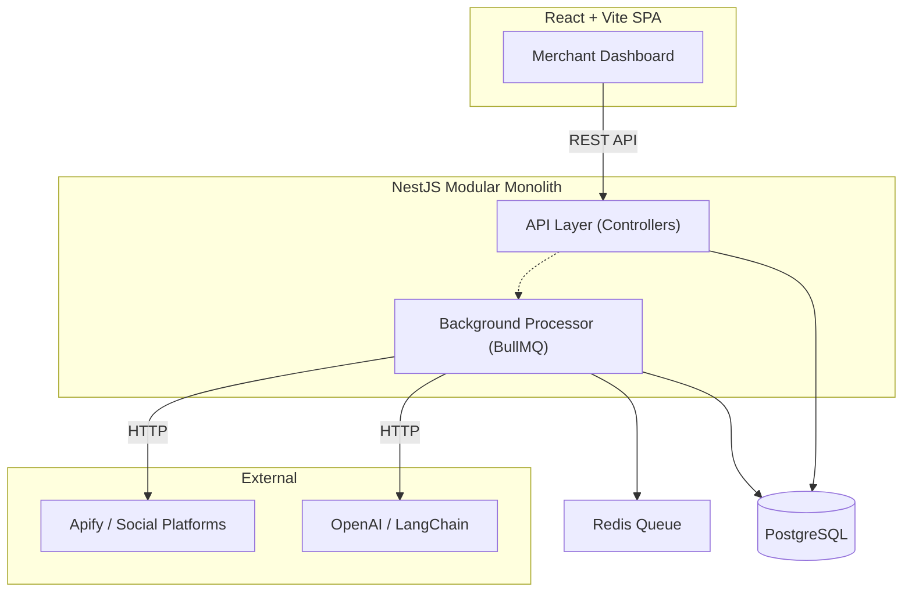
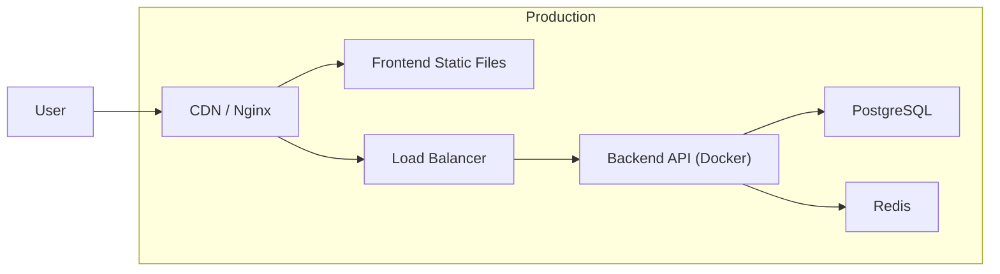

## 1. Executive Summary
The **Competitor Video Analysis System (CompetitorIQ)** is a data-intensive platform designed to provide deep insights into competitor video performance. The system consists of:
- **Backend**: Modular Monolith built on **NestJS** (Node.js)
- **Frontend**: Single Page Application built on **React + Vite**

Both applications are developed with TypeScript to ensure scalability, maintainability, and type safety across the entire stack.

## 2. Architectural Principles
*   **API-First (Headless)**: The backend serves as a pure API (REST/OpenAPI), completely decoupled from the frontend SPA.
*   **Modular Monolith**: The backend keeps a single deployable unit but structured into distinct modules (Domains) to enforce separation of concerns.
*   **Feature-Based Frontend**: The frontend organizes code by business features (dashboard, videos, competitors) rather than technical layers.
*   **Asynchronous Processing**: Heavy tasks (crawling, AI analysis) are offloaded to background queues (BullMQ/Redis) to keep the API responsive.
*   **Type Safety**: End-to-end type safety using TypeScript, ensuring consistency from Database (Prisma) to API (DTOs) to Frontend (React).

## 3. High-Level Architecture Diagram

## 4. Technology Stack

### 4.1. Backend Stack
| Layer | Technology | Rationale |
| :--- | :--- | :--- |
| **Framework** | NestJS (Fastify) | Structured, opinionated, enterprise-grade |
| **Database** | PostgreSQL + Prisma | Type-safe ORM, robust migrations |
| **Queue** | BullMQ (Redis) | Reliable background job processing |
| **AI** | LangChain.js + OpenAI | Flexible LLM orchestration |

### 4.2. Frontend Stack
| Layer | Technology | Rationale |
| :--- | :--- | :--- |
| **Framework** | React 18 + Vite | Fast HMR, modern SPA |
| **Routing** | TanStack Router | Type-safe nested routing |
| **Server State** | TanStack Query | API caching, auto-refetch |
| **Client State** | Zustand | Lightweight global state |
| **URL State** | nuqs | Shareable filter URLs |
| **UI** | Shadcn/UI + Tailwind | Customizable, modern design |
| **Charts** | Tremor / Recharts | Dashboard visualizations |

## 5. Domain Breakdown

### 5.1. Backend Domains (NestJS Modules)
*   **Auth Domain**: Handles JWT authentication, RBAC guards.
*   **Project Domain**: Manages projects, competitors, and configurations.
*   **Crawler Domain**: Integrates primarily with 3rd-party providers (e.g. Apify/SearchAPI.io) for MVP data collection; Playwright is an optional future optimization/fallback.
*   **Analysis Domain**: Consumes raw data, performs sentiment analysis using LLMs.
*   **Dashboard Domain**: Aggregates data for frontend visualization.

### 5.2. Frontend Features (React Modules)
*   **Auth Feature**: Login screen, auth guards, session management.
*   **Projects Feature**: Project list, create/edit project.
*   **Dashboard Feature**: Overview with activity feed, summary cards.
*   **Competitors Feature**: Competitor table, add competitor modal.
*   **Videos Feature**: Video library grid, filters, Hero Video detection.
*   **Reviews Feature**: Review list, sentiment analysis display.
*   **Channels Feature**: Social channel tracking cards.
*   **Marketing Feature**: Ad performance charts, KPI cards.
*   **ASO Feature**: Keyword rankings, metadata tracking.
*   **AI Insights Feature**: Strategic insights, executive summary.

## 6. Security Architecture
*   **Authentication**: Stateless JWT via `passport-jwt`.
*   **Authorization**: Role-Based Access Control (RBAC) using NestJS Guards and Decorators.
*   **Validation**: Strict DTO validation using `class-validator` and `class-transformer`.
*   **Hashing**: Argon2 for password hashing.

## 7. Error Handling & Resilience
*   **Global Filter**: `AllExceptionsFilter` to standardize error responses.
*   **Retries**: BullMQ automatic retries for failed jobs (network glitches).
*   **Rate Limiting**: NestJS Throttler to prevent abuse.

## 8. Deployment View
*   **Backend Container**: Docker (Node.js Alpine image).
*   **Frontend Build**: Static files served via Nginx or CDN.
*   **Orchestration**: Docker Compose (for Dev) / Kubernetes (Potential for Prod).

### 8.1. Deployment Architecture

### 8.2. Environment Configuration
| Environment | Frontend URL | Backend URL |
| :--- | :--- | :--- |
| Development | `localhost:5173` | `localhost:3000` |
| Staging | `staging.competitoriq.com` | `api-staging.competitoriq.com` |
| Production | `app.competitoriq.com` | `api.competitoriq.com` |
