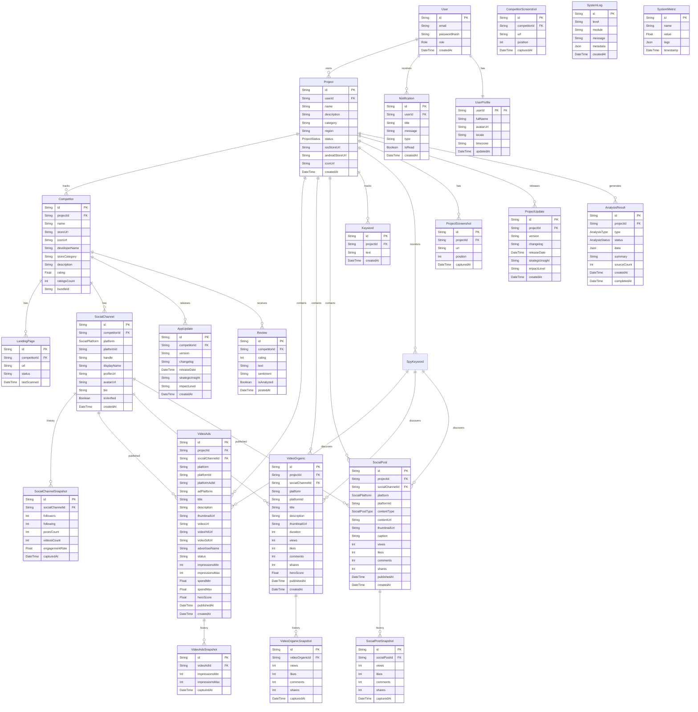

# System Database Schema (Prisma)

> [!NOTE]
> This document serves as the **Master Schema Reference**. It uses [Prisma Schema Language (PSL)](https://www.prisma.io/docs/concepts/components/prisma-schema) for clarity and type safety.
> 
> **Architecture Decision (Dec 2025)**: 
> - **Current Design**: Uses **shared tables** with field separation (`projectId` for Internal, `competitorId` for External).
> - **Proposed Alternative**: Table separation (`ProjectSocialChannel` vs `CompetitorSocialChannel`) is under review.
> - **Current Issues**: Controller bug (source parameter not passed), MIXED channels (data integrity violation).
> - **See**: `docs/3.technical-design/architecture-decision-table-separation.md` for detailed comparison and recommendation.
> - **See**: `docs/prompt-for-claude-code/critical-bug-fix-source-parameter.md` for current bugs.

## 1. User & Project Management




```prisma
enum Role {
  ADMIN
  USER
}

model User {
  id               String   @id @default(uuid())
  email            String   @unique
  passwordHash     String
  role             Role     @default(USER)
  createdAt        DateTime @default(now())
  
  projects         Project[]
  notifications    Notification[]
  profile          UserProfile?
}

/// Optional user profile / metadata.
/// Keep auth/identity fields in `User`, and move rarely-used or frequently-changing profile fields here.
model UserProfile {
  userId    String   @id
  user      User     @relation(fields: [userId], references: [id], onDelete: Cascade)

  fullName  String?
  avatarUrl String?
  locale    String?
  timezone  String?

  updatedAt DateTime @updatedAt
}

enum ProjectStatus {
  PRE_LAUNCH
  LIVE
}

model Project {
  id            String   @id @default(uuid())
  userId        String
  user          User     @relation(fields: [userId], references: [id])
  name          String
  description   String?  @db.Text
  category      String?
  
  // Config (project-scoped)
  region        String   @default("US")        // ISO 3166-1 alpha-2

  // Project Status & Store URLs
  // IMPORTANT: Project uses separate iosStoreUrl and androidStoreUrl fields (not a generic storeUrl)
  // This allows clear distinction between platforms for Project Info crawling
  status        ProjectStatus @default(PRE_LAUNCH)
  iosStoreUrl   String?       // Required when status = LIVE (for iOS App Store crawling)
  androidStoreUrl String?    // Optional (Android support planned for future phases)

  // App metadata (Project represents the user's own app being analyzed)
  // Note: iconUrl, screenshots, updates are populated by Project Info crawler
  iconUrl       String?
  
  createdAt     DateTime @default(now())

  competitors   Competitor[]
  socialChannels SocialChannel[] @relation("ProjectSocialChannels")  // Direct social channels for Internal projects
  videoAds      VideoAds[]       @relation("ProjectVideoAds")
  videoOrganics VideoOrganic[]   @relation("ProjectVideoOrganics")
  socialPosts   SocialPost[]
  keywords      Keyword[]
  spyKeywords   SpyKeyword[]
  screenshots   ProjectScreenshot[]
  updates       ProjectUpdate[]
  analyses      AnalysisResult[]

  @@index([userId])
  @@index([userId, status])
}

model Competitor {
  id            String   @id @default(uuid())
  projectId     String
  project       Project  @relation(fields: [projectId], references: [id])
  name          String
  storeUrl      String
  iconUrl       String
  
  // Normalized Metadata
  developerName String?
  /// Official developer / publisher website (from App Store `website` or other sources).
  /// Used as canonical "Developer Site" and as a source to seed `LandingPage` records.
  developerWebsite String?
  storeCategory String?
  
  landingPages    LandingPage[]
  socialChannels  SocialChannel[]
  reviews         Review[]
  appUpdates      AppUpdate[]

  @@unique([projectId, storeUrl]) // Cannot track same app twice in one project
  @@index([projectId])
}

/// NOTE: Crawl scheduling is a system-level configuration (e.g., `.env` / crawler module),
/// not stored per-project in the database schema.

/// ASO Keywords - for tracking keywords on App Store/Play Store
model Keyword {
  id        String   @id @default(uuid())
  projectId String
  project   Project  @relation(fields: [projectId], references: [id], onDelete: Cascade)
  text      String
  createdAt DateTime @default(now())

  @@unique([projectId, text])
  @@index([projectId])
}

/// Spy Keywords - for monitoring competitors across Ads Libraries and Social Media
enum SpyPlatform {
  META_ADS      // Meta Ads Library (Facebook, Instagram)
  TIKTOK_ADS    // TikTok Ads Library
  GOOGLE_ADS    // Google Ads Library
  TIKTOK        // TikTok organic content
  INSTAGRAM     // Instagram organic content
  YOUTUBE       // YouTube content
  FACEBOOK      // Facebook content
  ALL           // All platforms
}

enum SpyKeywordStatus {
  ACTIVE      // Active, will be used for crawling
  PAUSED      // Paused, temporarily disabled
  INACTIVE    // Inactive, archived
}

/// Spy Keywords - for monitoring competitors across Ads Libraries and Social Media
/// 
/// **IMPORTANT: Scope Clarification (Dec 2025)**
/// SpyKeyword is used for **competitor intelligence ONLY** - it discovers competitor ads and organic content.
/// 
/// **After Table Separation**:
/// - Links **ONLY** to External tables: `CompetitorVideoAds`, `CompetitorVideoOrganic`
/// - **DO NOT** link to Internal tables (`ProjectVideoAds`, `ProjectVideoOrganic`)
/// - Astraler's own video ads/organic content are managed directly by marketing team, not discovered via SpyKeyword
model SpyKeyword {
  id            String         @id @default(uuid())
  projectId     String
  project       Project        @relation(fields: [projectId], references: [id], onDelete: Cascade)
  
  text          String         // The keyword to spy on
  platforms     SpyPlatform[]  // Which platforms to crawl (can be multiple)
  status        SpyKeywordStatus @default(ACTIVE)
  
  description   String?        @db.Text  // Optional description/notes
  tags          String[]       // Tags for organization/filtering
  
  // Relations
  // NOTE: After table separation, these will link to CompetitorVideoAds and CompetitorVideoOrganic only
  videoAds      VideoAds[]       @relation("SpyKeywordVideoAds")
  videoOrganics VideoOrganic[]   @relation("SpyKeywordVideoOrganics")
  socialPosts   SocialPost[]
  
  // Timestamps
  createdAt     DateTime       @default(now())
  updatedAt     DateTime       @updatedAt
  lastCrawledAt DateTime?      // Last time this keyword was used for crawling
  
  // Stats (denormalized for quick access)
  videoAdsCount     Int          @default(0)
  videoOrganicsCount Int         @default(0)
  postsCount        Int          @default(0)
  
  @@unique([projectId, text])
  @@index([projectId])
  @@index([projectId, status])
  @@index([status])
}

model ProjectScreenshot {
  id         String   @id @default(uuid())
  projectId  String
  project    Project  @relation(fields: [projectId], references: [id], onDelete: Cascade)
  url        String
  position   Int
  capturedAt DateTime @default(now())

  @@unique([projectId, position])
  @@index([projectId])
}

model ProjectUpdate {
  id               String   @id @default(uuid())
  projectId         String
  project           Project  @relation(fields: [projectId], references: [id], onDelete: Cascade)

  version          String
  changelog        String   @db.Text
  releaseDate      DateTime

  // AI Analysis Results (optional)
  strategicInsight String?
  impactLevel      String?  // HIGH, MEDIUM, LOW

  createdAt        DateTime @default(now())

  @@unique([projectId, version])
  @@index([projectId, releaseDate])
}

/// Landing Page - represents competitor or project landing pages
/// 
/// **IMPORTANT: After Table Separation (Dec 2025)**
/// Decision: Keep one `LandingPage` table with nullable foreign keys to both Internal and External tables.
/// 
/// **Discovery Relations (After Table Separation)**:
/// - Internal: `discoveredFromProjectVideoAdId` → `ProjectVideoAds`, `discoveredFromProjectSocialChannelId` → `ProjectSocialChannel`
/// - External: `discoveredFromCompetitorVideoAdId` → `CompetitorVideoAds`, `discoveredFromCompetitorSocialChannelId` → `CompetitorSocialChannel`
/// - **Business Rule**: A landing page can be discovered from either Internal or External source, but not both (enforce at application level)
/// 
/// **Current Schema (Before Table Separation)**:
/// - Uses `discoveredFromVideoAdId` → `VideoAds` (will be split to Internal/External after migration)
/// - Uses `discoveredFromSocialChannelId` → `SocialChannel` (will be split to Internal/External after migration)
model LandingPage {
  id           String     @id @default(uuid())
  competitorId String
  competitor   Competitor @relation(fields: [competitorId], references: [id])
  url          String
  status       String     // ACTIVE, ERROR
  lastScanned  DateTime?

  // Discovery tracking
  discoverySource LandingPageDiscoverySource @default(MANUAL)
  discoveredFromVideoAdId String?  // If discovered from VideoAds, link to the ad
  discoveredFromVideoAd   VideoAds? @relation("LandingPageFromVideoAd", fields: [discoveredFromVideoAdId], references: [id], onDelete: SetNull)
  discoveredFromSocialChannelId String?  // If discovered from SocialChannel (manual or other source)
  discoveredFromSocialChannel   SocialChannel? @relation("LandingPageFromSocialChannel", fields: [discoveredFromSocialChannelId], references: [id], onDelete: SetNull)

  @@unique([competitorId, url])
  @@index([discoverySource])
  @@index([discoveredFromVideoAdId])
}

enum LandingPageDiscoverySource {
  MANUAL          // User manually added the landing page
  LANDING_PAGE    // Discovered by Landing Page crawler from another landing page
  ADS_LIBRARY     // Discovered from Ads Library (link_url in VideoAds)
  SOCIAL_CHANNEL  // Discovered from social channel profile/page
  IMPORT          // Imported from external file/seed
}
```

## 2. Data Collection & Processing

```prisma
// ============================================
// Social Channels (Profiles on Platforms)
// ============================================

enum SocialPlatform {
  TIKTOK
  YOUTUBE
  INSTAGRAM
  FACEBOOK
  X           // Twitter/X
}

/// Represents a social media profile/channel on a specific platform.
/// 
/// **IMPORTANT: Business Domain Separation**
/// This is a **shared table** but represents **two completely separate business domains**:
/// - **Internal (Astraler Marketing Platform)**: `projectId` is set, `competitorId = null` - Astraler's own channels
/// - **External (Competitor Intelligence)**: `competitorId` is set, `projectId = null` - Competitor channels
/// - **Independent**: Both null (advertiser channels not yet mapped to either domain)
/// 
/// **Business Logic Separation**:
/// - Internal queries MUST use `projectId` and ensure `competitorId IS NULL`
/// - External queries MUST use `competitorId` and ensure `projectId IS NULL`
/// - **Never mix data** - these are independent business domains
/// 
/// E.g., a TikTok account, YouTube channel, Instagram profile, or an independent advertiser page.
/// 
/// **Query Pattern for Internal vs External:**
/// - Internal (Astraler's channels): `WHERE projectId = ? AND competitorId IS NULL`
/// - External (Competitor channels): `WHERE competitor.projectId = ? AND projectId IS NULL`
model SocialChannel {
  id           String         @id @default(uuid())
  /// Optional owner competitor (for External section - Competitor Intelligence).
  /// When set, this channel belongs to a tracked competitor.
  /// When null AND projectId is also null: independent advertiser channel not yet mapped.
  /// **Business Rule**: Mutually exclusive with projectId - a channel is either:
  /// - Internal (Astraler's channel): `projectId` set, `competitorId = null`
  /// - External (Competitor channel): `competitorId` set, `projectId = null`
  competitorId String?
  competitor   Competitor?    @relation(fields: [competitorId], references: [id], onDelete: SetNull)
  
  /// Optional direct link to Project (for Internal section - Astraler Marketing Platform).
  /// When set, this represents a social channel owned/managed by Astraler (Astraler's own channel that Astraler is building/growing).
  /// **Business Rule**: Mutually exclusive with competitorId - a channel is either:
  /// - Internal (Astraler's channel): `projectId` set, `competitorId = null`
  /// - External (Competitor channel): `competitorId` set, `projectId = null`
  projectId    String?
  project      Project?       @relation("ProjectSocialChannels", fields: [projectId], references: [id], onDelete: Cascade)
  
  platform     SocialPlatform
  /// Primary external reference ID used to call 3rd-party crawlers.
  /// Examples:
  /// - Meta / Facebook Page: page_id / profile_id
  /// - TikTok: user_id
  /// - YouTube: channel_id
  platformId   String
  /// Human-readable handle / @username when available.
  /// Examples:
  /// - Instagram: @profile_name
  /// - TikTok: @username
  handle       String?
  /// Channel / page display name (social name).
  displayName  String
  /// Canonical public URL to the profile/page. REQUIRED for all manually added channels.
  profileUrl   String
  avatarUrl    String?
  bio          String?        @db.Text
  isVerified   Boolean        @default(false)
  /// Optional advertiser identifier used by Ads Transparency / Ads Library APIs.
  /// Examples:
  /// - Meta Ads: advertiser_id / page_id
  /// - TikTok Ads: advertiser_id
  /// - Google Ads Transparency: advertiser ID / name slug
  /// This field is used as the primary key when searching video ads for this channel.
  advertiserId String?
  /// How this social channel was first created in the system.
  /// - MANUAL: user explicitly added the channel
  /// - LANDING_PAGE: discovered from Landing Page crawler
  /// - ADS_LIBRARY: discovered from Ads Library crawler (using advertiser metadata)
  /// - IMPORT: imported from external CSV/seed
  discoverySource SocialDiscoverySource @default(MANUAL)
  
  // Platform-Specific Profile Flags
  isAdvertiser     Boolean   @default(false)
  advertiserMeta   Json?

  createdAt    DateTime       @default(now())
  
  // Relations
  snapshots    SocialChannelSnapshot[]
  videoAds     VideoAds[]       @relation("SocialChannelVideoAds")
  videoOrganics VideoOrganic[] @relation("SocialChannelVideoOrganics")
  posts        SocialPost[]
  discoveredLandingPages LandingPage[] @relation("LandingPageFromSocialChannel")

  /// Each external social entity is unique per platform.
  @@unique([platform, platformId])
  @@index([competitorId])
  @@index([competitorId, platform])
  @@index([projectId])
  @@index([projectId, platform])
  @@index([isAdvertiser])
  @@index([advertiserId])
  
  /// **Business Constraint**: A channel must be linked to either a Competitor OR a Project, but not both.
  /// This constraint is enforced at the application level (service layer validation).
  /// Prisma does not support multi-column check constraints, so validation is done in:
  /// - `SocialChannelService.addProjectSocialChannel()` - ensures competitorId is null when projectId is set
  /// - `SocialChannelService.addSocialChannel()` - ensures projectId is null when competitorId is set
}

/// Source of truth for how a social entity entered the system.
enum SocialDiscoverySource {
  MANUAL          // User manually added the social channel
  LANDING_PAGE    // Discovered by Landing Page crawler from competitor website
  ADS_LIBRARY     // Discovered from Ads Library / Ads Transparency crawler
  IMPORT          // Imported from external file/seed
}

/// Tracks social channel metrics over time (followers, engagement).
model SocialChannelSnapshot {
  id              String        @id @default(uuid())
  socialChannelId String
  socialChannel   SocialChannel @relation(fields: [socialChannelId], references: [id], onDelete: Cascade)
  
  /// Core audience & activity metrics at **profile level** (not per post/video)
  followers       Int           @default(0)
  following       Int           @default(0)
  postsCount      Int           @default(0)
  videosCount     Int           @default(0)

  /// Optional "profile likes" / cumulative appreciation metric at profile level.
  /// Examples:
  /// - TikTok: total "hearts" for the account
  /// - Facebook Page / Instagram Business: total page/profile likes if available
  /// This is used to represent the **overall strength** of the competitor profile, complementary to followers.
  profileLikes    Int?          @default(0)

  engagementRate  Float?        // Calculated avg engagement (e.g., from content metrics)
  
  capturedAt      DateTime      @default(now())

  @@index([socialChannelId, capturedAt])
}

// ============================================
// Video Ads (from Ads Library Transparency)
// ============================================

/// **Video Ads**: Videos discovered from Ads Library Transparency APIs (Meta, TikTok, Google Ads)
/// - Created directly from Ads Library crawler results
/// - Contains ad-specific metadata (impressions, spend, advertiser info)
/// - Contains video URLs (videoUrl, videoHdUrl, videoSdUrl) from ads APIs
/// - Linked to SocialChannel via advertiserId (advertiser profile)
/// - **Separate table** from Video Organic due to different data structure and use cases
/// 
/// **IMPORTANT: Business Domain Separation**
/// This is a **shared table** but represents **two completely separate business domains**:
/// - **Internal (Astraler Marketing Platform)**: VideoAds from Astraler's own channels (`socialChannel.projectId IS NOT NULL AND socialChannel.competitorId IS NULL`)
/// - **External (Competitor Intelligence)**: VideoAds from competitor channels (`socialChannel.competitorId IS NOT NULL AND socialChannel.projectId IS NULL`)
/// 
/// **Business Logic Separation**:
/// - Internal queries MUST filter: `WHERE projectId = ? AND socialChannel.projectId = ? AND socialChannel.competitorId IS NULL`
/// - External queries MUST filter: `WHERE projectId = ? AND socialChannel.competitorId IS NOT NULL AND socialChannel.projectId IS NULL`
/// - **Never mix data** - these are independent business domains

model VideoAds {
  id              String        @id @default(uuid())
  projectId       String
  project         Project       @relation("ProjectVideoAds", fields: [projectId], references: [id], onDelete: Cascade)
  socialChannelId String
  socialChannel   SocialChannel @relation("SocialChannelVideoAds", fields: [socialChannelId], references: [id], onDelete: Cascade)
  
  // Spy Keyword link (for tracking discovery source)
  spyKeywordId    String?
  spyKeyword      SpyKeyword?   @relation("SpyKeywordVideoAds", fields: [spyKeywordId], references: [id], onDelete: SetNull)
  
  // Platform identification
  platform        String        // 'tiktok', 'youtube', 'facebook', 'instagram'
  platformId      String        // External platform video ID
  platformAdId    String?       // Ad ID from platform (e.g., Meta ad_archive_id)
  adPlatform      String        // 'META', 'TIKTOK', 'GOOGLE'
  
  // Basic video info
  title           String
  description     String?       @db.Text
  thumbnailUrl    String?
  videoPreviewImageUrl String?
  
  // Video URLs (from Ads Library APIs)
  videoUrl        String?       // Direct video URL
  videoHdUrl      String?       // HD video URL
  videoSdUrl      String?       // SD video URL
  
  // Advertiser/Page info
  advertiserName  String?
  pageId          String?       // Platform page ID
  pageProfileUri  String?       // Advertiser profile URL
  pageProfilePictureUrl String? // Advertiser profile picture
  pageCategories  String[]      // Page categories
  pageLikeCount   Int?         // Page like count
  
  // Ad content
  creativeBody    String?       @db.Text  // Ad copy/text
  creativeLinkTitle String?     // Ad link title
  destinationUrl  String?      // Landing page URL (from link_url in Meta Ads response)
  snapshotUrl     String?      // Ad snapshot/preview URL
  
  // Call-to-Action (CTA) fields (from Meta Ads Library)
  ctaText         String?      // CTA button text (e.g., "Learn more", "Send message", "Download")
  ctaType         String?      // CTA type (e.g., "LEARN_MORE", "MESSAGE_PAGE", "DOWNLOAD", "WHATSAPP_MESSAGE")
  
  // Ad status & timing
  status          String        @default("UNKNOWN") // 'ACTIVE', 'INACTIVE', 'UNKNOWN'
  firstShownDate  DateTime?
  lastShownDate   DateTime?
  deliveryStartDate DateTime?
  deliveryStopDate  DateTime?
  
  // Ad targeting
  publisherPlatforms String[]   // ['FACEBOOK', 'INSTAGRAM', etc.]
  countries         String[]   // Target countries
  
  // Ad metrics (estimated ranges)
  impressionsMin    Int?
  impressionsMax    Int?
  spendMin          Float?
  spendMax          Float?
  spendCurrency     String?
  
  // Common fields
  heroScore       Float         @default(0.0)
  createdAt       DateTime      @default(now())
  publishedAt     DateTime
  
  // Relations
  snapshots       VideoAdsSnapshot[]
  discoveredLandingPages LandingPage[] @relation("LandingPageFromVideoAd")
  
  @@unique([platform, platformId])
  @@unique([adPlatform, platformAdId]) // Unique per ad platform
  @@index([projectId, publishedAt])
  @@index([projectId, heroScore])
  @@index([socialChannelId, publishedAt])
  @@index([spyKeywordId])
  @@index([projectId, status])
  @@index([adPlatform, platformAdId])
}

model VideoAdsSnapshot {
  id            String    @id @default(uuid())
  videoAdId     String
  videoAd       VideoAds  @relation(fields: [videoAdId], references: [id], onDelete: Cascade)
  
  // Ad metrics snapshots
  impressionsMin    Int?
  impressionsMax    Int?
  spendMin          Float?
  spendMax          Float?
  
  capturedAt    DateTime  @default(now())
  
  @@index([videoAdId, capturedAt])
}

// ============================================
// Video Organic (from Social Profile Crawlers)
// ============================================

/// **Video Organic**: Videos discovered from social profile crawlers
/// - Created from competitor/brand social channel profiles using platform APIs
/// - Contains engagement metrics (views, likes, comments, shares) from social platforms
/// - Contains standard video metadata from platform APIs
/// - Linked to SocialChannel via platformId (social profile)
/// - **Separate table** from Video Ads due to different data structure and use cases
/// 
/// **IMPORTANT: Business Domain Separation**
/// This is a **shared table** but represents **two completely separate business domains**:
/// - **Internal (Astraler Marketing Platform)**: VideoOrganic from Astraler's own channels (`socialChannel.projectId IS NOT NULL AND socialChannel.competitorId IS NULL`)
/// - **External (Competitor Intelligence)**: VideoOrganic from competitor channels (`socialChannel.competitorId IS NOT NULL AND socialChannel.projectId IS NULL`)
/// 
/// **Business Logic Separation**:
/// - Internal queries MUST filter: `WHERE projectId = ? AND socialChannel.projectId = ? AND socialChannel.competitorId IS NULL`
/// - External queries MUST filter: `WHERE projectId = ? AND socialChannel.competitorId IS NOT NULL AND socialChannel.projectId IS NULL`
/// - **Never mix data** - these are independent business domains

model VideoOrganic {
  id              String        @id @default(uuid())
  projectId       String
  project         Project       @relation("ProjectVideoOrganics", fields: [projectId], references: [id], onDelete: Cascade)
  socialChannelId String
  socialChannel   SocialChannel @relation("SocialChannelVideoOrganics", fields: [socialChannelId], references: [id], onDelete: Cascade)
  
  // Spy Keyword link (for tracking discovery source)
  spyKeywordId    String?
  spyKeyword      SpyKeyword?   @relation("SpyKeywordVideoOrganics", fields: [spyKeywordId], references: [id], onDelete: SetNull)
  
  // Platform identification
  platform        String        // 'tiktok', 'youtube', 'facebook', 'instagram'
  platformId      String        // External platform video ID
  
  // Basic video info
  title           String
  description     String?       @db.Text
  thumbnailUrl    String?
  duration        Int           // seconds
  
  // Video URL (from social platform APIs)
  videoUrl        String?       // Standard video URL from platform
  
  // Engagement metrics (from social platforms)
  views           Int           @default(0)
  likes           Int           @default(0)
  comments        Int           @default(0)
  shares          Int           @default(0)
  
  // Additional metadata
  transcript      String?       @db.Text  // Video transcript (if available)
  captions        String?       // Caption/subtitle URL (if available)
  
  // Common fields
  heroScore       Float         @default(0.0)
  createdAt       DateTime      @default(now())
  publishedAt     DateTime
  
  // Relations
  snapshots       VideoOrganicSnapshot[]
  
  @@unique([platform, platformId])
  @@index([projectId, publishedAt])
  @@index([projectId, heroScore])
  @@index([socialChannelId, publishedAt])
  @@index([spyKeywordId])
  @@index([projectId, views])  // For top videos queries
}

model VideoOrganicSnapshot {
  id            String         @id @default(uuid())
  videoOrganicId String
  videoOrganic  VideoOrganic   @relation(fields: [videoOrganicId], references: [id], onDelete: Cascade)
  
  // Engagement metrics snapshots
  views         Int
  likes         Int
  comments      Int            @default(0)
  shares        Int            @default(0)
  
  capturedAt    DateTime       @default(now())
  
  @@index([videoOrganicId, capturedAt])
}

// ============================================
// Social Posts (Non-Video Content)
// ============================================

enum SocialPostType {
  IMAGE         // Single image post
  CAROUSEL      // Multiple images/slides
  TEXT          // Text-only post
  STORY         // Ephemeral content (24h)
  REEL          // Short-form video (Instagram Reel, YouTube Short)
  LINK          // Link preview post
}

/// Represents non-video social media content (images, carousels, text posts, stories).
model SocialPost {
  id              String         @id @default(uuid())
  projectId       String
  project         Project        @relation(fields: [projectId], references: [id], onDelete: Cascade)
  socialChannelId String
  socialChannel   SocialChannel  @relation(fields: [socialChannelId], references: [id], onDelete: Cascade)
  
  // Spy Keyword link (for tracking which keyword discovered this post)
  spyKeywordId    String?
  spyKeyword      SpyKeyword?    @relation(fields: [spyKeywordId], references: [id], onDelete: SetNull)
  
  platform        SocialPlatform
  platformId      String         // External ID
  contentType     SocialPostType
  
  contentUrl      String?        // Direct link to content
  thumbnailUrl    String?
  imageUrls       String[]       // For carousels
  caption         String?        @db.Text
  
  views           Int            @default(0)
  likes           Int            @default(0)
  comments        Int            @default(0)
  shares          Int            @default(0)
  
  // Ad-specific metadata
  isAd            Boolean        @default(false)
  adMetadata      Json?

  publishedAt     DateTime
  createdAt       DateTime       @default(now())
  
  snapshots       SocialPostSnapshot[]

  @@unique([platform, platformId])
  @@index([projectId, publishedAt])
  @@index([socialChannelId, publishedAt])
  @@index([spyKeywordId])
  @@index([projectId, isAd])
}

/// Tracks social post metrics over time.
model SocialPostSnapshot {
  id           String     @id @default(uuid())
  socialPostId String
  socialPost   SocialPost @relation(fields: [socialPostId], references: [id], onDelete: Cascade)
  
  views        Int        @default(0)
  likes        Int        @default(0)
  comments     Int        @default(0)
  shares       Int        @default(0)
  
  capturedAt   DateTime   @default(now())

  @@index([socialPostId, capturedAt])
}

model AppUpdate {
  id               String   @id @default(uuid())
  competitorId     String   // LINKED TO COMPETITOR, NOT PROJECT
  competitor       Competitor @relation(fields: [competitorId], references: [id])
  
  version          String
  changelog        String
  releaseDate      DateTime
  
  // AI Analysis Results
  strategicInsight String?  // "What's New" Insight
  impactLevel      String?  // HIGH, MEDIUM, LOW
  
  createdAt        DateTime @default(now())

  @@unique([competitorId, version]) // Prevent duplicate version entries
}

model Review {
  id          String   @id @default(uuid())
  competitorId String   // LINKED TO COMPETITOR, NOT PROJECT
  competitor   Competitor @relation(fields: [competitorId], references: [id])
  
  rating      Int
  text        String
  sentiment   String   // POSITIVE, NEGATIVE, NEUTRAL
  isAnalyzed  Boolean  @default(false) // For Incremental Analysis
  
  postedAt    DateTime

  @@index([competitorId, postedAt]) // For sentiment trend analysis
}
```

## 3. Alerts & Notifications

```prisma
model Notification {
  id        String   @id @default(uuid())
  userId    String
  user      User     @relation(fields: [userId], references: [id])
  
  title     String
  message   String
  type      String   // HERO_VIDEO, APP_UPDATE
  isRead    Boolean  @default(false)
  
  createdAt DateTime @default(now())
}
```

## 4. System Observability (Admin)

```prisma
model SystemLog {
  id        String   @id @default(uuid())
  level     String   // INFO, WARN, ERROR
  module    String   // 'Crawler', 'Auth'
  message   String
  metadata  Json?
  createdAt DateTime @default(now())

  @@index([level])
  @@index([createdAt])
}

model SystemMetric {
  id        String   @id @default(uuid())
  name      String   // 'active_jobs'
  value     Float
  tags      Json?
  timestamp DateTime @default(now())

  @@index([name, timestamp])
}
```

## 5. AI Analysis

```prisma
enum AnalysisType {
  MARKET_LANDSCAPE    // Overall market analysis (competitors, positioning, gaps)
  PAIN_POINT          // Pain point extraction from negative reviews
  FEATURE_GAP         // Missing features compared to competitors
  CREATIVE_ANGLE      // Ad creative analysis (hooks, angles, CTAs)
  VIDEO_TRENDS        // Video performance patterns and hero video insights
  SENTIMENT_TOPIC     // Sentiment clustering by topic (Pricing, UX, Bugs...)
  WHATS_NEW_SUMMARY   // Aggregated "What's New" strategic summary
}

enum AnalysisStatus {
  PENDING     // Job queued
  PROCESSING  // AI is running
  COMPLETED   // Successfully finished
  FAILED      // Error occurred
}

/// Stores AI-generated analysis results for a project.
/// Each analysis type produces structured JSON in `data` field.
model AnalysisResult {
  id          String         @id @default(uuid())
  projectId   String
  project     Project        @relation(fields: [projectId], references: [id], onDelete: Cascade)

  type        AnalysisType
  status      AnalysisStatus @default(PENDING)

  // Flexible JSON payload (schema varies by type)
  data        Json?

  // Human-readable summary (optional, for quick display)
  summary     String?        @db.Text

  // Metadata
  sourceCount Int?           // Number of source items analyzed (reviews, videos, etc.)
  triggeredBy String?        // 'auto' | 'manual'

  createdAt   DateTime       @default(now())
  completedAt DateTime?

  @@index([projectId, type])
  @@index([projectId, createdAt])
  @@index([projectId, status])
}
```
