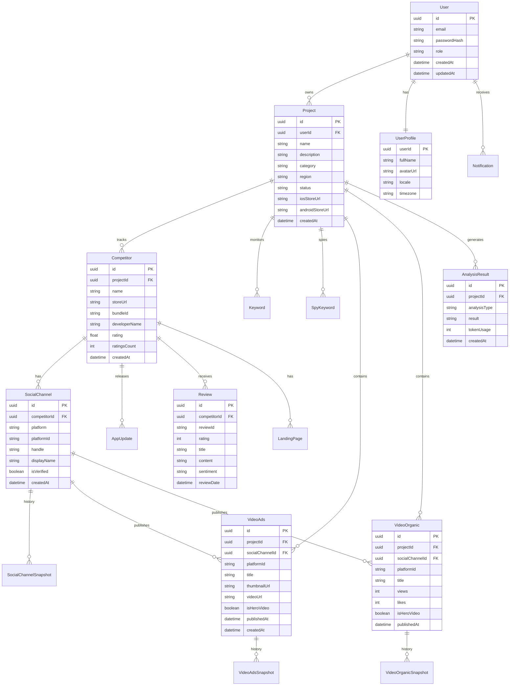
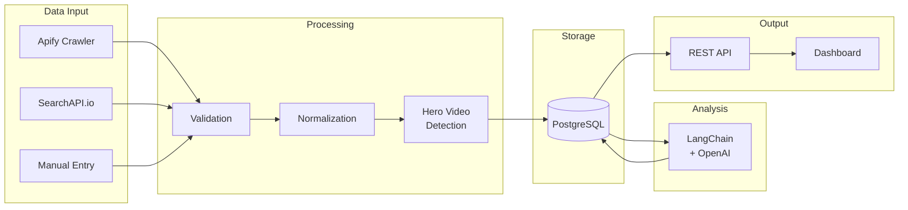

# Data Architecture

> **Version:** 1.0.0
> **Status:** Draft
> **Last Updated:** 251224

---

## 1. Overview

CompetitorIQ uses PostgreSQL as the primary data store with Prisma ORM for type-safe database access. The schema is designed around the Project concept, with all data scoped to specific projects.

---

## 2. Entity Relationship Diagram



---

## 3. Database Strategy

### Primary Database
| Attribute | Value |
|-----------|-------|
| Engine | PostgreSQL 15 |
| ORM | Prisma 5.x |
| Hosting | Docker (Dev) / RDS (Prod) |
| Backup | Daily snapshots, 30-day retention |

### Secondary Stores
| Store | Purpose | Data Types |
|-------|---------|------------|
| Redis | Queue, rate limiting | Job data, counters |

---

## 4. Core Entities

### User & Auth

| Entity | Purpose | Key Fields |
|--------|---------|------------|
| User | Authentication | email, passwordHash, role |
| UserProfile | User details | fullName, avatarUrl, timezone |

**Roles:** `ADMIN`, `FOUNDER`, `MARKETING`, `PRODUCT`, `ASO`

### Project Management

| Entity | Purpose | Key Fields |
|--------|---------|------------|
| Project | App workspace | name, category, storeUrls |
| Competitor | Tracked competitors | name, storeUrl, bundleId |
| Keyword | ASO keywords | keyword, projectId |
| SpyKeyword | Discovery keywords | keyword, platform |

### Data Collection

| Entity | Purpose | Key Fields |
|--------|---------|------------|
| SocialChannel | Social accounts | platform, handle, competitorId |
| VideoAds | Ad videos | title, videoUrl, isHeroVideo |
| VideoOrganic | Organic videos | title, views, likes, isHeroVideo |
| Review | App reviews | rating, content, sentiment |
| AppUpdate | Version updates | version, releaseNotes |

### Snapshots (Time-series)

| Entity | Purpose | Frequency |
|--------|---------|-----------|
| SocialChannelSnapshot | Follower history | Daily |
| VideoAdsSnapshot | Ad metrics history | Every 6 hours |
| VideoOrganicSnapshot | Video metrics history | Every 6 hours |

---

## 5. Data Flow



---

## 6. Hero Video Detection Logic

**Definition:** Video with ≥20% growth in 24 hours (likes/comments/shares/views)

```
Growth Rate = (Current - Previous) / Previous * 100

If Growth Rate >= 20% for any metric:
    Mark as Hero Video
    Trigger notification (Phase 2)
```

| Metric | Threshold | Measurement |
|--------|-----------|-------------|
| Views | +20% | 24h delta |
| Likes | +20% | 24h delta |
| Comments | +20% | 24h delta |
| Shares | +20% | 24h delta |

---

## 7. Data Lifecycle

| State | Duration | Storage | Action |
|-------|----------|---------|--------|
| Active | Indefinite | Primary DB | Full access |
| Archived | 1 year | Primary DB | Read-only |
| Deleted | 30 days | Soft delete | Recoverable |
| Purged | 0 | None | Permanent |

### Retention Policies
| Data Type | Retention | Reason |
|-----------|-----------|--------|
| Snapshots | 90 days | Storage optimization |
| Analysis results | 1 year | Historical insights |
| User data | 7 years | Compliance |
| Logs | 30 days | Debugging |

---

## 8. Rules & Constraints

### Naming Conventions
| Type | Convention | Example |
|------|------------|---------|
| Tables | PascalCase | `VideoAds`, `SocialChannel` |
| Columns | camelCase | `createdAt`, `projectId` |
| Indexes | idx_table_column | `idx_video_project` |
| Enums | SCREAMING_SNAKE | `HERO_VIDEO`, `PENDING` |

### Data Integrity
- All tables have UUID primary keys
- All tables have `createdAt` timestamp
- Foreign keys enforced at database level
- Soft delete via `deletedAt` where applicable
- Unique constraints on external IDs (platformId)

---

## 9. Open Questions

| # | Question | Impact | Status |
|---|----------|--------|--------|
| 1 | Table separation for Internal vs External channels? | Data model | Open (see ADR) |
| 2 | Partitioning strategy for snapshots? | Performance | Open |
| 3 | Full-text search: PostgreSQL or Elasticsearch? | Search UX | Open |

---

## 10. Changelog

### 251224 - v1.0.0 - Initial Draft
- Created data architecture from database-schema.md
- Added ERD diagram (mermaid)
- Documented entity catalog and relationships
- Added Hero Video detection logic
