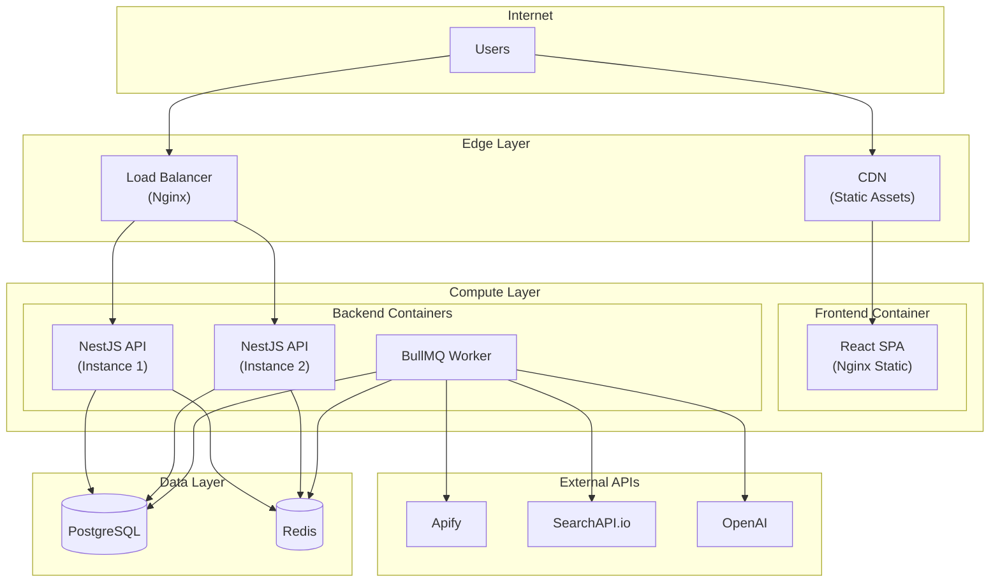
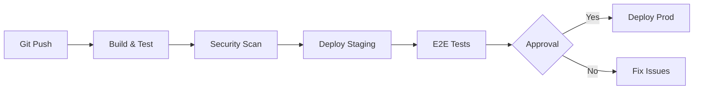

# Infrastructure

> **Version:** 1.0.0
> **Status:** Draft
> **Last Updated:** 251224

---

## 1. Overview

CompetitorIQ uses a containerized deployment architecture with Docker. Development uses Docker Compose, with potential Kubernetes for production scaling.

---

## 2. Deployment Topology Diagram



---

## 3. Environments

| Environment | Purpose | URL | Instances |
|-------------|---------|-----|-----------|
| Development | Local dev | localhost:3000 / :5173 | 1 |
| Staging | Pre-prod testing | staging.competitoriq.com | 2 |
| Production | Live users | app.competitoriq.com | 4+ |

### Environment Configuration
| Setting | Dev | Staging | Prod |
|---------|-----|---------|------|
| API Instances | 1 | 2 | 4 |
| Worker Instances | 1 | 1 | 2 |
| Database | Docker | RDS db.t3.small | RDS db.r5.large |
| Redis | Docker | ElastiCache t3.micro | ElastiCache r5.large |
| CDN | None | CloudFront | CloudFront |

---

## 4. Docker Configuration

### Backend Dockerfile
```dockerfile
FROM node:20-alpine
WORKDIR /app
COPY package*.json ./
RUN npm ci --only=production
COPY dist ./dist
COPY prisma ./prisma
RUN npx prisma generate
EXPOSE 3000
CMD ["node", "dist/main.js"]
```

### Docker Compose (Development)
```yaml
services:
  api:
    build: ./backend
    ports: ["3000:3000"]
    depends_on: [db, redis]
    environment:
      DATABASE_URL: postgresql://...
      REDIS_URL: redis://redis:6379

  worker:
    build: ./backend
    command: ["node", "dist/worker.js"]
    depends_on: [db, redis]

  frontend:
    build: ./frontend
    ports: ["5173:5173"]

  db:
    image: postgres:15-alpine
    volumes: [pgdata:/var/lib/postgresql/data]

  redis:
    image: redis:7-alpine
```

---

## 5. Cloud Resources (Production)

### Compute
| Resource | Type | Specs |
|----------|------|-------|
| API Servers | ECS Fargate | 1vCPU, 2GB |
| Workers | ECS Fargate | 1vCPU, 2GB |
| Frontend | S3 + CloudFront | Static hosting |

### Database
| Resource | Type | Specs |
|----------|------|-------|
| PostgreSQL | RDS | db.r5.large, Multi-AZ |
| Redis | ElastiCache | cache.r5.large, Cluster |

### Storage
| Resource | Purpose |
|----------|---------|
| S3 | Static assets, backups |

---

## 6. Scaling Strategy

### Horizontal Scaling
| Component | Trigger | Min | Max |
|-----------|---------|-----|-----|
| API Servers | CPU > 70% | 2 | 8 |
| Workers | Queue depth > 500 | 1 | 4 |

### Queue Scaling
| Queue | Concurrency | Rate Limit |
|-------|-------------|------------|
| crawl-jobs | 5 | 100/min |
| process-jobs | 10 | 200/min |
| analysis-jobs | 3 | 50/min (OpenAI limits) |

---

## 7. Deployment Process



### Deployment Checklist
- [ ] All tests passing
- [ ] Prisma migrations ready
- [ ] Environment variables updated
- [ ] Feature flags configured
- [ ] Rollback plan documented

---

## 8. Disaster Recovery

### Backup Strategy
| Component | Frequency | Retention |
|-----------|-----------|-----------|
| PostgreSQL | Daily snapshot | 30 days |
| Redis | N/A (ephemeral) | - |
| S3 | Cross-region replication | 90 days |

### Recovery Targets
| Metric | Target |
|--------|--------|
| RTO | < 4 hours |
| RPO | < 1 hour |

---

## 9. SLA Targets

| Metric | Target |
|--------|--------|
| Availability | 99.5% |
| API Response (p95) | < 500ms |
| Dashboard Load | < 3s |
| Crawl Job Success | > 95% |

---

## 10. Open Questions

| # | Question | Impact | Status |
|---|----------|--------|--------|
| 1 | Kubernetes vs ECS for production? | Operations | Open |
| 2 | Multi-region deployment needed? | Availability | Open |
| 3 | Dedicated worker nodes or shared? | Cost | Open |

---

## 11. Changelog

### 251224 - v1.0.0 - Initial Draft
- Created infrastructure spec from SAD deployment view
- Added deployment topology diagram
- Documented Docker configuration
- Defined scaling and DR strategy
