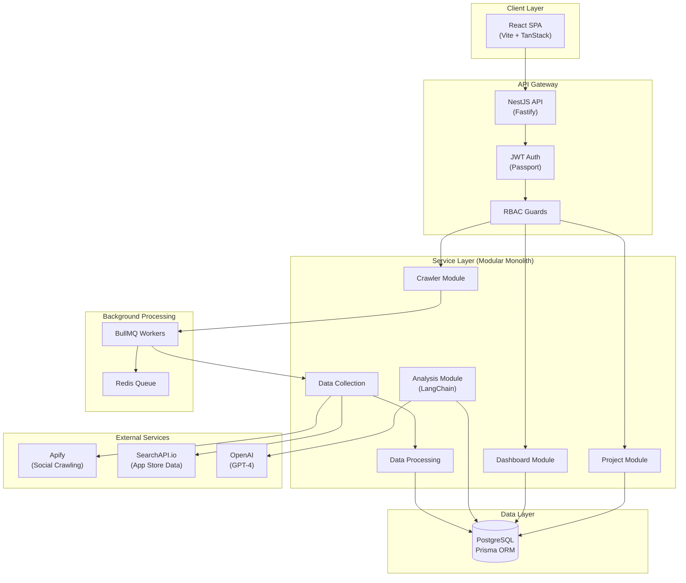
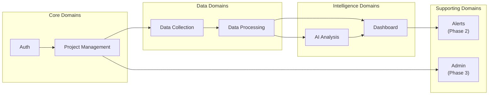

# System Master Map

> **Version:** 1.0.0
> **Status:** Draft
> **Last Updated:** 251224

---

## 1. Overview

CompetitorIQ is a data-intensive competitor intelligence platform for mobile app teams. It monitors competitor videos, detects Hero Videos, analyzes winning creatives, and extracts AI-powered insights to optimize app growth strategy.

---

## 2. System Architecture Diagram

---

## 3. Component Overview

### Client Layer
| Component | Technology | Purpose |
|-----------|------------|---------|
| Web App | React 18 + Vite | Merchant dashboard SPA |
| Routing | TanStack Router | Type-safe nested routing |
| State | TanStack Query + Zustand | Server + client state |
| UI | Shadcn/UI + Tailwind | Modern component library |

### Service Layer (Modular Monolith)
| Module | Responsibility | Key Entities |
|--------|----------------|--------------|
| Auth | JWT authentication, RBAC | User, UserProfile |
| Project | Project/Competitor management | Project, Competitor, Keyword |
| Crawler | Queue management, job scheduling | CrawlJob, CrawlSchedule |
| Data Collection | External API integration | SocialChannel, Video, Review |
| Data Processing | Normalization, Hero Video detection | VideoSnapshot, Metrics |
| Analysis | LLM-powered insights | AnalysisResult, PainPoint |
| Dashboard | Data aggregation for UI | (aggregates all) |

### Data Layer
| Store | Technology | Purpose |
|-------|------------|---------|
| Primary DB | PostgreSQL 15 | Persistent data, relationships |
| Queue | Redis + BullMQ | Job queue, rate limiting |

---

## 4. Domain Map

| Domain | Type | Phase | Responsibility |
|--------|------|-------|----------------|
| Auth | Core | 1 | User identity, JWT, RBAC |
| Project Management | Core | 1 | Projects, competitors, keywords |
| Data Collection | Data | 1 | Crawling, external APIs |
| Data Processing | Data | 1 | Normalization, Hero Video detection |
| AI Analysis | Intelligence | 1 | LLM insights, pain points |
| Dashboard | Intelligence | 1 | Aggregation, visualization |
| Alerts | Supporting | 2 | Notifications, triggers |
| Admin | Supporting | 3 | API keys, cost monitoring |

---

## 5. Communication Patterns

### Synchronous (REST API)
| From | To | Protocol | Purpose |
|------|-----|----------|---------|
| Web App | API Gateway | HTTPS | User requests |
| API | Database | TCP | Data operations |

### Asynchronous (BullMQ)
| Producer | Queue | Consumer | Purpose |
|----------|-------|----------|---------|
| Crawler Module | `crawl-jobs` | Data Collection | Scheduled crawls |
| Data Collection | `process-jobs` | Data Processing | Raw data processing |
| Data Processing | `analysis-jobs` | Analysis Module | AI analysis |

---

## 6. Cross-Cutting Concerns

### Authentication & Authorization
- **Method:** JWT (access + refresh tokens)
- **Provider:** Internal (passport-jwt)
- **RBAC Roles:** Admin, Founder, Marketing, Product, ASO

### Security
- Password hashing: Argon2
- Input validation: class-validator
- Rate limiting: NestJS Throttler
- CORS: Configured per environment

### Observability
- Error handling: Global exception filter
- Job monitoring: BullMQ dashboard
- Logging: Structured JSON logs

---

## 7. Rules & Constraints

- All API endpoints require authentication except `/auth/login` and `/auth/register`
- RBAC enforced at both API and UI level
- Background jobs retry up to 3 times on failure
- External API calls rate-limited to prevent provider blocks
- All timestamps stored in UTC

---

## 8. Dependencies

### External Services
| Service | Purpose | Criticality |
|---------|---------|-------------|
| Apify | Social media crawling | High |
| SearchAPI.io | App store data | High |
| OpenAI | LLM analysis | High |

### Infrastructure
| Provider | Services |
|----------|----------|
| Docker | Containerization |
| PostgreSQL | Primary database |
| Redis | Queue, caching |

---

## 9. Open Questions

| # | Question | Impact | Status |
|---|----------|--------|--------|
| 1 | Should we add WebSocket for real-time dashboard updates? | UX improvement | Open |
| 2 | Multi-tenancy model: workspace-based or project-based? | Architecture | Resolved (Project-based) |
| 3 | CDN for static assets in production? | Performance | Open |

---

## 10. Changelog

### 251224 - v1.0.0 - Initial Draft
- Created system master map from SAD
- Added architecture diagram (mermaid)
- Documented domain map and communication patterns
