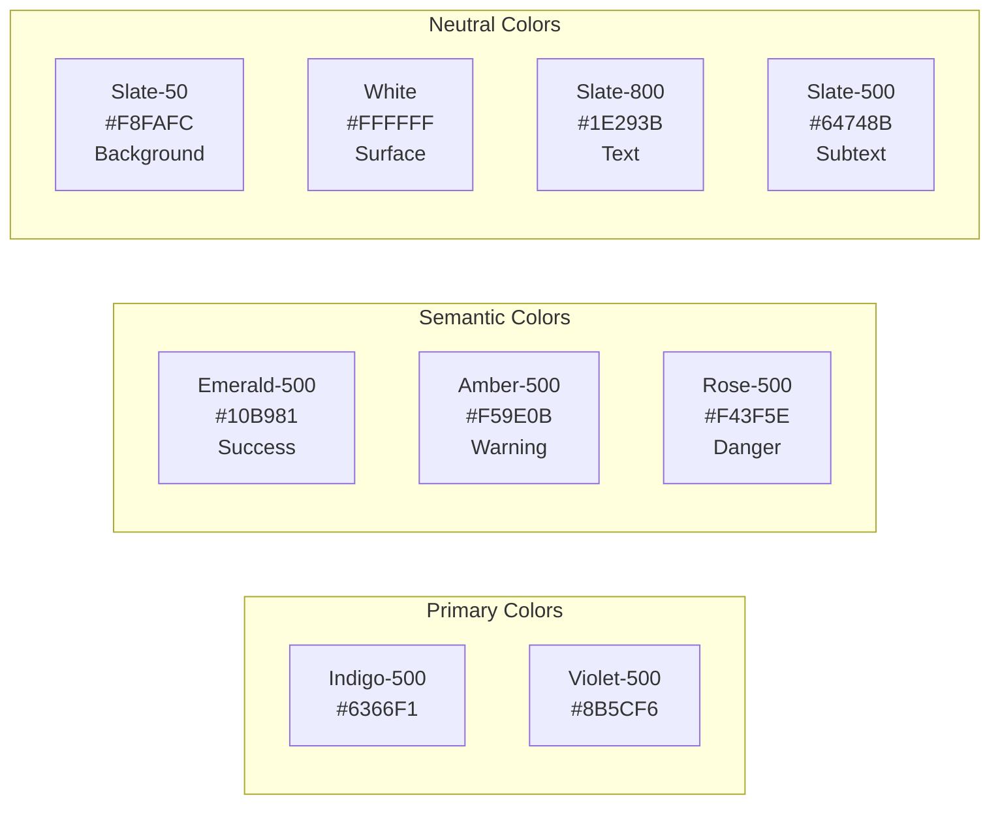

# Design System

> **Version:** 1.0.0
> **Status:** Draft
> **Last Updated:** 251224

---

## 1. Overview

This document defines the UI/UX design system for CompetitorIQ. All frontend development must follow these guidelines for visual consistency.

> **CRITICAL**: The reference theme at `references/themes/demo-website-v2/` is the single source of truth. Copy styles from existing components - do NOT create custom designs.

---

## 2. Design Principles

| Principle | Description |
|-----------|-------------|
| **Data-Centric but Clean** | High-density data with effective whitespace |
| **Action-Oriented** | Key actions prominent and accessible |
| **Professional & Modern** | Sleek, trustworthy business intelligence aesthetic |
| **Feedback-Rich** | Clear status indicators for async operations |

---

## 3. Color Palette



### Color Usage Table

| Role | Color | Hex | Tailwind Class | Usage |
|------|-------|-----|----------------|-------|
| Primary | Indigo | #6366F1 | `indigo-500` | Primary actions, branding |
| Secondary | Violet | #8B5CF6 | `violet-500` | Accents, gradients |
| Success | Emerald | #10B981 | `emerald-500` | Success, growth trends |
| Warning | Amber | #F59E0B | `amber-500` | Warnings, needs review |
| Danger | Rose | #F43F5E | `rose-500` | Destructive, negative trends |
| Background | Slate Light | #F8FAFC | `slate-50` | App background |
| Surface | White | #FFFFFF | `white` | Cards, modals |
| Text | Slate Dark | #1E293B | `slate-800` | Headings, primary text |
| Subtext | Slate Gray | #64748B | `slate-500` | Secondary text, labels |

---

## 4. Typography

### Font Family
- **Primary**: Inter (Google Fonts), sans-serif

### Type Scale

| Level | Size | Line Height | Weight | Usage |
|-------|------|-------------|--------|-------|
| H1 | 24px | 32px | 600 | Page Titles |
| H2 | 20px | 28px | 600 | Section Headers |
| H3 | 16px | 24px | 500 | Card Headers |
| Body | 14px | 20px | 400 | Standard Text |
| Small | 12px | 16px | 400 | Metadata, Labels |

### Font Weights
- Light: 300
- Regular: 400
- Medium: 500
- Semi-Bold: 600
- Bold: 700

---

## 5. Layout Structure

### Application Shell

```
┌─────────────────────────────────────────────────────────────┐
│                         HEADER (64px)                        │
│  [Breadcrumbs] [Project Switcher] [Search] [Notifications]  │
├──────────┬──────────────────────────────────┬───────────────┤
│          │                                  │               │
│ SIDEBAR  │         MAIN CONTENT             │  RIGHT PANEL  │
│ (250px)  │         (padding: 24px)          │  (optional)   │
│          │                                  │               │
│ - Logo   │                                  │               │
│ - Nav    │                                  │               │
│ - Quick  │                                  │               │
│   Action │                                  │               │
│ - User   │                                  │               │
│          │                                  │               │
└──────────┴──────────────────────────────────┴───────────────┘
```

### Sidebar (Left, Fixed)
- **Width**: 250px (Desktop), Collapsed (Tablet), Drawer (Mobile)
- **Elements**: Logo, Navigation, Quick Actions, User Profile

### Header (Top, Sticky)
- **Height**: 64px
- **Elements**: Breadcrumbs, Project Switcher, Search, Notifications

### Main Content
- **Padding**: 24px
- **Background**: Slate-50 (#F8FAFC)
- **Grid**: 12-column system

---

## 6. Component Patterns

### Common CSS Patterns

| Pattern | Tailwind Classes | Use For |
|---------|------------------|---------|
| Card | `bg-white rounded-2xl p-6 shadow-sm` | All card wrappers |
| Primary Button | `bg-indigo-500 hover:bg-indigo-600 text-white px-4 py-2 rounded-lg` | Main actions |
| Secondary Button | `bg-slate-100 hover:bg-slate-200 text-slate-700 px-4 py-2 rounded-lg` | Secondary actions |
| Section Header | `text-lg font-semibold text-slate-800` | Section titles |
| Subtle Text | `text-sm text-slate-500` | Metadata, labels |
| Success Badge | `bg-emerald-100 text-emerald-700 px-2 py-1 rounded-full text-xs` | Positive status |
| Warning Badge | `bg-amber-100 text-amber-700 px-2 py-1 rounded-full text-xs` | Warning status |
| Danger Badge | `bg-rose-100 text-rose-700 px-2 py-1 rounded-full text-xs` | Negative status |

### Component Library Reference

| Component | File Path | Purpose |
|-----------|-----------|---------|
| Sidebar | `components/Sidebar.tsx` | Main navigation |
| Header | `components/Header.tsx` | Top bar |
| ProjectDashboard | `components/ProjectDashboard.tsx` | Overview page |
| VideosLibrary | `components/VideosLibrary.tsx` | Video grid |
| NewContentCard | `components/cards/NewContentCard.tsx` | Content updates |
| ReviewsCard | `components/cards/ReviewsCard.tsx` | User reviews |

---

## 7. Icons

- **Library**: Google Material Symbols
- **Style**: Outlined (primary), Filled (emphasis)
- **Size**: 20px (default), 24px (large)

---

## 8. Feedback States

### Loading
- **Skeleton**: Initial data fetch
- **Spinner**: Inside buttons during actions
- **Progress Bar**: Route transitions (NProgress)

### Error
- **Inline**: Red text + icon below inputs
- **Toast**: Top-right for system errors
- **Empty State**: Illustration with CTA

---

## 9. Accessibility (WCAG)

| Requirement | Standard | Implementation |
|-------------|----------|----------------|
| Contrast | 4.5:1 ratio | Slate-700 on White |
| Focus | Visible rings | `ring-primary` on interactive |
| Alt Text | Required | All images/charts |
| Screen Readers | aria-live | For dynamic updates |
| Forms | Labels | All inputs must have labels |

---

## 10. Responsive Strategy

| Breakpoint | Sidebar | Layout |
|------------|---------|--------|
| Desktop (1024px+) | Full | Sidebar + Content |
| Tablet (768px-1023px) | Collapsed (icons) | Icons + Content |
| Mobile (<768px) | Drawer | Hamburger menu |

---

## 11. Anti-Patterns

**DO NOT:**
- Create custom color classes like `bg-[#123456]`
- Use inline styles when Tailwind classes exist
- Introduce new UI component libraries
- Deviate from established spacing (`p-4`, `p-6`, `gap-4`)
- Create new designs without referencing theme

---

## 12. Open Questions

| # | Question | Impact | Status |
|---|----------|--------|--------|
| 1 | Dark mode support? | UX | Open |
| 2 | Custom illustration library? | Brand | Open |

---

## 13. Changelog

### 251224 - v1.0.0 - Initial Draft
- Created design system from system-ui-design.md
- Documented color palette and typography
- Added component patterns and accessibility standards
