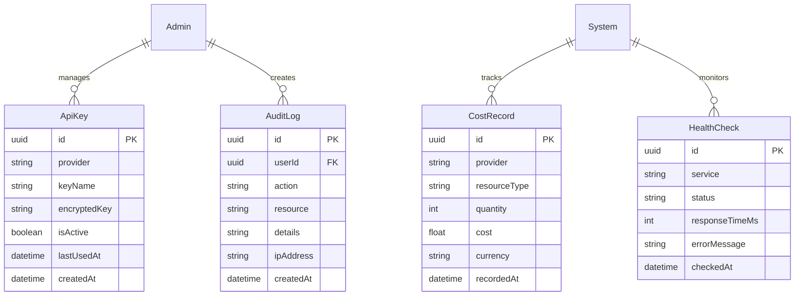
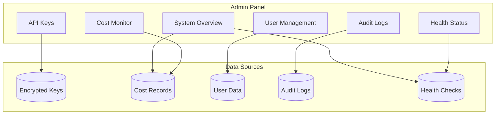

# Admin Domain

> **Version:** 1.0.0
> **Status:** Draft
> **Last Updated:** 251224
> **Phase:** 3 (Post-MVP)

---

## 1. Overview

The Admin domain provides system administration capabilities including API key management, cost monitoring, user management, and system health monitoring.

### Responsibilities
- External API key management (Apify, OpenAI, SearchAPI)
- Cost tracking and budget alerts
- User administration
- System health monitoring
- Audit logging

### Boundaries
- Admin-only access (role check)
- Does NOT handle regular user operations

---

## 2. Entity Relationship Diagram



---

## 3. Admin Functions

### API Key Management

| Provider | Key Type | Rotation Policy |
|----------|----------|-----------------|
| Apify | API Token | Every 90 days |
| OpenAI | API Key | Every 90 days |
| SearchAPI.io | API Key | Every 90 days |

### Cost Monitoring

| Provider | Metric | Alert Threshold |
|----------|--------|-----------------|
| Apify | Actor runs | $X/month |
| OpenAI | Token usage | $X/month |
| SearchAPI.io | API calls | $X/month |

---

## 4. Admin Dashboard Flow



---

## 5. API Contracts

### GET /admin/api-keys
```typescript
// Response 200 (Admin only)
{
  keys: {
    id: string,
    provider: string,
    keyName: string,
    isActive: boolean,
    lastUsedAt: datetime,
    maskedKey: string // "sk-...abc"
  }[]
}
```

### POST /admin/api-keys
```typescript
// Request
{ provider: string, keyName: string, apiKey: string }

// Response 201
{ key: ApiKeyResponse }
```

### GET /admin/costs
```typescript
// Query: ?period=month&provider=openai
// Response 200
{
  summary: { total: number, byProvider: Record<string, number> },
  records: CostRecord[],
  budget: { limit: number, used: number, remaining: number }
}
```

### GET /admin/health
```typescript
// Response 200
{
  status: "healthy" | "degraded" | "unhealthy",
  services: {
    database: ServiceHealth,
    redis: ServiceHealth,
    apify: ServiceHealth,
    openai: ServiceHealth
  },
  lastChecked: datetime
}
```

### GET /admin/audit-logs
```typescript
// Query: ?userId=xxx&action=login&from=date&to=date
// Response 200
{ logs: AuditLog[], total: number }
```

---

## 6. Business Rules

| ID | Rule | Enforcement |
|----|------|-------------|
| ADMIN-001 | Only ADMIN role can access | RBAC guard |
| ADMIN-002 | API keys encrypted at rest | AES-256 |
| ADMIN-003 | Audit logs retained 1 year | Retention policy |
| ADMIN-004 | Health checks every 5 minutes | Scheduler |
| ADMIN-005 | Cost alerts at 80% budget | Alert rule |

---

## 7. Error Codes

| Code | Message | HTTP Status |
|------|---------|-------------|
| ADMIN_001 | Insufficient permissions | 403 |
| ADMIN_002 | Invalid API key format | 400 |
| ADMIN_003 | Provider not supported | 400 |

---

## 8. Security Considerations

- API keys encrypted with AES-256
- Keys never logged or exposed in responses
- All admin actions logged to audit trail
- Rate limiting on admin endpoints
- MFA required for admin accounts (future)

---

## 9. Integration Points

### Inbound
- Admin UI only

### Outbound
- Key storage (encrypted)
- Cost aggregation
- Health check endpoints

---

## 10. Open Questions

| # | Question | Impact | Status |
|---|----------|--------|--------|
| 1 | Centralized secrets manager (Vault)? | Security | Open |
| 2 | Auto-rotate keys on schedule? | Operations | Open |
| 3 | Multi-admin support with permissions? | Features | Open |

---

## 11. Changelog

### 251224 - v1.0.0 - Initial Draft
- Created admin domain (Phase 3)
- Defined API key management
- Documented cost monitoring
