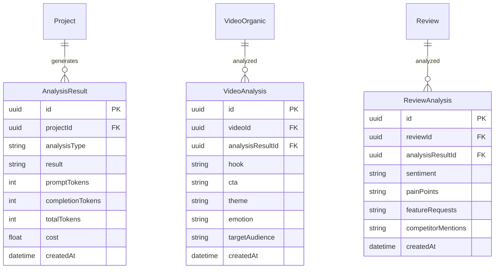
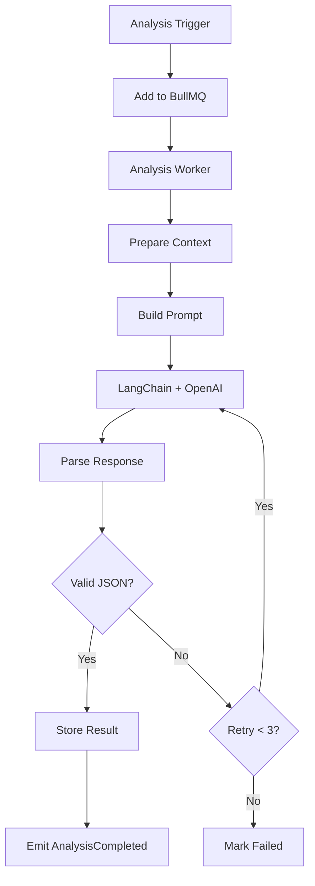

# AI Analysis Domain

> **Version:** 1.0.0
> **Status:** Draft
> **Last Updated:** 251224

---

## 1. Overview

The AI Analysis domain uses LangChain.js and OpenAI GPT-4 to generate insights from collected data. It analyzes competitor videos, reviews, and trends to extract actionable intelligence.

### Responsibilities
- Video content analysis (hooks, CTAs, themes)
- Review sentiment analysis
- Pain point extraction
- Competitive insight generation
- Trend summarization

### Boundaries
- Does NOT collect or process raw data (see Data Collection, Data Processing)
- Does NOT display results (see Dashboard)

---

## 2. Entity Relationship Diagram



---

## 3. Business Rules

| ID | Rule | Enforcement |
|----|------|-------------|
| AI-001 | Max 50 analysis jobs per minute (OpenAI limits) | Rate limiter |
| AI-002 | Cache analysis results for 24 hours | Redis cache |
| AI-003 | Retry on rate limit with exponential backoff | LangChain config |
| AI-004 | Track token usage per project | Cost monitoring |
| AI-005 | Use GPT-4 for analysis, GPT-3.5 for classification | Model selection |

---

## 4. Analysis Types

| Type | Input | Output | Model |
|------|-------|--------|-------|
| VideoHookAnalysis | Video title, description, thumbnail | Hook type, effectiveness score | GPT-4 |
| ReviewSentiment | Review text | Sentiment, pain points | GPT-3.5 |
| CompetitorInsight | Multiple videos | Trends, patterns, recommendations | GPT-4 |
| PainPointExtraction | Reviews batch | Categorized pain points | GPT-4 |
| TrendSummary | Time-series data | Weekly/monthly summary | GPT-4 |

---

## 5. Analysis Pipeline



---

## 6. Prompt Templates

### Video Hook Analysis
```
Analyze this competitor video for marketing insights:

Title: {title}
Description: {description}
Platform: {platform}
Views: {views}
Engagement Rate: {engagementRate}

Extract:
1. Hook type (question, statistic, story, controversy, etc.)
2. Call-to-action (if any)
3. Primary theme/topic
4. Emotional trigger
5. Target audience
6. Why this might be performing well

Respond in JSON format.
```

### Review Pain Point Extraction
```
Analyze these app reviews and extract pain points:

{reviews}

Categorize pain points into:
- UX/UI issues
- Performance problems
- Missing features
- Pricing concerns
- Customer support

Respond in JSON format with frequency counts.
```

---

## 7. API Contracts

### POST /analysis/video
```typescript
// Request
{ videoId: string, type: "hook" | "full" }

// Response 202
{ analysisId: string, status: "queued" }
```

### POST /analysis/reviews
```typescript
// Request
{ competitorId: string, dateRange: { from, to } }

// Response 202
{ analysisId: string, status: "queued" }
```

### GET /analysis/:id
```typescript
// Response 200
{
  id: string,
  status: "queued" | "processing" | "completed" | "failed",
  result?: AnalysisResult,
  tokenUsage?: { prompt, completion, total, cost }
}
```

---

## 8. Error Codes

| Code | Message | HTTP Status |
|------|---------|-------------|
| AI_001 | OpenAI rate limit exceeded | 429 |
| AI_002 | Invalid analysis type | 400 |
| AI_003 | Analysis timeout | 504 |
| AI_004 | Insufficient data for analysis | 400 |

---

## 9. Domain Events

| Event | Trigger | Consumers |
|-------|---------|-----------|
| AnalysisQueued | Job created | - |
| AnalysisStarted | Worker picks job | - |
| AnalysisCompleted | Successful analysis | Dashboard, Alerts |
| AnalysisFailed | Max retries exceeded | Admin |
| InsightGenerated | New insight saved | Dashboard |

---

## 10. Cost Management

| Model | Input Cost | Output Cost | Typical Usage |
|-------|------------|-------------|---------------|
| GPT-4 | $0.03/1K | $0.06/1K | ~2K tokens/analysis |
| GPT-3.5 | $0.0015/1K | $0.002/1K | ~1K tokens/classification |

### Monthly Budget Tracking
```typescript
interface CostTracking {
  projectId: string;
  month: string;
  totalTokens: number;
  totalCost: number;
  budget: number;
  alertThreshold: number; // 80%
}
```

---

## 11. Integration Points

### Inbound
- Data Processing (hero video detected)
- Dashboard (manual analysis request)
- Scheduler (batch analysis)

### Outbound
- OpenAI API (LLM calls)
- Database (analysis results)
- Dashboard (insights display)

---

## 12. Open Questions

| # | Question | Impact | Status |
|---|----------|--------|--------|
| 1 | Add Claude as fallback LLM? | Reliability | Open |
| 2 | Fine-tune model for app marketing domain? | Quality | Open |
| 3 | Implement streaming responses? | UX | Open |

---

## 13. Changelog

### 251224 - v1.0.0 - Initial Draft
- Created AI analysis domain
- Documented analysis types and prompts
- Defined cost management strategy
