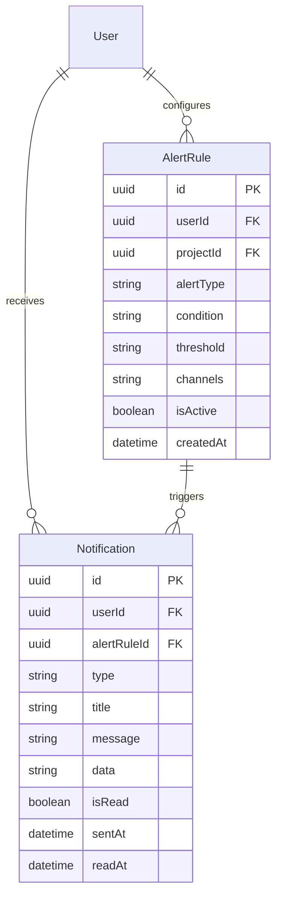
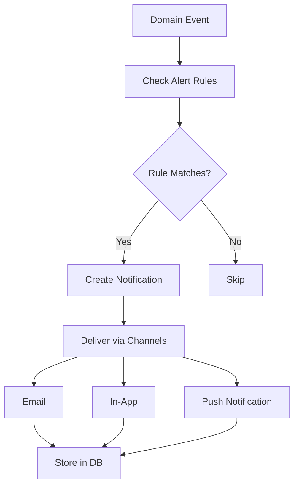

# Alerts Domain

> **Version:** 1.0.0
> **Status:** Draft
> **Last Updated:** 251224
> **Phase:** 2 (Not in MVP)

---

## 1. Overview

The Alerts domain handles notifications and triggers when significant events occur, such as Hero Video detection, competitor activity spikes, or negative review trends.

### Responsibilities
- Alert rule configuration
- Notification delivery (email, in-app, push)
- Alert history and acknowledgment
- Threshold management

### Boundaries
- Does NOT detect events (subscribes to domain events)
- Does NOT analyze data (uses pre-calculated metrics)

---

## 2. Entity Relationship Diagram



---

## 3. Alert Types

| Type | Trigger Event | Default Threshold |
|------|---------------|-------------------|
| HeroVideoAlert | HeroVideoDetected | Any (immediate) |
| FollowerSpike | SnapshotCreated | +10% in 24h |
| NegativeReviewSurge | ReviewAnalysis | 5+ negative in 24h |
| CompetitorUpdate | AppUpdate | Any new version |
| CrawlFailure | CrawlJobFailed | 3 consecutive |

---

## 4. Alert Flow



---

## 5. Notification Channels

| Channel | Implementation | Use Case |
|---------|----------------|----------|
| In-App | Database + Polling | Real-time awareness |
| Email | SendGrid/SES | Important alerts |
| Push | Firebase/OneSignal | Mobile (future) |

---

## 6. API Contracts

### GET /alerts/rules
```typescript
// Response 200
{ rules: AlertRule[] }
```

### POST /alerts/rules
```typescript
// Request
{
  projectId: string,
  alertType: string,
  condition: "greater_than" | "less_than" | "equals",
  threshold: number,
  channels: ("email" | "in_app")[]
}

// Response 201
{ rule: AlertRule }
```

### GET /notifications
```typescript
// Query: ?unreadOnly=true
// Response 200
{ notifications: Notification[], unreadCount: number }
```

### PATCH /notifications/:id/read
```typescript
// Response 200
{ notification: Notification }
```

---

## 7. Business Rules

| ID | Rule | Enforcement |
|----|------|-------------|
| ALERT-001 | Max 10 alert rules per project | Service layer |
| ALERT-002 | Email notifications batched (max 1/hour) | Queue |
| ALERT-003 | In-app notifications kept for 30 days | Cleanup job |
| ALERT-004 | User can mute alerts temporarily | Preference |

---

## 8. Error Codes

| Code | Message | HTTP Status |
|------|---------|-------------|
| ALERT_001 | Invalid alert type | 400 |
| ALERT_002 | Max rules exceeded | 400 |
| ALERT_003 | Notification not found | 404 |

---

## 9. Domain Events (Subscribed)

| Event | Source Domain | Action |
|-------|---------------|--------|
| HeroVideoDetected | Data Processing | Create HeroVideoAlert |
| AnalysisCompleted | AI Analysis | Check for insights alerts |
| CrawlJobFailed | Data Collection | Create failure alert |

---

## 10. Integration Points

### Inbound (Event Subscriptions)
- Data Processing
- Data Collection
- AI Analysis

### Outbound
- Email service (SendGrid/SES)
- Push service (future)
- Database (notifications)

---

## 11. Open Questions

| # | Question | Impact | Status |
|---|----------|--------|--------|
| 1 | Slack/Discord integrations? | Features | Open |
| 2 | SMS for critical alerts? | Cost | Open |
| 3 | Alert digest (daily summary)? | UX | Open |

---

## 12. Changelog

### 251224 - v1.0.0 - Initial Draft
- Created alerts domain (Phase 2)
- Defined alert types and flow
- Documented notification channels
