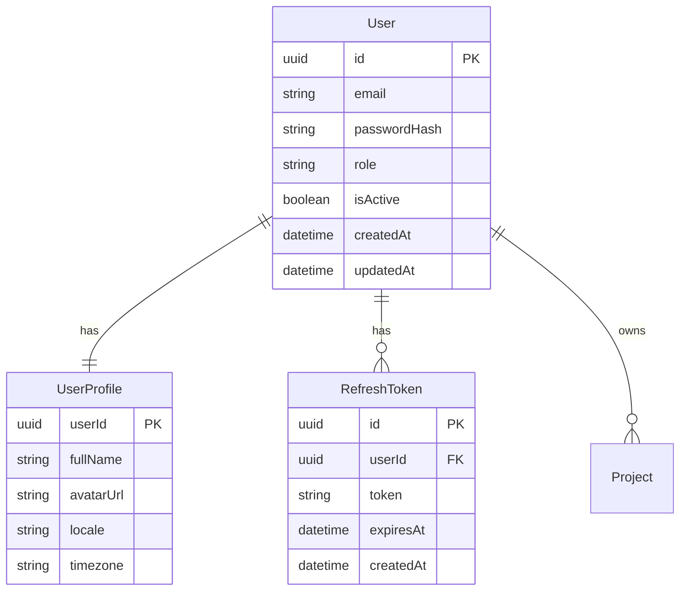

# Auth Domain

> **Version:** 1.0.0
> **Status:** Draft
> **Last Updated:** 251224

---

## 1. Overview

The Auth domain handles user identity, authentication via JWT, and role-based access control (RBAC). It is a core domain that gates access to all other system functionality.

### Responsibilities
- User registration and login
- JWT token management (access + refresh)
- Password hashing and verification
- Role-based access control
- Session management

### Boundaries
- Does NOT handle user profile data (see Project Management)
- Does NOT handle billing/subscriptions

---

## 2. Entity Relationship Diagram



---

## 3. Business Rules

| ID | Rule | Enforcement |
|----|------|-------------|
| AUTH-001 | Email must be unique | Database unique constraint |
| AUTH-002 | Password minimum 8 chars, 1 uppercase, 1 number | Validation layer |
| AUTH-003 | Access token expires in 15 minutes | JWT config |
| AUTH-004 | Refresh token expires in 7 days | JWT config |
| AUTH-005 | Max 5 active refresh tokens per user | Service layer |

---

## 4. Roles & Permissions

| Role | Description | Permissions |
|------|-------------|-------------|
| ADMIN | System administrator | All |
| FOUNDER | Company owner | Full project access |
| MARKETING | Marketing team | View + export data |
| PRODUCT | Product team | View + analysis |
| ASO | App store optimization | View + keywords |

---

## 5. API Contracts

### POST /auth/register
```typescript
// Request
{ email: string, password: string, fullName: string }

// Response 201
{ user: { id, email, role }, accessToken, refreshToken }
```

### POST /auth/login
```typescript
// Request
{ email: string, password: string }

// Response 200
{ user: { id, email, role }, accessToken, refreshToken }
```

### POST /auth/refresh
```typescript
// Request
{ refreshToken: string }

// Response 200
{ accessToken, refreshToken }
```

### POST /auth/logout
```typescript
// Request (Header: Authorization: Bearer <token>)

// Response 200
{ message: "Logged out successfully" }
```

---

## 6. Error Codes

| Code | Message | HTTP Status |
|------|---------|-------------|
| AUTH_001 | Invalid credentials | 401 |
| AUTH_002 | Email already exists | 409 |
| AUTH_003 | Token expired | 401 |
| AUTH_004 | Invalid token | 401 |
| AUTH_005 | Insufficient permissions | 403 |

---

## 7. Domain Events

| Event | Trigger | Consumers |
|-------|---------|-----------|
| UserRegistered | New user signup | Email service, Analytics |
| UserLoggedIn | Successful login | Analytics, Audit log |
| TokenRefreshed | Token refresh | Audit log |
| PasswordChanged | Password update | Email service |

---

## 8. Integration Points

### Inbound
- Frontend login/register forms
- API Gateway authentication middleware

### Outbound
- Email service (welcome, password reset)
- Audit logging

---

## 9. Related Features

- `03-features/241220-user-authentication/` (if exists)

---

## 10. Open Questions

| # | Question | Impact | Status |
|---|----------|--------|--------|
| 1 | Add OAuth providers (Google, GitHub)? | User convenience | Open |
| 2 | Implement 2FA? | Security | Open |
| 3 | Password reset flow needed for MVP? | Scope | Open |

---

## 11. Changelog

### 251224 - v1.0.0 - Initial Draft
- Created auth domain spec from SAD
- Defined RBAC roles and permissions
- Documented JWT token strategy
