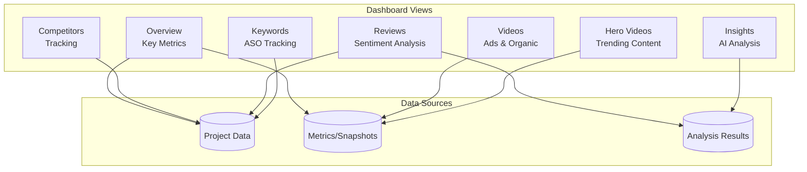

# Dashboard Domain

> **Version:** 1.0.0
> **Status:** Draft
> **Last Updated:** 251224

---

## 1. Overview

The Dashboard domain aggregates and presents data from all other domains in a user-friendly interface. It handles data visualization, filtering, and export functionality.

### Responsibilities
- Data aggregation for UI
- Chart and visualization data preparation
- Filtering and search
- Export functionality (CSV, PDF)
- Real-time updates (future)

### Boundaries
- Does NOT process or analyze data (read-only aggregation)
- Does NOT handle authentication (see Auth domain)

---

## 2. Dashboard Sections



---

## 3. Key Metrics

### Overview Dashboard

| Metric | Calculation | Update Frequency |
|--------|-------------|------------------|
| Total Competitors | COUNT(competitors) | Real-time |
| Hero Videos (7d) | COUNT(isHeroVideo=true, 7d) | 6 hours |
| Avg Engagement | AVG(engagementRate) | 6 hours |
| New Reviews | COUNT(reviews, 7d) | Daily |
| Sentiment Score | AVG(sentiment) | Daily |

### Competitor Card

| Metric | Source |
|--------|--------|
| Follower Count | SocialChannelSnapshot |
| Follower Growth | Calculated delta |
| Total Videos | VideoOrganic count |
| Avg Engagement | Calculated from snapshots |
| App Rating | Competitor entity |

---

## 4. API Contracts

### GET /dashboard/overview
```typescript
// Query: ?projectId=xxx
// Response 200
{
  project: { name, status },
  metrics: {
    competitorCount: number,
    heroVideoCount: number,
    avgEngagement: number,
    newReviews: number,
    sentimentScore: number
  },
  trends: {
    heroVideos: TrendData[],
    engagement: TrendData[]
  }
}
```

### GET /dashboard/competitors
```typescript
// Query: ?projectId=xxx&sort=followers&order=desc
// Response 200
{
  competitors: CompetitorCard[],
  total: number
}
```

### GET /dashboard/hero-videos
```typescript
// Query: ?projectId=xxx&period=7d&platform=tiktok
// Response 200
{
  heroVideos: HeroVideoCard[],
  total: number,
  filters: { platforms: string[], periods: string[] }
}
```

### GET /dashboard/insights
```typescript
// Query: ?projectId=xxx&type=painpoints
// Response 200
{
  insights: InsightCard[],
  generatedAt: datetime
}
```

### GET /dashboard/export
```typescript
// Query: ?projectId=xxx&type=competitors&format=csv
// Response 200 (file download)
Content-Disposition: attachment; filename="competitors-251224.csv"
```

---

## 5. Filtering & Search

| Filter | Applies To | Type |
|--------|------------|------|
| Platform | Videos, Channels | Multi-select |
| Date Range | All time-series | Date picker |
| Competitor | Videos, Reviews | Multi-select |
| Sentiment | Reviews | Single-select |
| Hero Status | Videos | Toggle |

### Search
- Full-text search on video titles, review content
- Fuzzy matching for competitor names

---

## 6. Charts & Visualizations

| Chart Type | Library | Use Case |
|------------|---------|----------|
| Line Chart | Tremor | Time-series trends |
| Bar Chart | Tremor | Comparisons |
| Donut Chart | Tremor | Distribution |
| Data Table | Tremor | Lists with sorting |
| Sparkline | Recharts | Inline trends |

---

## 7. Business Rules

| ID | Rule | Enforcement |
|----|------|-------------|
| DASH-001 | Cache dashboard data for 5 minutes | Redis cache |
| DASH-002 | Paginate lists (max 50 items) | API layer |
| DASH-003 | Export limited to 10,000 rows | Service layer |
| DASH-004 | Date range max 90 days | Validation |

---

## 8. Error Codes

| Code | Message | HTTP Status |
|------|---------|-------------|
| DASH_001 | Project not found | 404 |
| DASH_002 | Invalid date range | 400 |
| DASH_003 | Export limit exceeded | 400 |
| DASH_004 | Invalid filter | 400 |

---

## 9. Domain Events

| Event | Trigger | Consumers |
|-------|---------|-----------|
| DashboardViewed | Page load | Analytics |
| ExportRequested | Export action | Audit log |
| FilterApplied | Filter change | Analytics |

---

## 10. Integration Points

### Inbound
- All domains (read-only data)

### Outbound
- Frontend (API responses)
- Export service (file generation)

---

## 11. Open Questions

| # | Question | Impact | Status |
|---|----------|--------|--------|
| 1 | Real-time updates via WebSocket? | UX | Open |
| 2 | Dashboard customization per user? | Complexity | Open |
| 3 | PDF report generation? | Features | Open |

---

## 12. Changelog

### 251224 - v1.0.0 - Initial Draft
- Created dashboard domain
- Defined key metrics and charts
- Documented API contracts
