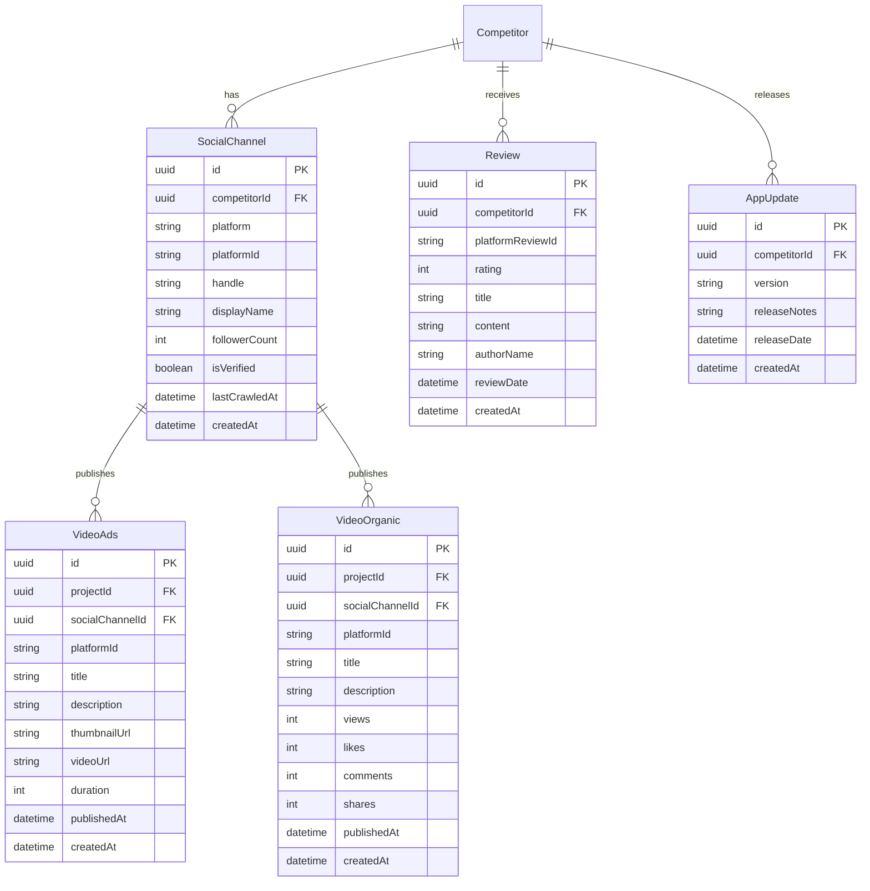
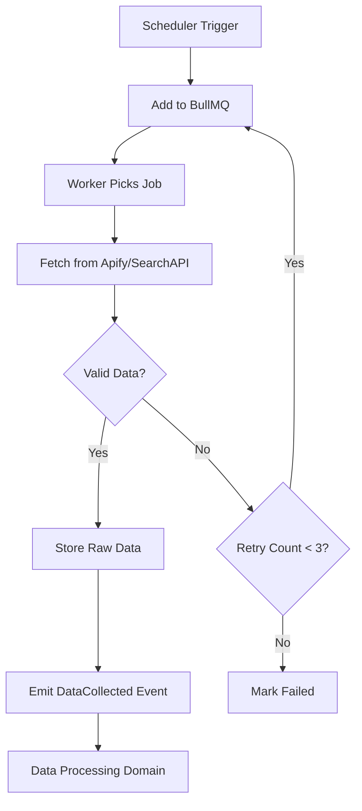

# Data Collection Domain

> **Version:** 1.0.0
> **Status:** Draft
> **Last Updated:** 251224

---

## 1. Overview

The Data Collection domain handles all external data fetching from social media platforms and app stores via Apify and SearchAPI.io. It manages crawl jobs, rate limiting, and raw data ingestion.

### Responsibilities
- Social media crawling (TikTok, YouTube, Facebook, Instagram)
- App store data fetching (iOS, Android)
- Crawl job scheduling and management
- Rate limiting and quota management
- Raw data normalization

### Boundaries
- Does NOT process or analyze data (see Data Processing, AI Analysis)
- Does NOT store processed metrics (see Data Processing)

---

## 2. Entity Relationship Diagram



---

## 3. Business Rules

| ID | Rule | Enforcement |
|----|------|-------------|
| COLL-001 | Max 100 crawl jobs per minute | Rate limiter |
| COLL-002 | Retry failed jobs max 3 times | BullMQ config |
| COLL-003 | Social channels crawled every 6 hours | Scheduler |
| COLL-004 | App store data fetched daily | Scheduler |
| COLL-005 | Deduplicate by platformId | Upsert logic |

---

## 4. Supported Platforms

| Platform | Data Type | Provider | Rate Limit |
|----------|-----------|----------|------------|
| TikTok | Videos, Ads | Apify | 50/min |
| YouTube | Videos | Apify | 50/min |
| Facebook | Ads Library | Apify | 30/min |
| Instagram | Posts, Reels | Apify | 30/min |
| iOS App Store | Reviews, Updates | SearchAPI.io | 100/min |
| Google Play | Reviews, Updates | SearchAPI.io | 100/min |

---

## 5. Crawl Job Flow



---

## 6. API Contracts

### POST /crawl/trigger
```typescript
// Request (Admin only)
{ projectId: string, type: "social" | "appstore" | "all" }

// Response 202
{ jobId: string, status: "queued" }
```

### GET /crawl/status/:jobId
```typescript
// Response 200
{ jobId, status: "queued" | "processing" | "completed" | "failed", progress: number }
```

---

## 7. Error Codes

| Code | Message | HTTP Status |
|------|---------|-------------|
| COLL_001 | Rate limit exceeded | 429 |
| COLL_002 | External API error | 502 |
| COLL_003 | Invalid platform | 400 |
| COLL_004 | Crawl job not found | 404 |

---

## 8. Domain Events

| Event | Trigger | Consumers |
|-------|---------|-----------|
| CrawlJobQueued | Job scheduled | - |
| CrawlJobStarted | Worker picks job | - |
| CrawlJobCompleted | Successful fetch | Data Processing |
| CrawlJobFailed | Max retries exceeded | Alerts (Phase 2) |
| DataCollected | New data ingested | Data Processing |

---

## 9. Integration Points

### Inbound
- Project Management (competitor added)
- Scheduler (cron triggers)
- Admin API (manual trigger)

### Outbound
- Apify (social crawling)
- SearchAPI.io (app store data)
- Data Processing (raw data)
- BullMQ (job queue)

---

## 10. Open Questions

| # | Question | Impact | Status |
|---|----------|--------|--------|
| 1 | Add LinkedIn company pages? | Data sources | Open |
| 2 | Store raw API responses for debugging? | Storage cost | Open |
| 3 | Webhook vs polling for Apify results? | Architecture | Open |

---

## 11. Changelog

### 251224 - v1.0.0 - Initial Draft
- Created data collection domain
- Documented supported platforms and rate limits
- Defined crawl job lifecycle
