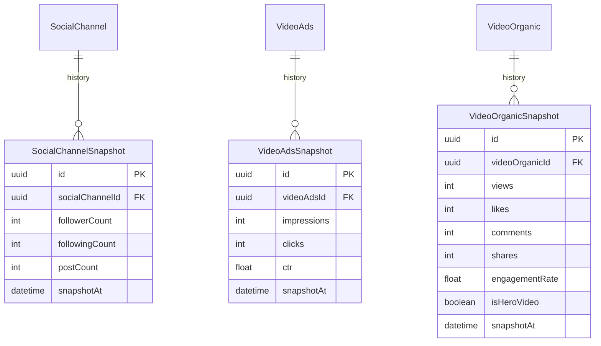
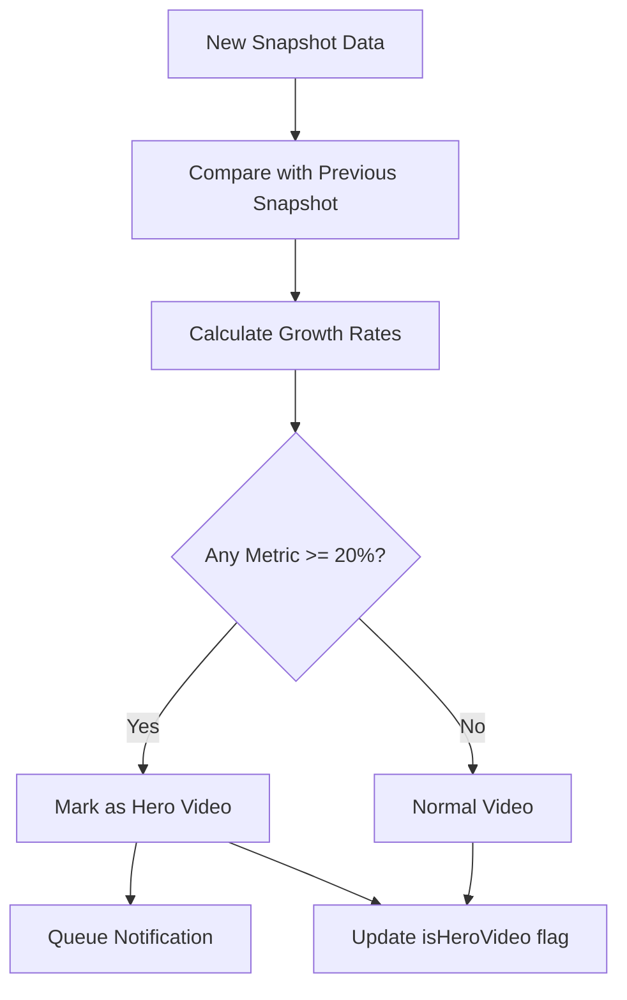
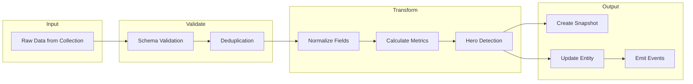

# Data Processing Domain

> **Version:** 1.0.0
> **Status:** Draft
> **Last Updated:** 251224

---

## 1. Overview

The Data Processing domain transforms raw collected data into structured metrics, detects Hero Videos, and prepares data for AI analysis and dashboard display.

### Responsibilities
- Data normalization and validation
- Metric calculation (growth rates, engagement)
- Hero Video detection algorithm
- Snapshot creation for time-series tracking
- Data aggregation for dashboards

### Boundaries
- Does NOT fetch external data (see Data Collection)
- Does NOT perform AI analysis (see AI Analysis)

---

## 2. Entity Relationship Diagram



---

## 3. Business Rules

| ID | Rule | Enforcement |
|----|------|-------------|
| PROC-001 | Hero Video: ≥20% growth in 24h | Algorithm |
| PROC-002 | Snapshots created every 6 hours | Scheduler |
| PROC-003 | Engagement rate = (likes + comments + shares) / views | Formula |
| PROC-004 | Retain snapshots for 90 days | Cleanup job |
| PROC-005 | Flag anomalies (>500% growth) for review | Detection |

---

## 4. Hero Video Detection



### Growth Rate Formula
```
Growth Rate = ((Current - Previous) / Previous) * 100

Metrics tracked:
- Views growth
- Likes growth
- Comments growth
- Shares growth
```

### Hero Thresholds

| Metric | Threshold | Time Window |
|--------|-----------|-------------|
| Views | +20% | 24 hours |
| Likes | +20% | 24 hours |
| Comments | +20% | 24 hours |
| Shares | +20% | 24 hours |

---

## 5. Processing Pipeline



---

## 6. API Contracts

### GET /metrics/video/:id/history
```typescript
// Response 200
{
  videoId: string,
  snapshots: VideoOrganicSnapshot[],
  growthTrend: { views: number, likes: number, engagement: number }
}
```

### GET /metrics/hero-videos
```typescript
// Query: ?projectId=xxx&period=7d
// Response 200
{ heroVideos: VideoOrganic[], total: number }
```

---

## 7. Error Codes

| Code | Message | HTTP Status |
|------|---------|-------------|
| PROC_001 | Invalid data format | 400 |
| PROC_002 | Missing required fields | 400 |
| PROC_003 | Processing timeout | 504 |

---

## 8. Domain Events

| Event | Trigger | Consumers |
|-------|---------|-----------|
| SnapshotCreated | New snapshot saved | Dashboard |
| HeroVideoDetected | Growth >= 20% | Alerts, AI Analysis |
| AnomalyDetected | Growth >= 500% | Admin review |
| ProcessingCompleted | Batch finished | - |

---

## 9. Integration Points

### Inbound
- Data Collection (raw data)
- Scheduler (snapshot triggers)

### Outbound
- Database (snapshots, updates)
- AI Analysis (hero video data)
- Alerts (notifications)
- Dashboard (aggregated metrics)

---

## 10. Open Questions

| # | Question | Impact | Status |
|---|----------|--------|--------|
| 1 | Adjust hero threshold per platform? | Algorithm accuracy | Open |
| 2 | Real-time processing vs batch? | Architecture | Open |
| 3 | ML-based anomaly detection? | Complexity | Open |

---

## 11. Changelog

### 251224 - v1.0.0 - Initial Draft
- Created data processing domain
- Documented Hero Video algorithm
- Defined snapshot strategy
