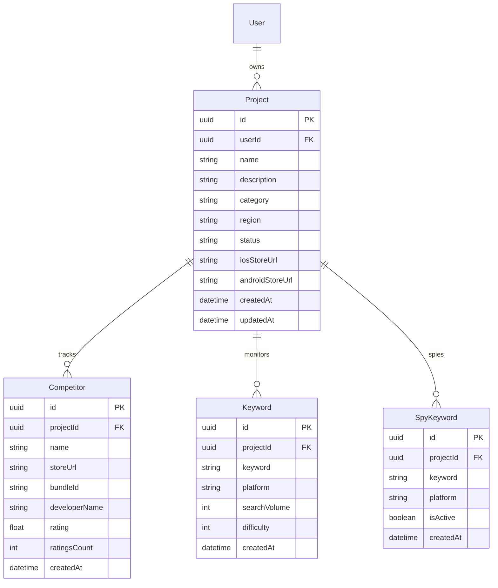
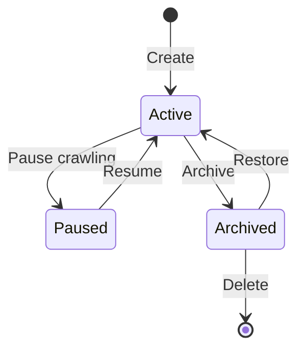

# Project Management Domain

> **Version:** 1.0.0
> **Status:** Draft
> **Last Updated:** 251224

---

## 1. Overview

The Project Management domain handles the core workspace concept. Users create Projects to track their app and competitors. All data collection and analysis is scoped to Projects.

### Responsibilities
- Project CRUD operations
- Competitor management
- Keyword tracking (ASO + Spy)
- Project settings and configuration

### Boundaries
- Does NOT handle data crawling (see Data Collection)
- Does NOT handle analysis (see AI Analysis)

---

## 2. Entity Relationship Diagram



---

## 3. Business Rules

| ID | Rule | Enforcement |
|----|------|-------------|
| PROJ-001 | Max 10 competitors per project | Service layer |
| PROJ-002 | Max 50 keywords per project | Service layer |
| PROJ-003 | Project name must be unique per user | Database constraint |
| PROJ-004 | Store URLs must be valid App Store / Play Store format | Validation |
| PROJ-005 | Deleting project soft-deletes all related data | Cascade policy |

---

## 4. Project Status States



| Status | Description | Crawling |
|--------|-------------|----------|
| Active | Normal operation | Yes |
| Paused | Temporarily stopped | No |
| Archived | Read-only historical | No |

---

## 5. API Contracts

### GET /projects
```typescript
// Response 200
{ projects: Project[], total: number }
```

### POST /projects
```typescript
// Request
{ name, description?, category, region, iosStoreUrl?, androidStoreUrl? }

// Response 201
{ project: Project }
```

### GET /projects/:id/competitors
```typescript
// Response 200
{ competitors: Competitor[] }
```

### POST /projects/:id/competitors
```typescript
// Request
{ storeUrl: string }

// Response 201 (auto-fetches metadata)
{ competitor: Competitor }
```

---

## 6. Error Codes

| Code | Message | HTTP Status |
|------|---------|-------------|
| PROJ_001 | Project not found | 404 |
| PROJ_002 | Max competitors reached | 400 |
| PROJ_003 | Invalid store URL | 400 |
| PROJ_004 | Duplicate project name | 409 |

---

## 7. Domain Events

| Event | Trigger | Consumers |
|-------|---------|-----------|
| ProjectCreated | New project | Crawler scheduler |
| CompetitorAdded | New competitor | Data Collection |
| KeywordAdded | New keyword | Crawler scheduler |
| ProjectArchived | Archive action | Stop all crawl jobs |

---

## 8. Integration Points

### Inbound
- Dashboard UI
- API endpoints

### Outbound
- Data Collection (trigger crawls)
- Crawler Module (schedule jobs)

---

## 9. Related Features

- `03-features/project-setup/` (if exists)

---

## 10. Open Questions

| # | Question | Impact | Status |
|---|----------|--------|--------|
| 1 | Allow project sharing between users? | Multi-tenancy | Open |
| 2 | Project templates for quick setup? | UX | Open |

---

## 11. Changelog

### 251224 - v1.0.0 - Initial Draft
- Created project management domain
- Defined competitor and keyword entities
- Documented project lifecycle states
