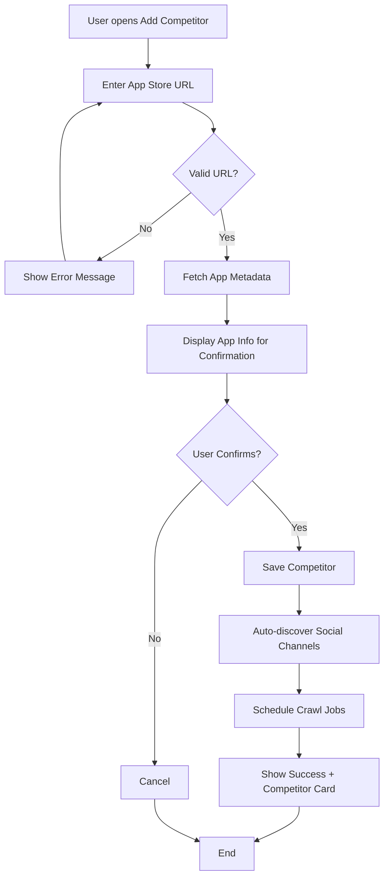

# Feature: Competitor Tracking

> **Version:** 1.0.0
> **Status:** Draft
> **Last Updated:** 251224
> **Feature ID:** 251224-competitor-tracking
> **Domain:** Project Management, Data Collection
> **Phase:** 1 (MVP)

---

## 1. Overview

### Business Value
Allow users to add and track competitors by simply providing app store URLs. The system automatically discovers social media channels and starts collecting data on videos, followers, and engagement.

### User Story
> As a **product manager**, I want to **add competitors using their app store URL** so that I can **automatically track their social media activity without manual configuration**.

---

## 2. User Flow Diagram



---

## 3. Functional Requirements

| ID | Requirement | Priority |
|----|-------------|----------|
| FR-001 | System shall accept iOS App Store and Google Play URLs | Must |
| FR-002 | System shall auto-fetch app metadata (name, developer, rating) | Must |
| FR-003 | System shall allow manual entry of competitor name | Should |
| FR-004 | System shall auto-discover linked social media channels | Should |
| FR-005 | System shall display competitor card with key metrics | Must |
| FR-006 | System shall limit competitors to 10 per project | Must |
| FR-007 | System shall allow removing competitors | Must |
| FR-008 | System shall allow adding social channels manually | Should |

---

## 4. Non-Functional Requirements

| ID | Requirement | Target |
|----|-------------|--------|
| NFR-001 | Metadata fetch time | < 5 seconds |
| NFR-002 | Channel discovery | < 30 seconds |
| NFR-003 | First data available | < 1 hour after adding |

---

## 5. Acceptance Criteria

| ID | Scenario | Criteria |
|----|----------|----------|
| AC-001 | Valid iOS URL | Given URL "apps.apple.com/app/id123", When submitted, Then fetch and display app name, icon, rating |
| AC-002 | Valid Play Store URL | Given URL "play.google.com/store/apps/details?id=com.app", When submitted, Then fetch metadata |
| AC-003 | Invalid URL | Given URL "invalid.com", When submitted, Then show "Invalid app store URL" error |
| AC-004 | Max competitors | Given project has 10 competitors, When adding 11th, Then show "Maximum competitors reached" |
| AC-005 | Remove competitor | Given competitor exists, When user clicks delete, Then soft-delete and stop crawling |

---

## 6. Technical Design

### URL Validation Patterns
```typescript
const URL_PATTERNS = {
  ios: /apps\.apple\.com\/.*\/app\/.*\/id(\d+)/,
  android: /play\.google\.com\/store\/apps\/details\?id=([a-zA-Z0-9._]+)/
};

interface CompetitorInput {
  storeUrl: string;
  platform: "ios" | "android";
  bundleId?: string;
}
```

### Auto-Discovery Flow
1. Fetch app metadata from store
2. Extract developer website from app listing
3. Crawl website for social media links
4. Search social platforms for official accounts
5. Present discovered channels for user confirmation

---

## 7. UI/UX Design

### Add Competitor Modal
```
┌─────────────────────────────────────────────────────────┐
│ Add Competitor                                      [X] │
├─────────────────────────────────────────────────────────┤
│                                                         │
│ App Store URL *                                         │
│ ┌─────────────────────────────────────────────────────┐ │
│ │ https://apps.apple.com/app/competitor/id12345       │ │
│ └─────────────────────────────────────────────────────┘ │
│                                                         │
│ ┌─────────────────────────────────────────────────────┐ │
│ │ ✓ App Found                                         │ │
│ │ ┌──────┐                                            │ │
│ │ │ ICON │ Competitor App Name                        │ │
│ │ └──────┘ by Developer Inc.                          │ │
│ │          ⭐ 4.5 (12,345 ratings)                    │ │
│ └─────────────────────────────────────────────────────┘ │
│                                                         │
│                        [Cancel]  [Add Competitor]       │
└─────────────────────────────────────────────────────────┘
```

### Competitor Card
```
┌─────────────────────────────────────────────────────────┐
│ ┌──────┐ Competitor App                         [···]   │
│ │ ICON │ by Developer Inc.                              │
│ └──────┘ ⭐ 4.5                                         │
├─────────────────────────────────────────────────────────┤
│ Social Channels                                         │
│ ┌────────┐ ┌────────┐ ┌────────┐ ┌────────┐            │
│ │TikTok  │ │YouTube │ │Insta   │ │+ Add   │            │
│ │ 125K   │ │ 45K    │ │ 89K    │ │        │            │
│ └────────┘ └────────┘ └────────┘ └────────┘            │
├─────────────────────────────────────────────────────────┤
│ 📊 12 Videos │ 🔥 3 Hero │ Last crawled: 2h ago        │
└─────────────────────────────────────────────────────────┘
```

---

## 8. API Contract

### POST /projects/:projectId/competitors
```typescript
// Request
{
  storeUrl: string;  // iOS or Android store URL
}

// Response 201
{
  competitor: {
    id: string;
    name: string;
    storeUrl: string;
    bundleId: string;
    developerName: string;
    rating: number;
    ratingsCount: number;
    iconUrl: string;
    createdAt: datetime;
  };
  discoveredChannels: {
    platform: string;
    handle: string;
    url: string;
    confidence: "high" | "medium" | "low";
  }[];
}
```

### GET /projects/:projectId/competitors
```typescript
// Response 200
{
  competitors: {
    id: string;
    name: string;
    rating: number;
    socialChannels: SocialChannel[];
    metrics: {
      totalVideos: number;
      heroVideos: number;
      totalFollowers: number;
    };
    lastCrawledAt: datetime;
  }[];
  total: number;
  limit: 10;
}
```

### DELETE /projects/:projectId/competitors/:id
```typescript
// Response 200
{ message: "Competitor removed" }
```

---

## 9. Out of Scope

- Bulk import competitors
- Competitor comparison charts
- Competitor alerts (Phase 2)
- Web-only competitors (no app)

---

## 10. Dependencies

| Dependency | Type | Status |
|------------|------|--------|
| SearchAPI.io | External | Active |
| Apify social crawlers | External | Active |
| Project Management domain | Internal | Active |

---

## 11. Open Questions

| # | Question | Impact | Status |
|---|----------|--------|--------|
| 1 | Auto-discover channels or manual only for MVP? | Scope | Open |
| 2 | What if app has multiple store URLs (iOS + Android)? | Data model | Open |
| 3 | Show competitor's app updates timeline? | Features | Open |

---

## 12. Testing

### Unit Tests

| Test ID | Description | Input | Expected Output |
|---------|-------------|-------|-----------------|
| UT-001 | Valid iOS URL pattern | `apps.apple.com/app/id123` | Returns bundleId `123` |
| UT-002 | Valid Play Store URL | `play.google.com/store/apps/details?id=com.app` | Returns bundleId `com.app` |
| UT-003 | Invalid URL rejection | `invalid.com` | Throws ValidationError |
| UT-004 | Empty URL rejection | `""` | Throws ValidationError |

### Integration Tests

| Test ID | Description | Preconditions | Steps | Expected Result |
|---------|-------------|---------------|-------|-----------------|
| IT-001 | POST valid iOS competitor | Auth user, project exists | POST `/projects/:id/competitors` with iOS URL | 201, competitor created |
| IT-002 | POST valid Android competitor | Auth user, project exists | POST with Play Store URL | 201, competitor created |
| IT-003 | POST invalid URL | Auth user, project exists | POST with `invalid.com` | 400, "Invalid app store URL" |
| IT-004 | POST max competitors exceeded | Project has 10 competitors | POST 11th competitor | 400, "Maximum competitors reached" |
| IT-005 | DELETE competitor | Competitor exists | DELETE `/projects/:id/competitors/:cid` | 200, soft deleted |

### Edge Cases

| Case | Description | How to Handle |
|------|-------------|---------------|
| EC-001 | URL with query params | Strip params, extract ID only |
| EC-002 | Uppercase URL | Normalize to lowercase |
| EC-003 | Network timeout | Retry 2x, then fail gracefully |
| EC-004 | App not found in store | Return 404 with helpful message |

**Test Coverage Target:** 80%
**Generated:** 251224

---

## 13. Implementation Progress

| Task | Status | Notes |
|------|--------|-------|
| URL validation | Not Started | Frontend + Backend |
| Metadata fetching | Not Started | SearchAPI integration |
| Competitor CRUD | Not Started | API + Database |
| UI components | Not Started | Modal, Card |
| Channel discovery | Not Started | Phase 1.5 maybe |

---

## 14. Changelog

### 251224 - v1.0.0 - Initial Draft
- Created feature spec from BRD
- Defined URL validation and metadata flow
- Documented UI mockups
