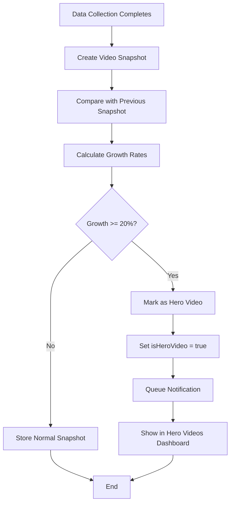

# Feature: Hero Video Detection

> **Version:** 1.0.0
> **Status:** Draft
> **Last Updated:** 251224
> **Feature ID:** 251224-hero-video-detection
> **Domain:** Data Processing
> **Phase:** 1 (MVP)

---

## 1. Overview

### Business Value
Automatically detect competitor videos that are gaining significant traction (≥20% growth in 24 hours) so users can analyze winning creative strategies and react quickly to market trends.

### User Story
> As a **marketing manager**, I want to be **automatically alerted when competitor videos go viral** so that I can **study their approach and adapt my strategy**.

---

## 2. User Flow Diagram



---

## 3. Functional Requirements

| ID | Requirement | Priority |
|----|-------------|----------|
| FR-001 | System shall calculate growth rate for views, likes, comments, shares | Must |
| FR-002 | System shall mark video as Hero when any metric grows ≥20% in 24h | Must |
| FR-003 | System shall compare current snapshot with snapshot from 24h ago | Must |
| FR-004 | System shall display Hero Videos in dedicated dashboard section | Must |
| FR-005 | System shall show growth percentage for each metric | Should |
| FR-006 | System shall allow filtering Hero Videos by platform | Should |
| FR-007 | System shall allow filtering Hero Videos by date range | Should |

---

## 4. Non-Functional Requirements

| ID | Requirement | Target |
|----|-------------|--------|
| NFR-001 | Detection latency | < 30 minutes after snapshot |
| NFR-002 | Dashboard load time | < 2 seconds |
| NFR-003 | Historical data retention | 90 days |

---

## 5. Acceptance Criteria

| ID | Scenario | Criteria |
|----|----------|----------|
| AC-001 | Video with 25% view growth | Given a video had 10,000 views yesterday, When current views are 12,500+, Then mark as Hero Video |
| AC-002 | Video with 15% growth | Given a video had 10,000 views yesterday, When current views are 11,500, Then do NOT mark as Hero |
| AC-003 | Multiple metrics trigger | Given likes grew 25% but views only 5%, Then still mark as Hero (any metric qualifies) |
| AC-004 | Dashboard display | Given 5 Hero Videos exist, When user views Hero Videos section, Then all 5 display with growth stats |

---

## 6. Technical Design

### Detection Algorithm
```typescript
interface GrowthCheck {
  videoId: string;
  currentSnapshot: VideoSnapshot;
  previousSnapshot: VideoSnapshot; // 24h ago

  calculateGrowth(): GrowthResult;
  isHero(): boolean;
}

interface GrowthResult {
  viewsGrowth: number;      // percentage
  likesGrowth: number;
  commentsGrowth: number;
  sharesGrowth: number;
  isHeroVideo: boolean;
  triggerMetric: string;    // which metric triggered
}

// Growth formula
const growth = ((current - previous) / previous) * 100;
const HERO_THRESHOLD = 20; // percent
```

### Database Changes
- Add `isHeroVideo: boolean` to `VideoOrganic` and `VideoAds` tables
- Add `triggerMetric: string` to track which metric triggered hero status

---

## 7. UI/UX Design

### Hero Videos Section
```
┌─────────────────────────────────────────────────────────┐
│ 🔥 Hero Videos (7)                    [Filter ▼] [7d ▼] │
├─────────────────────────────────────────────────────────┤
│ ┌─────────┐ ┌─────────┐ ┌─────────┐ ┌─────────┐        │
│ │ 🎬      │ │ 🎬      │ │ 🎬      │ │ 🎬      │        │
│ │ Video 1 │ │ Video 2 │ │ Video 3 │ │ Video 4 │        │
│ │ +45% 👁  │ │ +32% ❤   │ │ +28% 💬 │ │ +22% 👁  │        │
│ │ TikTok  │ │ YouTube │ │ TikTok  │ │ Insta   │        │
│ └─────────┘ └─────────┘ └─────────┘ └─────────┘        │
└─────────────────────────────────────────────────────────┘
```

### Hero Badge
- Fire emoji (🔥) indicator
- Growth percentage with metric icon
- Platform badge

---

## 8. API Contract

### GET /dashboard/hero-videos
```typescript
// Query
{
  projectId: string;
  period?: "24h" | "7d" | "30d";  // default: 7d
  platform?: "tiktok" | "youtube" | "instagram" | "facebook";
  page?: number;
  limit?: number;
}

// Response 200
{
  heroVideos: {
    id: string;
    title: string;
    thumbnailUrl: string;
    platform: string;
    publishedAt: datetime;
    currentMetrics: { views, likes, comments, shares };
    growth: { views: number, likes: number, comments: number, shares: number };
    triggerMetric: string;
    detectedAt: datetime;
    competitor: { id: string, name: string };
  }[];
  total: number;
  page: number;
  limit: number;
}
```

---

## 9. Out of Scope

- Real-time push notifications (Phase 2)
- Custom threshold configuration per user
- Predictive "about to go viral" detection
- Cross-platform aggregation (same video on multiple platforms)

---

## 10. Dependencies

| Dependency | Type | Status |
|------------|------|--------|
| Data Collection domain | Internal | Active |
| Snapshot creation job | Internal | Active |
| Dashboard domain | Internal | Active |

---

## 11. Open Questions

| # | Question | Impact | Status |
|---|----------|--------|--------|
| 1 | Should threshold be configurable per project? | Flexibility | Open |
| 2 | How to handle videos with very low baseline (100 views → 150 views = 50%)? | False positives | Open |
| 3 | Show hero status history or just current? | UX | Open |

---

## 12. Implementation Progress

| Task | Status | Notes |
|------|--------|-------|
| Database migration | Not Started | Add isHeroVideo field |
| Detection algorithm | Not Started | Processing service |
| Dashboard UI | Not Started | Hero Videos section |
| API endpoint | Not Started | /dashboard/hero-videos |

---

## 13. Changelog

### 251224 - v1.0.0 - Initial Draft
- Created feature spec from BRD requirements
- Defined detection algorithm and thresholds
- Documented API contract and UI design
