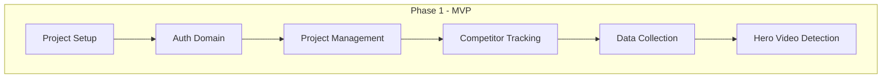

# Project Roadmap

> **Last Updated:** 251224
> **Current Phase:** Phase 1 - MVP

---

## Phases Overview

| Phase | Name | Goal | Timeline | Status |
|-------|------|------|----------|--------|
| 1 | MVP | Core tracking + Hero detection | Sprint 1-4 | Planning |
| 2 | Alerts | Notifications + Custom thresholds | Sprint 5-6 | Not Started |
| 3 | Admin | Admin panel + Cost monitoring | Sprint 7-8 | Not Started |

---

## Phase 1: MVP (Current)

### Priority Queue

| Priority | Feature | Dependencies | Status | Spec |
|----------|---------|--------------|--------|------|
| P0 | Project Setup | None | Not Started | - |
| P0 | Auth Domain | Project Setup | Not Started | 02-domains/auth |
| P1 | Project Management | Auth | Not Started | 02-domains/project-management |
| P1 | Competitor Tracking | Project Management | Not Started | 03-features/251224-competitor-tracking |
| P2 | Data Collection | Competitor Tracking | Not Started | 02-domains/data-collection |
| P2 | Hero Video Detection | Data Collection | Not Started | 03-features/251224-hero-video-detection |

### Dependency Graph

---

## Phase 2: Alerts (Planned)

| Priority | Feature | Dependencies | Status |
|----------|---------|--------------|--------|
| P0 | Alert Rules Engine | Hero Video Detection | Not Started |
| P1 | Push Notifications | Alert Rules Engine | Not Started |
| P2 | Email Notifications | Alert Rules Engine | Not Started |

---

## Phase 3: Admin (Planned)

| Priority | Feature | Dependencies | Status |
|----------|---------|--------------|--------|
| P0 | Admin Dashboard | Auth | Not Started |
| P1 | User Management | Admin Dashboard | Not Started |
| P2 | Cost Monitoring | All | Not Started |

---

## Reorder Log

| Date | Action | Rationale |
|------|--------|-----------|
| 251224 | Initial roadmap | Created based on MVP planning |

---

## Notes

- Phase 1 MVP focuses on core data collection and hero detection
- External dependencies: SearchAPI.io, Apify crawlers
- All feature specs are in Draft status pending implementation
