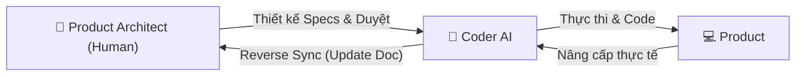
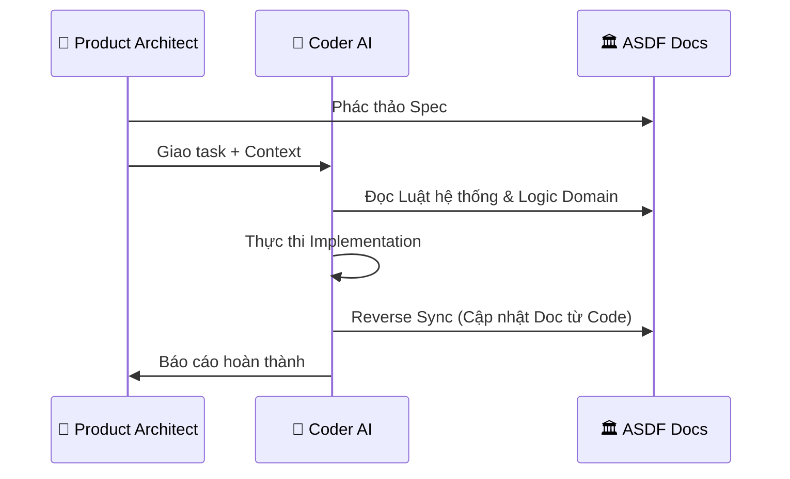

# Astraler Spec-Driven Framework (ASDF): Master Blueprint (Approach 1)
> **Version**: 1.2 (Updated: 2025-12-23)
> **Status**: Approved

---

## 📜 Nhật ký thay đổi (Changelog)
- **v1.0**: Phác thảo cấu trúc phân tầng (System/Domain/Feature).
- **v1.1**: Bổ sung cơ chế **State & Memory Management**.
- **v1.2**: Refactor toàn bộ vai trò sang **Product Architect** và **Coder AI**. Tinh gọn mô hình vận hành.

---

## 1. Triết lý & Phân tích Chiến lược

### 🎯 Mục tiêu
Biến tài liệu (Specs) thành **Source of Truth** duy nhất để điều khiển AI, giảm thiểu sự hỗn loạn trong dự án lớn và tối ưu hóa hiệu suất thực thi.

### ⚖️ Ưu & Nhược điểm
- **Ưu điểm**: Kiểm soát chất lượng tuyệt đối, chống trôi context (Context Drift), và bảo toàn tri thức dự án thông qua cơ chế tự cập nhật tài liệu (**Reverse Sync**).
- **Nhược điểm**: Đòi hỏi Product Architect có tư duy thiết kế tốt và kỷ luật cao.

### 🚀 Tính thời đại
ASDF là **Spec-Driven Development** cho kỷ nguyên AI-Native. Bạn dùng "Tầm nhìn" của Product Architect để định hướng và "Tốc độ" của Coder AI để thực thi.

---

## 2. Mô hình Cộng tác (Human-AI Direct Interaction)



---

## 3. Cấu trúc Tài liệu Phân tầng (Directory Tree)

Tổ chức tri thức theo 3 tầng để AI dễ dàng nạp đúng context:

```text
asdf-docs/
├── 🏛️ system-core/                 # Tầng 1: Global Rules (Quy tắc chung)
│   ├── master-map.md               # Bản đồ gene dự án
│   ├── ui-ux-design-system.md      # "Kinh thánh" UI/UX
│   └── project-status.md           # Heartbeat - Trạng thái tổng thể
│
├── 🧱 domains/                     # Tầng 2: Module Logic (Nghiệp vụ)
│   └── ...
│
├── 🚀 features/                    # Tầng 3: Actionable Specs (Thực thi)
│   └── ...
│
└── ⚙️ operations/                  # Tầng vận hành (Context thực thi)
    ├── implementation-active.md    # Bảng điều khiển task hiện tại
    ├── session-handoff.md          # Short-term Memory (Lần cuối làm gì?)
    └── changelog/                  # Nhật ký thay đổi Doc
```

---

## 4. State & Memory Management (Project Heartbeat)

ASDF sử dụng cơ chế "điểm neo" để đảm bảo AI không bao giờ quên context dự án:

### 🏛️ Tầng 1 (Bền vững): `system-core/project-status.md`
- **Mục đích**: Bản đồ trạng thái tổng thể (High-level Inventory).
- **Giá trị**: Cho biết "Dự án đã đi được bao xa?".

### ⚙️ Tầng 4 (Vận hành): `operations/session-handoff.md`
- **Mục đích**: Ghi nhớ trạng thái phiên làm việc gần nhất.
- **Giá trị**: Cho biết "Lần trước chúng ta đang dừng ở đâu?".

### 🛡️ Giao thức Reverse Sync
Coder AI trước khi kết thúc phiên phải rà soát code và cập nhật các file Specs tương ứng để phản ánh đúng thực tế codebase.

---

## 5. Mô hình Tương tác & Nạp Context



---

## 6. Case Studies & Prompt Mẫu

### Case 1: Brainstorm Specs
> "Bạn là Product Architect AI. Hãy đọc `system-core/`, sau đó hỏi tôi 5 câu về logic để chúng ta cùng soạn `feature-spec.md`."

### Case 2: Thực thi & Reverse Sync
> "Thực hiện tính năng `checkout-cod`. Tài liệu tại `features/checkout-cod/`. Sau khi hoàn thành, hãy kiểm tra lại nếu code có thay đổi so với Spec thì cập nhật lại file tài liệu đó."

---

## 💡 Kết luận
ASDF biến tài liệu thành công cụ cấu hình để điều khiển AI, giúp một Product Architect có thể quản trị dự án quy mô lớn một cách chính xác và hiệu quả.
