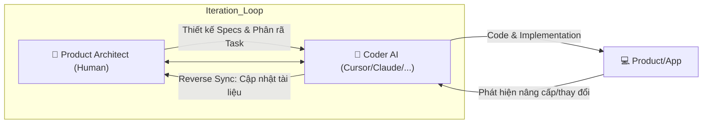
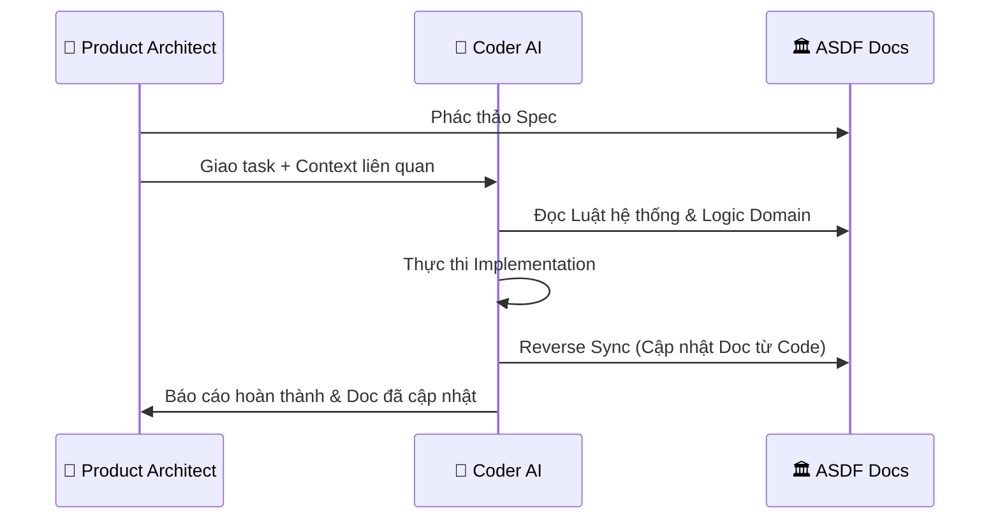

# Astraler Spec-Driven Framework (ASDF): The Master Blueprint

Tài liệu này tổng hợp toàn bộ kiến trúc, tư duy và hướng dẫn vận hành của framework **ASDF** - một hệ thống SDLC tinh gọn, tối ưu hóa cho sự cộng tác giữa Con người (**Product Architect**) và **Coder AI**.

---

## 1. Triết lý & Phân tích Chiến lược

### 🎯 Mục tiêu
Biến tài liệu (Specs) thành **Source of Truth** duy nhất để điều khiển AI, giảm thiểu sự hỗn loạn trong dự án lớn và tối ưu hóa hiệu suất thực thi.

### ⚖️ Ưu & Nhược điểm
- **Ưu điểm**: Kiểm soát chất lượng tuyệt đối, chống trôi context (Context Drift), và bảo toàn tri thức dự án thông qua cơ chế tự cập nhật tài liệu (**Reverse Sync**).
- **Nhược điểm**: Đòi hỏi Product Architect có tư duy thiết kế tốt và kỷ luật cao.

### 🚀 Tính thời đại
ASDF là **Spec-Driven Development** cho kỷ nguyên AI-Native. Bạn dùng "Tầm nhìn và Tư duy" của Product Architect để định hướng và "Tốc độ của Coder AI" để thực thi.

---

## 2. Mô hình Cộng tác (Human-AI Direct Loop)

ASDF vận hành dựa trên vòng lặp trực tiếp giữa Người vận hành và AI:



---

## 3. Vai trò & Trách nhiệm

### 👤 Product Architect (The Driver)
- **Tư duy**: Đóng vai trò là người vận hành hệ thống (PO, PM, hoặc Lead Dev). Thấu hiểu nghiệp vụ và thiết kế kiến trúc tổng thể.
- **Nghiệm vụ**: Phác thảo Specs ban đầu, duyệt Implementation Plan, và kiểm soát chất lượng đầu ra.

### 🤖 Coder AI (The Navigator/Executor)
- **Công cụ**: Cursor, Claude Code, viber AI, hoặc bất kỳ công cụ AI lập trình nào.
- **Nhiệm vụ**: Đọc Specs, thực thi code, và **quan trọng nhất**: nếu phát hiện bất kỳ thay đổi hoặc nâng cấp nào trong quá trình code, phải tự động cập nhật lại hệ thống tài liệu (**Reverse Sync**).

---

## 4. Cấu trúc Tài liệu Phân tầng (Directory Tree)

Tổ chức tri thức theo 3 tầng để AI dễ dàng nạp đúng context:

```text
asdf-docs/
├── 🏛️ 01-system-core/                 # Tầng 1: Global Rules (Quy tắc chung)
│   ├── master-map.md               # Bản đồ gene dự án
│   ├── ui-ux-design-system.md      # "Kinh thánh" UI/UX
│   └── project-status.md           # Heartbeat - Trạng thái tổng thể
│
├── 🧱 02-domains/                     # Tầng 2: Module Logic (Nghiệp vụ)
│   └── ...
│
├── 🚀 03-features/                    # Tầng 3: Actionable Specs (Thực thi)
│   └── ...
│
└── ⚙️ 04-operations/                  # Tầng vận hành (Context thực thi)
    ├── implementation-active.md    # Bảng điều khiển task hiện tại
    ├── session-handoff.md          # Short-term Memory (Lần cuối làm gì?)
    └── changelog/                  # Nhật ký thay đổi Doc
```

---

## 5. State & Memory Management (Project Heartbeat)

ASDF sử dụng cơ chế "điểm neo" để đảm bảo AI không bao giờ quên context dự án:

### 🏛️ Tầng 1 (Bền vững): `01-system-core/project-status.md`
- **Mục đích**: Bản đồ trạng thái tổng thể (High-level Inventory).
- **Giá trị**: Cho biết "Dự án đã đi được bao xa?".

### ⚙️ Tầng 4 (Vận hành): `04-operations/session-handoff.md`
- **Mục đích**: Ghi nhớ trạng thái phiên làm việc gần nhất.
- **Giá trị**: Cho biết "Lần trước chúng ta đang dừng ở đâu?".

---

## 6. Giao thức Reverse Sync (Tự cập nhật tài liệu)

Đây là giá trị cốt lõi của ASDF: **Tài liệu không bao giờ lỗi thời**.

1. **Thực thi**: Coder AI thực hiện code dựa trên Spec.
2. **Học hỏi**: Trong quá trình code, nếu AI tìm ra cách giải quyết tốt hơn hoặc thay đổi UI/UX cho khớp thực tế, AI phải ghi nhận lại.
3. **Cập nhật**: Kết thúc task, AI tự động cập nhật lại file Spec hoặc Design System tương ứng để phản ánh đúng trạng thái của Code.

---

## 7. Sơ đồ Tương tác & Nạp Context



---

## 8. Case Studies & Prompt Mẫu

### Case 1: Brainstorm Specs
> "Bạn là Product Architect AI. Chúng ta cần module 'Loyalty'. Hãy đọc `01-system-core/`, sau đó hỏi tôi 5 câu về logic để chúng ta cùng soạn `feature-spec.md`."

### Case 2: Thực thi & Reverse Sync
> "Thực hiện tính năng `checkout-cod`. Tài liệu tại `03-features/checkout-cod/`. Sau khi hoàn thành, hãy kiểm tra lại nếu code có bất kỳ thay đổi nào so với Spec ban đầu thì cập nhật lại file tài liệu đó."

---

## 💡 Kết luận
ASDF là một hệ điều hành (OS) dành cho việc phát triển phần mềm bằng AI. Nó biến Product Architect thành người điều phối quyền năng và Coder AI thành một cộng sự thông minh, tự động hóa cả việc lập trình lẫn quản lý tri thức.
