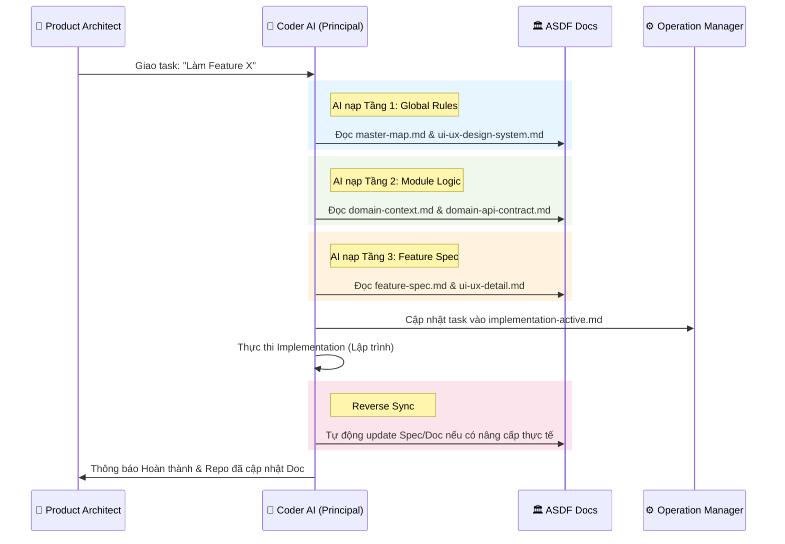

# ASDF Practice Guide: Interaction & Real-world Case Studies

Tài liệu này hướng dẫn cách nạp context và điều khiển Coder AI thông qua framework ASDF với vai trò **Product Architect**.

## 1. Sơ đồ Tương tác Hệ thống (Interaction Flow)

Sơ đồ này mô tả cách Coder AI truy xuất tri thức từ các tầng của ASDF để thực hiện task dưới sự điều khiển của Product Architect.

---

## 2. Case Studies & Prompt Mẫu

### 🛡️ Case Study 1: Brainstorm Tính năng mới
**Mục tiêu**: Ép AI phải hỏi ngược lại để làm rõ yêu cầu trước khi tạo Spec.

**Prompt nạp AI:**
> "Bạn là Coder AI cấp Senior. Chúng ta cần thêm tính năng 'Thẻ thành viên Platinum' vào `domain-payment`. 
> 1. Hãy đọc `system-core/` và `domains/payment/` để nắm vững context.
> 2. Đừng viết code ngay. Hãy hỏi tôi ít nhất 5 câu hỏi về logic nghiệp vụ và UI/UX để làm rõ yêu cầu này.
> 3. Sau khi tôi trả lời, hãy phác thảo file `features/platinum-card/feature-spec.md`."

---

### 🚀 Case Study 2: Handoff thực thi (Direct Loop)
**Mục tiêu**: Nạp chuẩn context để AI thực thi mà không làm hỏng cấu trúc hệ thống.

**Prompt nạp AI (Handoff):**
> "Hãy thực thi tính năng tại `features/checkout-cart/`. 
> **Context nạp vào gồm:**
> - `- 🏛️ Core rules:` `tech-standards.md`
> - `- 🎨 UI Vibe:` `ui-ux-design-system.md`
> - `- 🧱 Domain Logic:` `domain-context.md`
> - `- 🚀 The Spec:` `feature-spec.md`
>
> **Nhiệm vụ:** 
> 1. Phân rã task vào `implementation-active.md`.
> 2. Thực thi code tuân thủ tuyệt đối Tech Standards. 
> 3. Nếu thấy UI có thể cải tiến tốt hơn bản Spec, hãy tự động cập nhật lại tài liệu sau khi code xong."

---

### 🔄 Case Study 3: Reverse Sync (Cập nhật Doc từ Code)
**Mục tiêu**: Giữ tài liệu luôn bám sát thực tế code.

**Prompt nạp AI:**
> "Trong quá trình code tính năng `login-google`, tôi đã thay đổi hiệu ứng chuyển cảnh vì nó mượt hơn.
> 1. Hãy đọc code thực tế tại `LoginView.tsx`.
> 2. Hãy cập nhật lại file `ui-ux-detail.md` trong folder features tương ứng để khớp với code."

---

### 💡 Lưu ý vận hành:
- **Product Architect** nên sử dụng các Model mạnh nhất (Claude 3.5 Sonnet, GPT-4o) để thiết kế Specs.
- **Coder AI** (Cursor, Claude Code) chịu trách nhiệm thực thi và bảo trì tài liệu.
- Luôn đảm bảo cơ chế **Reverse Sync** được thực hiện sau mỗi task lớn.
