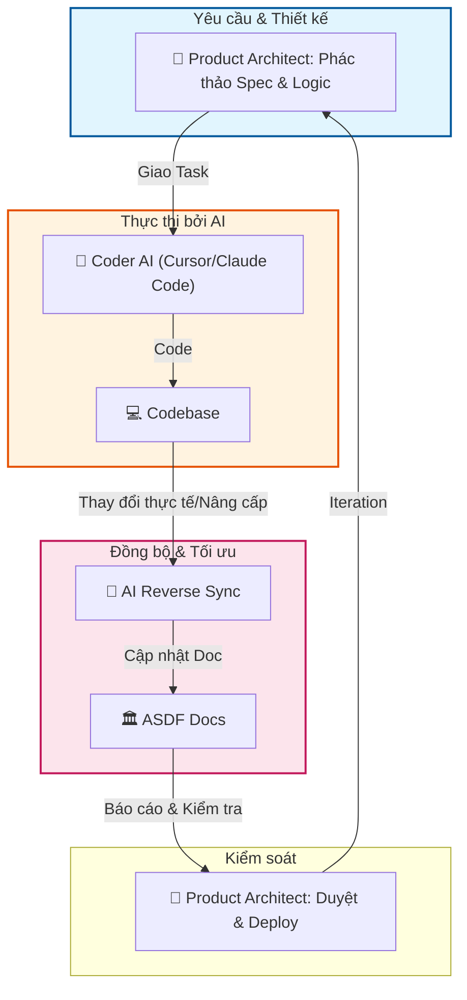

# Astraler SDLC: Human-AI Direct Interaction Flow

Tài liệu này mô hình hóa cách **Product Architect** phối hợp trực tiếp cùng **Coder AI** để vận hành dự án, đảm bảo tốc độ thực thi cực nhanh mà vẫn kiểm soát được chất lượng.

## 1. Sơ đồ Vòng lặp Thực thi (The Direct Execution Loop)

---

## 2. Phân tích cơ chế vận hành

### 🛡️ Product Architect: Người lái (The Driver)
- **Nhiệm vụ**: Chốt Spec, thiết kế logic nghiệp vụ, và đưa ra các chỉ dẫn (Prompts) sắc bén cho AI.
- **Giá trị**: Đảm bảo dự án không bị "trôi context" và giữ vững kiến trúc hệ thống.

### 🚀 Coder AI: Cộng sự thực thi (The Navigator)
- **Nhiệm vụ**: Chuyển hóa Spec thành Code, tối ưu hóa các thành phần, và tự động cập nhật lại tài liệu khi có thay đổi thực tế.
- **Cơ chế Reverse Sync**: Đây là điểm mấu chốt. Khi AI code xong một tính năng, nó phải tự kiểm tra lại file tài liệu (PRD/SAD/Feature-Spec) để cập nhật những thay đổi phát sinh trong lúc code.

## 3. Lợi ích của sự tinh gọn
1. **Tốc độ (Velocity)**: Loại bỏ các khâu trung gian, đẩy nhanh quá trình từ ý tưởng đến sản phẩm.
2. **Đồng bộ tuyệt đối (Perfect Sync)**: Nhờ Reverse Sync, tài liệu không bao giờ bị lệch so với code thực tế.
3. **Hiệu năng cao**: Một Product Architect có thể phối hợp với nhiều AI instances để xử lý các module khác nhau song song.

---

### 💡 Nhận xét:
Mô hình này tối ưu hóa tối đa khả năng của các AI thế hệ mới (Cursor, Claude Code) - những AI có khả năng đọc hiểu và chỉnh sửa codebase lớn một cách tự chủ.
