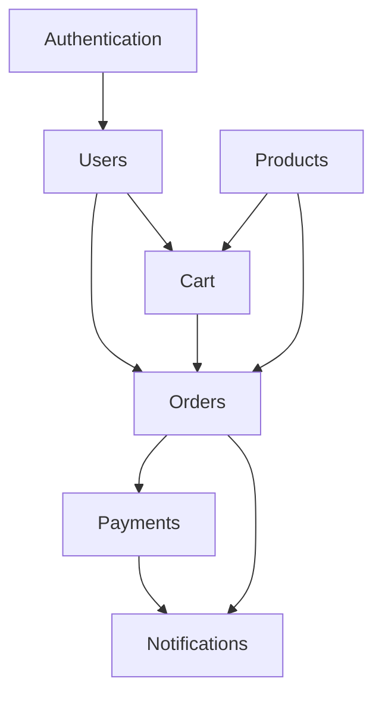

# Master Map - Project DNA

> **Version**: 1.0.0
> **Last Updated**: 241223
> **Owner**: Product Architect

---

## 1. Project Identity

| Attribute | Value |
|-----------|-------|
| **Name** | Astraler Commerce Platform |
| **Type** | E-commerce SaaS |
| **Stage** | MVP Development |
| **Target Launch** | Q1 2025 |

### Mission Statement
Build a modern, AI-native e-commerce platform that enables small businesses to launch online stores with minimal technical overhead.

### Success Metrics
- [ ] 100 beta users by launch
- [ ] < 3s page load time
- [ ] 99.5% uptime SLA
- [ ] < 24h customer support response

---

## 2. Technical Architecture

### 2.1 System Overview

```
┌─────────────────────────────────────────────────────────────┐
│                      CLIENT LAYER                           │
│  ┌──────────────┐  ┌──────────────┐  ┌──────────────┐      │
│  │   Web App    │  │  Mobile App  │  │  Admin Panel │      │
│  │   (Next.js)  │  │   (Flutter)  │  │   (Next.js)  │      │
│  └──────┬───────┘  └──────┬───────┘  └──────┬───────┘      │
└─────────┼─────────────────┼─────────────────┼───────────────┘
          │                 │                 │
          ▼                 ▼                 ▼
┌─────────────────────────────────────────────────────────────┐
│                      API GATEWAY                            │
│                    (Cloudflare Workers)                     │
└─────────────────────────────┬───────────────────────────────┘
                              │
          ┌───────────────────┼───────────────────┐
          ▼                   ▼                   ▼
┌──────────────────┐ ┌──────────────────┐ ┌──────────────────┐
│   Auth Service   │ │  Order Service   │ │ Payment Service  │
│   (Supabase)     │ │  (Node.js)       │ │ (Node.js)        │
└────────┬─────────┘ └────────┬─────────┘ └────────┬─────────┘
         │                    │                    │
         ▼                    ▼                    ▼
┌─────────────────────────────────────────────────────────────┐
│                      DATA LAYER                             │
│  ┌──────────────┐  ┌──────────────┐  ┌──────────────┐      │
│  │  PostgreSQL  │  │    Redis     │  │  Cloudflare  │      │
│  │  (Supabase)  │  │   (Cache)    │  │     R2       │      │
│  └──────────────┘  └──────────────┘  └──────────────┘      │
└─────────────────────────────────────────────────────────────┘
```

### 2.2 Technology Stack

| Layer | Technology | Rationale |
|-------|------------|-----------|
| **Frontend** | Next.js 14 (App Router) | SSR, RSC, excellent DX |
| **Mobile** | Flutter | Cross-platform, single codebase |
| **API** | Node.js + Hono | Lightweight, edge-compatible |
| **Auth** | Supabase Auth | Built-in, OAuth support |
| **Database** | PostgreSQL (Supabase) | Relational, RLS, realtime |
| **Cache** | Redis (Upstash) | Serverless, low latency |
| **Storage** | Cloudflare R2 | S3-compatible, no egress fees |
| **Edge** | Cloudflare Workers | Global, low latency |
| **Payments** | SePay + Stripe | Vietnam + International |

### 2.3 Module Dependencies



---

## 3. Domain Boundaries

| Domain | Responsibility | Owner |
|--------|----------------|-------|
| **Authentication** | User identity, sessions, OAuth | Core Team |
| **Payments** | Transaction processing, refunds | Core Team |
| **Orders** | Order lifecycle, fulfillment | Core Team |
| **Notifications** | Email, push, SMS delivery | Core Team |
| **Products** | Catalog, inventory, pricing | Future |
| **Analytics** | Tracking, reporting, insights | Future |

---

## 4. Integration Points

### 4.1 External Services

| Service | Purpose | API Type | Docs |
|---------|---------|----------|------|
| Supabase | Auth + DB | REST/Realtime | [Link] |
| SePay | VN Payments | Webhook | [Link] |
| Stripe | Intl Payments | REST | [Link] |
| Resend | Email | REST | [Link] |
| Firebase | Push Notifications | SDK | [Link] |

### 4.2 Webhook Endpoints

| Endpoint | Source | Purpose |
|----------|--------|---------|
| `/webhooks/sepay` | SePay | Payment confirmation |
| `/webhooks/stripe` | Stripe | Payment events |
| `/webhooks/supabase` | Supabase | DB triggers |

---

## 5. Environment Configuration

### 5.1 Environments

| Environment | Purpose | URL |
|-------------|---------|-----|
| `development` | Local dev | localhost:3000 |
| `staging` | Testing | staging.astraler.com |
| `production` | Live | app.astraler.com |

### 5.2 Required Secrets

```
# Authentication
SUPABASE_URL=
SUPABASE_ANON_KEY=
SUPABASE_SERVICE_KEY=

# Payments
SEPAY_API_KEY=
SEPAY_WEBHOOK_SECRET=
STRIPE_SECRET_KEY=
STRIPE_WEBHOOK_SECRET=

# Notifications
RESEND_API_KEY=
FIREBASE_PROJECT_ID=
FIREBASE_PRIVATE_KEY=

# Storage
CLOUDFLARE_ACCOUNT_ID=
CLOUDFLARE_R2_ACCESS_KEY=
CLOUDFLARE_R2_SECRET_KEY=
```

---

## 6. Non-Functional Requirements

### 6.1 Performance

| Metric | Target | Measurement |
|--------|--------|-------------|
| Page Load (LCP) | < 2.5s | Lighthouse |
| API Response (p95) | < 200ms | Cloudflare Analytics |
| Database Query (p95) | < 50ms | Supabase Dashboard |

### 6.2 Security

- All API endpoints require authentication (except public catalog)
- PCI DSS compliance for payment handling (via SePay/Stripe)
- Data encryption at rest (Supabase) and in transit (TLS 1.3)
- Rate limiting: 100 req/min per user, 1000 req/min per IP

### 6.3 Scalability

- Target: 10,000 concurrent users
- Horizontal scaling via Cloudflare Workers
- Database connection pooling via Supabase

---

## 7. Governance

### 7.1 Decision Log

| Date | Decision | Rationale | Impact |
|------|----------|-----------|--------|
| 241215 | Use Supabase over Firebase | Better Postgres support, RLS | High |
| 241218 | Add SePay for VN payments | Local payment support | Medium |
| 241220 | Cloudflare R2 over S3 | Cost savings, edge proximity | Low |

### 7.2 Technical Debt Register

| Item | Severity | Target Resolution |
|------|----------|-------------------|
| Manual DB migrations | Medium | Q1 2025 |
| No E2E tests | High | Before launch |
| Hardcoded config values | Low | Q1 2025 |

---

**Cross-References:**
- UI/UX: `03-design/ui-ux-design-system.md`
- Components: `03-design/component-library.md`
- Coding: `02-standards/coding-standards.md`
- API: `02-standards/api-standards.md`
- Testing: `02-standards/testing-strategy.md`
- Performance: `02-standards/performance-slas.md`
- Security: `04-governance/security-policy.md`
- Decisions: `04-governance/decision-log.md`
- Data: `01-architecture/data-architecture.md`
- Infrastructure: `01-architecture/infrastructure.md`
