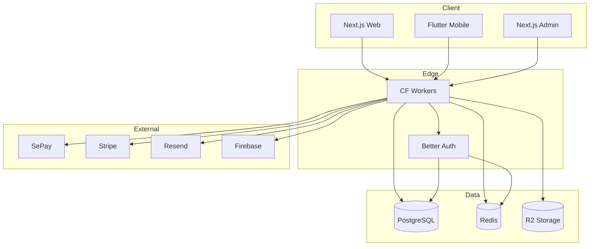

# Technology Stack

> **Version**: 1.0.0
> **Last Updated**: 241223
> **Owner**: Product Architect

---

## 1. Stack Overview

```
┌─────────────────────────────────────────────────────────────────┐
│                        CLIENT LAYER                              │
│  Next.js 14 (Web) │ Flutter (Mobile) │ Next.js (Admin)          │
└─────────────────────────────────────────────────────────────────┘
                              │
┌─────────────────────────────────────────────────────────────────┐
│                        EDGE LAYER                                │
│  Cloudflare Workers │ Hono │ Better Auth                        │
└─────────────────────────────────────────────────────────────────┘
                              │
┌─────────────────────────────────────────────────────────────────┐
│                        DATA LAYER                                │
│  Supabase (PostgreSQL) │ Upstash (Redis) │ Cloudflare R2        │
└─────────────────────────────────────────────────────────────────┘
                              │
┌─────────────────────────────────────────────────────────────────┐
│                     EXTERNAL SERVICES                            │
│  SePay │ Stripe │ Resend │ Firebase │ Meilisearch               │
└─────────────────────────────────────────────────────────────────┘
```

---

## 2. Core Technologies

### 2.1 Frontend

| Technology | Version | Purpose | Status |
|------------|---------|---------|--------|
| **Next.js** | 14.x | Web application framework | Active |
| **React** | 18.x | UI library | Active |
| **TypeScript** | 5.x | Type safety | Active |
| **TailwindCSS** | 3.x | Styling | Active |
| **TanStack Query** | 5.x | Server state management | Active |
| **TanStack Router** | 1.x | Type-safe routing | Active |
| **Zustand** | 4.x | Client state management | Active |
| **React Hook Form** | 7.x | Form handling | Active |
| **Zod** | 3.x | Schema validation | Active |

### 2.2 Mobile

| Technology | Version | Purpose | Status |
|------------|---------|---------|--------|
| **Flutter** | 3.x | Cross-platform framework | Planned |
| **Dart** | 3.x | Language | Planned |
| **Riverpod** | 2.x | State management | Planned |
| **Dio** | 5.x | HTTP client | Planned |

### 2.3 Backend

| Technology | Version | Purpose | Status |
|------------|---------|---------|--------|
| **Node.js** | 20.x LTS | Runtime | Active |
| **Hono** | 4.x | Web framework (edge) | Active |
| **Better Auth** | 1.x | Authentication | Active |
| **Drizzle ORM** | 0.29+ | Database ORM | Active |
| **Zod** | 3.x | Validation | Active |

### 2.4 Database & Storage

| Technology | Provider | Purpose | Status |
|------------|----------|---------|--------|
| **PostgreSQL** | Supabase | Primary database | Active |
| **Redis** | Upstash | Caching, rate limiting | Active |
| **R2** | Cloudflare | File storage | Active |
| **KV** | Cloudflare | Edge key-value | Active |

### 2.5 Infrastructure

| Technology | Purpose | Status |
|------------|---------|--------|
| **Cloudflare Workers** | Edge compute | Active |
| **Cloudflare Pages** | Frontend hosting | Active |
| **Cloudflare CDN** | Content delivery | Active |
| **Cloudflare WAF** | Security | Active |
| **GitHub Actions** | CI/CD | Active |
| **Docker** | Containerization | Active |

---

## 3. External Services

### 3.1 Active Integrations

| Service | Purpose | API Type | Docs |
|---------|---------|----------|------|
| **Supabase** | Database + Realtime | REST/WebSocket | [supabase.com/docs](https://supabase.com/docs) |
| **Upstash** | Serverless Redis | REST | [upstash.com/docs](https://upstash.com/docs) |
| **SePay** | Vietnam payments | REST/Webhook | [sepay.vn/docs](https://sepay.vn) |
| **Stripe** | International payments | REST/Webhook | [stripe.com/docs](https://stripe.com/docs) |
| **Resend** | Transactional email | REST | [resend.com/docs](https://resend.com/docs) |
| **Firebase** | Push notifications | SDK | [firebase.google.com](https://firebase.google.com/docs) |
| **Sentry** | Error tracking | SDK | [sentry.io/docs](https://sentry.io) |
| **Better Uptime** | Uptime monitoring | REST | [betteruptime.com](https://betteruptime.com) |

### 3.2 Planned Integrations

| Service | Purpose | Priority | Target |
|---------|---------|----------|--------|
| **Meilisearch** | Product search | High | Q1 2025 |
| **Twilio** | SMS/OTP | Medium | Q1 2025 |
| **Cloudflare Images** | Image optimization | Medium | Q1 2025 |
| **PostHog** | Product analytics | Medium | Q2 2025 |
| **Cloudflare Queues** | Background jobs | High | Q1 2025 |
| **GHN API** | Shipping (Vietnam) | High | Q1 2025 |
| **GHTK API** | Shipping backup | Low | Q2 2025 |

### 3.3 Under Evaluation

| Service | Purpose | Alternative | Decision By |
|---------|---------|-------------|-------------|
| **Algolia** | Search | Meilisearch | Q1 2025 |
| **LaunchDarkly** | Feature flags | Flagsmith | Q2 2025 |
| **Sanity** | CMS | Payload | Q2 2025 |

---

## 4. Service Dependencies

### 4.1 Dependency Graph



### 4.2 Critical Path Dependencies

| Service | Depends On | If Down |
|---------|------------|---------|
| **API** | Cloudflare Workers | Full outage |
| **Auth** | PostgreSQL, Redis | No login/signup |
| **Payments** | SePay, Stripe | No checkout |
| **Orders** | PostgreSQL | No order creation |
| **Notifications** | Resend, Firebase | Delayed alerts |

---

## 5. Version Requirements

### 5.1 Minimum Versions

| Technology | Minimum | Recommended | Notes |
|------------|---------|-------------|-------|
| Node.js | 18.x | 20.x LTS | ES modules, native fetch |
| pnpm | 8.x | 9.x | Workspace support |
| TypeScript | 5.0 | 5.3+ | Satisfies operator |
| PostgreSQL | 14 | 15 | Supabase default |

### 5.2 Browser Support

| Browser | Minimum Version |
|---------|-----------------|
| Chrome | 90+ |
| Firefox | 90+ |
| Safari | 14+ |
| Edge | 90+ |
| Mobile Safari | 14+ |
| Chrome Android | 90+ |

---

## 6. Environment Configuration

### 6.1 Required Variables

```bash
# Database
DATABASE_URL=postgresql://...
DIRECT_URL=postgresql://...          # For migrations

# Redis
UPSTASH_REDIS_URL=https://...
UPSTASH_REDIS_TOKEN=...

# Auth
BETTER_AUTH_SECRET=...
BETTER_AUTH_URL=https://...

# Payments
SEPAY_API_KEY=...
SEPAY_WEBHOOK_SECRET=...
STRIPE_SECRET_KEY=...
STRIPE_WEBHOOK_SECRET=...

# Email
RESEND_API_KEY=...

# Push
FIREBASE_PROJECT_ID=...
FIREBASE_PRIVATE_KEY=...
FIREBASE_CLIENT_EMAIL=...

# Storage
R2_ACCOUNT_ID=...
R2_ACCESS_KEY_ID=...
R2_SECRET_ACCESS_KEY=...
R2_BUCKET_NAME=...

# Monitoring
SENTRY_DSN=...
```

### 6.2 Per-Environment Overrides

| Variable | Development | Staging | Production |
|----------|-------------|---------|------------|
| `DATABASE_URL` | Local/Supabase dev | Staging project | Production project |
| `SEPAY_API_KEY` | Sandbox key | Sandbox key | Live key |
| `STRIPE_SECRET_KEY` | Test key | Test key | Live key |
| `SENTRY_DSN` | - | Staging DSN | Production DSN |

---

## 7. Package Management

### 7.1 Monorepo Structure

```
/
├── apps/
│   ├── web/              # Next.js customer app
│   ├── admin/            # Next.js admin panel
│   └── api/              # Hono API workers
├── packages/
│   ├── @astraler/ui/     # Shared UI components
│   ├── @astraler/db/     # Drizzle schema + queries
│   ├── @astraler/auth/   # Better Auth config
│   └── @astraler/types/  # Shared TypeScript types
└── tooling/
    ├── eslint/           # ESLint config
    ├── typescript/       # TSConfig base
    └── tailwind/         # Tailwind preset
```

### 7.2 Key Dependencies

| Package | Workspace | Purpose |
|---------|-----------|---------|
| `hono` | apps/api | Edge-compatible framework |
| `drizzle-orm` | packages/db | Type-safe ORM |
| `better-auth` | packages/auth | Authentication |
| `@tanstack/react-query` | apps/web | Data fetching |
| `zod` | shared | Schema validation |

---

## 8. Development Tools

### 8.1 Required Tools

| Tool | Purpose | Install |
|------|---------|---------|
| **pnpm** | Package manager | `npm i -g pnpm` |
| **Wrangler** | CF Workers CLI | `pnpm add -g wrangler` |
| **Supabase CLI** | Local DB | `pnpm add -g supabase` |
| **Docker** | Containers | [docker.com](https://docker.com) |

### 8.2 Recommended IDE Setup

| Extension | Purpose |
|-----------|---------|
| ESLint | Linting |
| Prettier | Formatting |
| Tailwind Intellisense | CSS autocomplete |
| Prisma/Drizzle | DB schema highlighting |
| Error Lens | Inline errors |

---

## 9. Security Considerations

### 9.1 API Keys Storage

| Environment | Storage Method |
|-------------|----------------|
| Development | `.env.local` (gitignored) |
| CI/CD | GitHub Secrets |
| Production | Cloudflare Secrets |

### 9.2 Rotation Schedule

| Secret | Rotation |
|--------|----------|
| Database password | Quarterly |
| API keys | Annually |
| JWT secrets | On breach |
| Webhook secrets | Annually |

---

## 10. Upgrade Policy

### 10.1 Update Frequency

| Type | Frequency | Process |
|------|-----------|---------|
| Security patches | Immediate | Hotfix branch |
| Minor versions | Monthly | Batch update PR |
| Major versions | Quarterly | Migration plan required |

### 10.2 Breaking Change Protocol

1. Create ADR documenting upgrade rationale
2. Test in staging for 1 week minimum
3. Create migration guide if API changes
4. Coordinate with team on deployment window

---

**Cross-References:**
- Architecture Decisions: `04-governance/decision-log.md`
- Infrastructure: `01-architecture/infrastructure.md`
- Master Map: `01-architecture/master-map.md`
