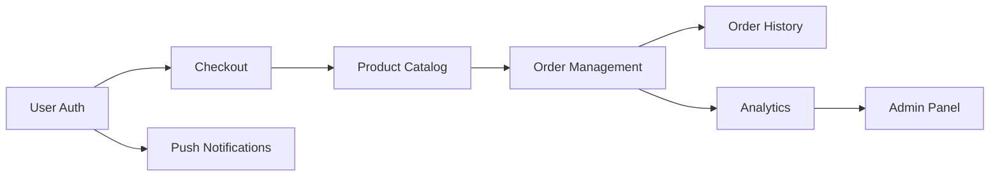

# Project Roadmap

> **Version:** 1.0.0
> **Last Updated:** YYMMDD
> **Total Phases:** 3

---

## Current Phase

**Phase 1: MVP Auth & Core** (Active)

---

## Phases Overview

| # | Phase | Status | Features | Progress |
|---|-------|--------|----------|----------|
| 1 | MVP Auth & Core | 🔵 Active | 3 | 60% |
| 2 | Payments & Commerce | ⚪ Planned | 2 | 0% |
| 3 | Scale & Polish | ⚪ Planned | 3 | 0% |

---

## Phase 1: MVP Auth & Core 🔵

**Goal:** Establish core user flows and authentication
**Exit Criteria:**
- [ ] All P0 features complete
- [ ] User can register, login, and manage profile
- [ ] Push notifications working

| Priority | Feature | Spec | Status | Dependencies |
|----------|---------|------|--------|--------------|
| P0 | User Authentication | 241220-user-authentication | ✅ Done | None |
| P0 | Checkout Flow | 241221-checkout-flow | 🔵 60% | User Auth |
| P0 | Push Notifications | 241222-push-notifications | 🔴 Blocked | User Auth |

---

## Phase 2: Payments & Commerce ⚪

**Goal:** Enable payment processing and product management
**Exit Criteria:**
- [ ] Payment gateway integrated
- [ ] Product catalog functional
- [ ] Orders can be placed

| Priority | Feature | Spec | Status | Dependencies |
|----------|---------|------|--------|--------------|
| P0 | Product Catalog | TBD | ⚪ Pending | Phase 1 |
| P0 | Order Management | TBD | ⚪ Pending | Product Catalog |

---

## Phase 3: Scale & Polish ⚪

**Goal:** Enhance UX and prepare for scale
**Exit Criteria:**
- [ ] Performance targets met
- [ ] Analytics integrated
- [ ] Admin dashboard functional

| Priority | Feature | Spec | Status | Dependencies |
|----------|---------|------|--------|--------------|
| P1 | Order History | TBD | ⚪ Pending | Phase 2 |
| P1 | Analytics Dashboard | TBD | ⚪ Pending | Phase 2 |
| P2 | Admin Panel | TBD | ⚪ Pending | Analytics |

---

## Dependency Graph

---

## Reorder Log

| Version | Date | Change | Reason |
|---------|------|--------|--------|
| 1.0.0 | YYMMDD | Initial roadmap | Project kickoff |

---

## Phase Transition Protocol

### To close current phase:
1. Verify all P0 features complete
2. All exit criteria checked
3. Run `/asdf:status` to confirm
4. Update phase status to ✅ Done
5. Advance "Current Phase" to next

### To reorder:
1. Run `/asdf:roadmap reorder [feature] [new-priority|phase]`
2. System validates dependencies
3. If safe, updates roadmap
4. If blocked, shows dependency conflicts
