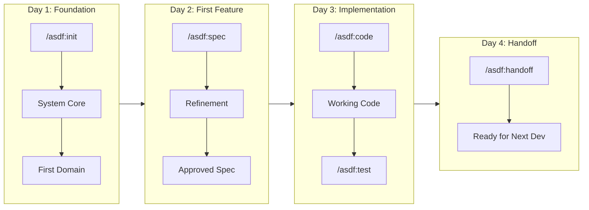

# Case Study 1: New Project (Greenfield)

**Scenario:** Starting a new e-commerce platform called "ShopFast" from scratch.

**Goal:** Go from idea to first working feature using ASDF methodology.

---

## Timeline Overview



---

## Phase 1: Project Initialization

### Step 1: Run `/asdf:init`

```
You: /asdf:init ShopFast
```

**AI Response:**
```
Initializing ASDF for: ShopFast

Do you have existing documents to reference?

Categories:
- Business — PRD, BRD, requirements
- Technical — API specs, architecture docs
- Data — ERD, schemas
- Design — Wireframes, mockups
- External — Third-party API docs

Provide file path(s) or type "no" to continue.
```

### Step 2: Provide References

```
You: docs/shopfast-prd.pdf, designs/wireframes.fig
```

**AI Response:**
```
Extracted from shopfast-prd.pdf:
- Project: E-commerce platform for small businesses
- Target users: SMB owners, consumers
- Core features: Product catalog, cart, checkout, payments
- Tech preference: Node.js, React, PostgreSQL

Extracted from wireframes.fig:
- 12 screens identified
- Design system: Tailwind-based
- Mobile-first approach

Any additional references? (type "no" to continue)
```

```
You: no
```

### Step 3: AI Generates System Core

**AI Response:**
```
Draft ShopFast system-core v1.0.0 ready for review.

Generated:
├── 01-system-core/
│   ├── 01-architecture/
│   │   ├── master-map.md (with mermaid diagram)
│   │   ├── tech-stack.md
│   │   ├── data-architecture.md (with ERD)
│   │   └── infrastructure.md
│   ├── 02-standards/
│   │   └── code-standards.md
│   ├── 03-design/
│   │   └── design-system.md
│   └── project-status.md

Please choose:
- Feedback — Type your changes
- Reference — Type `reference` to add source documents
- Confirm — Type `confirm` to finalize
```

### Step 4: Review and Confirm

```
You: The tech stack looks good, but we need Redis for caching. Also add Stripe for payments.
```

**AI Response:**
```
Updated to v1.1.0

Changes made:
- tech-stack.md: Added Redis for session/cache layer
- tech-stack.md: Added Stripe SDK for payments
- master-map.md: Updated architecture diagram with Redis + Stripe

Please choose:
- Feedback — Type your changes
- Reference — Type `reference` to add source documents
- Confirm — Type `confirm` to finalize
```

```
You: confirm
```

**AI Response:**
```
System Core Finalized

Project: ShopFast
Version: 1.1.0
Status: Approved
Location: astraler-docs/01-system-core/

Files created:
- master-map.md (architecture diagram)
- tech-stack.md (Node.js, React, PostgreSQL, Redis, Stripe)
- data-architecture.md (initial ERD)
- infrastructure.md (deployment topology)
- code-standards.md
- design-system.md
- project-status.md

Proceeding to CLAUDE.md setup...
```

### Step 5: CLAUDE.md Generation

**AI Response:**
```
Generating CLAUDE.md...

No existing CLAUDE.md found. Creating new file.

✓ CLAUDE.md created

Contents:
- Project name: ShopFast
- Agent: asdf-coder.md
- Commands: 17 ASDF commands
- Tech stack: Node.js, React, PostgreSQL, Redis, Stripe
- Domains: (pending creation)
- Critical rules: 4 items

ASDF Initialization Complete

Next steps:
1. Create domain specs: /asdf:spec [domain]
2. Or create first feature: /asdf:spec [feature-name]
```

> **Note:** CLAUDE.md is the entry point for Claude Code. It tells Claude this project uses ASDF methodology and provides the command reference.

---

## Phase 2: First Domain Spec

### Step 1: Create Product Domain

```
You: /asdf:spec products
```

**AI Response:**
```
Do you have existing documents to reference for the products domain?

Categories:
- Business — Product requirements, catalog structure
- Technical — Existing product APIs
- Data — Product schemas
- Design — Product page wireframes

Provide file path(s) or type "no" to continue.
```

```
You: The PRD section 3.2 covers products. Also designs/product-page.fig
```

**AI Response:**
```
Extracted from PRD section 3.2:
- Products have: name, description, price, images, variants
- Categories: hierarchical, up to 3 levels
- Inventory tracking required
- Search with filters

Extracted from product-page.fig:
- Product detail layout
- Image gallery component
- Variant selector UI

Draft Products domain spec v1.0.0 ready for review.

Sections:
- Overview: Product catalog management
- Entities: Product, Category, Variant, Inventory
- Business Rules: 5 rules defined
- API Contract: 8 endpoints
- ERD: Entity relationship diagram

Please choose:
- Feedback — Type your changes
- Reference — Type `reference` to add source documents
- Confirm — Type `confirm` to finalize
```

```
You: confirm
```

**AI Response:**
```
Domain Spec Finalized

Domain: products
Version: 1.0.0
Status: Approved
Location: astraler-docs/02-domains/products/domain.md

Next: Create feature specs that use this domain
Example: /asdf:spec product-listing
```

---

## Phase 3: First Feature Spec

### Step 1: Create Product Listing Feature

```
You: /asdf:spec product-listing
```

**AI Response:**
```
Do you have existing documents to reference?
...
```

```
You: no, use the products domain we just created
```

**AI Response:**
```
Loading context:
- 01-system-core/ (architecture, standards)
- 02-domains/products/ (entities, business rules)

Draft Product Listing feature spec v1.0.0 ready for review.

## Overview
Display paginated, filterable product catalog.

## User Flow
[Mermaid flowchart showing: Browse → Filter → Sort → View Details]

## Acceptance Criteria
- AC-001: User can view paginated product list (20 per page)
- AC-002: User can filter by category
- AC-003: User can sort by price, name, date
- AC-004: User can search by keyword

## API Contract
- GET /api/products (with query params)
- Response schema defined

## Dependencies
- Domain: products (required)

Please choose:
- Feedback — Type your changes
- Reference — Type `reference` to add source documents
- Confirm — Type `confirm` to finalize
```

```
You: Add AC-005 for mobile responsive grid. Also need infinite scroll option.
```

**AI Response:**
```
Updated to v1.1.0

Changes made:
- AC-005: Product grid is responsive (4 cols desktop, 2 cols mobile)
- AC-006: User can enable infinite scroll (optional, default pagination)
- Updated UI/UX section with responsive breakpoints
- Updated NFR: Page load <2s with lazy image loading

Please choose:
- Feedback — Type your changes
- Reference — Type `reference` to add source documents
- Confirm — Type `confirm` to finalize
```

```
You: confirm
```

**AI Response:**
```
Feature Spec Finalized

Feature: product-listing
Version: 1.1.0
Status: Approved
Location: astraler-docs/03-features/251224-product-listing/spec.md

Next: Implement with /asdf:code astraler-docs/03-features/251224-product-listing/
```

---

## Phase 4: Implementation

### Step 1: Run `/asdf:code`

```
You: /asdf:code astraler-docs/03-features/251224-product-listing/
```

**AI Response:**
```
EXECUTE MODE: Product Listing

Loading spec: 251224-product-listing v1.1.0
Status: Approved ✓

Dependency Check:
✓ Domain: products — Available

Impact Analysis:
No existing features affected (first feature)

Acquiring lock... ✓
Lock: 251224-product-listing.lock

Implementation Plan:
1. Create Product model (from domain spec)
2. Create ProductController with GET /api/products
3. Create ProductService with filtering/sorting
4. Create React ProductList component
5. Create React ProductCard component
6. Add pagination/infinite scroll logic

Proceeding with implementation...
```

### Step 2: Handle Deviation

During implementation, AI discovers an issue:

```
Deviation Detected

Spec says: Sort by "date" (AC-003)
Implementation needs: Sort by "createdAt" (database field name)
Reason: PostgreSQL convention uses createdAt timestamp

Options:
A) Update spec now — Minor clarification
B) Continue + sync later — Tracked deviation
C) Wait for decision — Blocking issue
```

```
You: A
```

**AI Response:**
```
Spec updated: AC-003 now reads "sort by createdAt"
Continuing implementation...
```

### Step 3: Implementation Complete

```
Implementation Complete

Feature: product-listing
Files created:
- backend/src/models/Product.ts
- backend/src/controllers/ProductController.ts
- backend/src/services/ProductService.ts
- frontend/src/components/ProductList.tsx
- frontend/src/components/ProductCard.tsx
- frontend/src/hooks/useProducts.ts

Acceptance Criteria Verification:
✓ AC-001: Pagination implemented (20 per page)
✓ AC-002: Category filter implemented
✓ AC-003: Sort by price, name, createdAt implemented
✓ AC-004: Keyword search implemented
✓ AC-005: Responsive grid (4/2 cols)
✓ AC-006: Infinite scroll option added

Lock released: 251224-product-listing.lock

Next: Run tests with /asdf:test product-listing
```

---

## Phase 5: Testing

```
You: /asdf:test product-listing
```

**AI Response:**
```
TEST MODE: Product Listing

Loading spec: 251224-product-listing v1.1.0

Test Matrix:

┌────────┬────────────┬─────────────┬────────────┐
│ AC     │ Unit       │ Integration │ E2E        │
├────────┼────────────┼─────────────┼────────────┤
│ AC-001 │ [x] P1     │ [x] P1      │ [ ]        │
│ AC-002 │ [x] P1     │ [x] P1      │ [ ]        │
│ AC-003 │ [x] P1     │ [x] P1      │ [ ]        │
│ AC-004 │ [x] P1     │ [x] P1      │ [ ]        │
│ AC-005 │ [ ]        │ [ ]         │ [x] P2     │
│ AC-006 │ [x] P1     │ [ ]         │ [ ]        │
└────────┴────────────┴─────────────┴────────────┘

Options:
- [skip-e2e] Generate Unit + Integration only (recommended)
- [yes] Generate all tests including E2E
- [feedback] Adjust test plan
```

```
You: skip-e2e
```

**AI Response:**
```
Test Generation Complete

Feature: product-listing
Tests Generated: 18 total

Files Created:
- __tests__/product-listing/ProductService.test.ts (8 tests)
- __tests__/product-listing/ProductController.integration.test.ts (6 tests)
- __tests__/product-listing/fixtures.ts

Next Steps:
1. Run tests: npm test -- --grep "product-listing"
2. Check coverage: npm run coverage
```

---

## Phase 6: Session Handoff

End of day, hand off to next developer:

```
You: /asdf:handoff
```

**AI Response:**
```
Session Handoff Created

## Session Summary

**Date:** 251224
**Duration:** ~4 hours
**Instance:** claude-abc123

### Completed
- [x] Project initialization (ShopFast)
- [x] System-core with architecture diagrams
- [x] Products domain spec
- [x] Product-listing feature spec (v1.1.0)
- [x] Product-listing implementation
- [x] Test suite generated (18 tests)

### In Progress
None

### Blockers
None

### Next Steps
1. Run test suite and fix any failures
2. Create next feature: /asdf:spec shopping-cart
3. Consider: user-auth feature before checkout

### Mental Context
- Using createdAt instead of date for sorting (spec updated)
- Infinite scroll is optional, pagination is default
- Mobile breakpoint at 768px

### Technical Context
- Products domain is foundation for cart/checkout
- Redis not yet configured (needed for cart sessions)

Saved to: astraler-docs/04-operations/session-handoff.md
```

---

## Summary

| Phase | Command | Output |
|-------|---------|--------|
| 1. Init | `/asdf:init ShopFast` | System-core structure + CLAUDE.md |
| 2. Domain | `/asdf:spec products` | Domain spec |
| 3. Feature | `/asdf:spec product-listing` | Feature spec v1.1.0 |
| 4. Code | `/asdf:code ...` | Working implementation |
| 5. Test | `/asdf:test product-listing` | 18 test cases |
| 6. Handoff | `/asdf:handoff` | Session notes |

**Total time:** ~4 hours from idea to working feature with tests.

---

## Key Takeaways

1. **Reference collection matters** — PRD and wireframes accelerated spec creation
2. **CLAUDE.md auto-generated** — Entry point for Claude Code created automatically
3. **Refinement loop** — 2 iterations refined the feature spec
4. **Deviation handling** — Option A kept spec and code aligned
5. **Test matrix** — Skipping E2E for non-critical features saves time
6. **Handoff** — Mental context helps next developer continue smoothly

---

## Next Steps After First Feature

| Task | Command | Purpose |
|------|---------|---------|
| Add more features | `/asdf:spec [name]` | Continue building |
| Monitor pipeline | `/asdf:guardian` | Track feature progress |
| Create PR | `/asdf:pr [feature] --push` | Push to GitHub |
| Weekly check | `/asdf:report all` | Project health |
| Check version | `/asdf:version` | Toolkit info |
