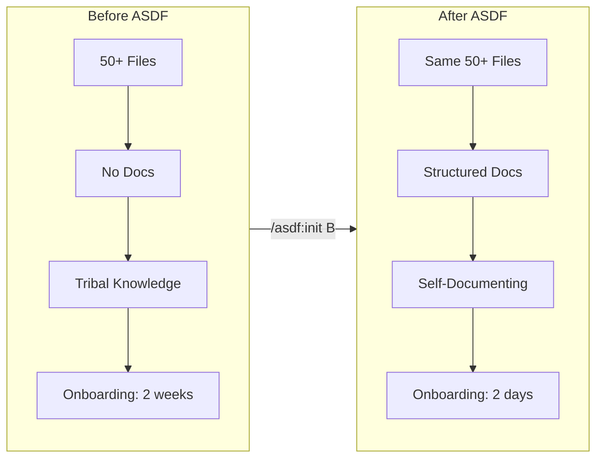
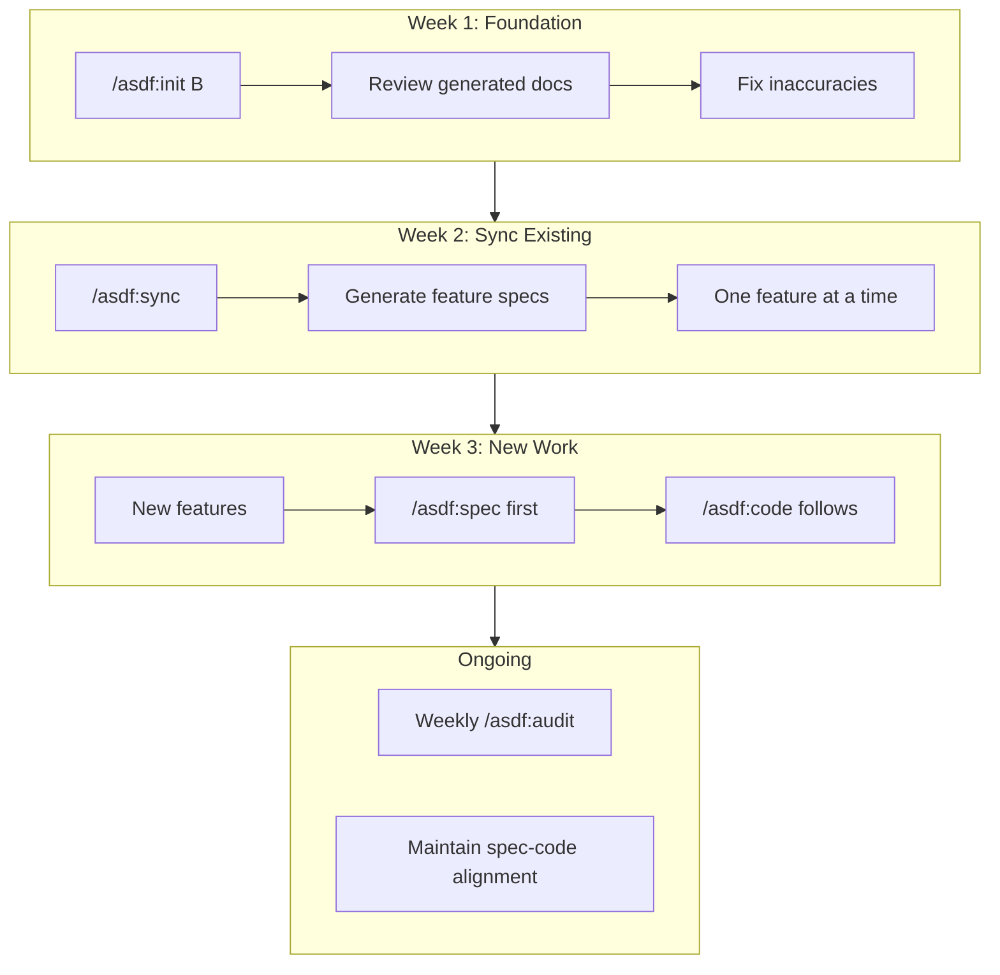

# Case Study 2: Existing Codebase (Brownfield)

**Scenario:** Adding ASDF to "TaskFlow" — an existing Node.js project with 50+ files and no documentation.

**Goal:** Retrofit ASDF methodology to bring order and documentation to undocumented code.

---

## Before & After



---

## Initial State

```
taskflow/
├── src/
│   ├── controllers/
│   │   ├── AuthController.js
│   │   ├── TaskController.js
│   │   ├── ProjectController.js
│   │   └── UserController.js
│   ├── models/
│   │   ├── User.js
│   │   ├── Task.js
│   │   ├── Project.js
│   │   └── Comment.js
│   ├── services/
│   │   ├── AuthService.js
│   │   ├── EmailService.js
│   │   └── NotificationService.js
│   ├── routes/
│   │   └── index.js
│   └── app.js
├── package.json
├── .env.example
└── (no documentation)
```

**Problems:**
- No architecture documentation
- No API documentation
- New developers take 2 weeks to understand the codebase
- Features added ad-hoc without specs
- Technical debt accumulating

---

## Phase 1: Initialize with Option B

### Step 1: Run `/asdf:init`

```
You: /asdf:init TaskFlow
```

**AI Response:**
```
Detected existing codebase in current directory.

Files found:
- 50+ source files
- package.json (Node.js project)
- No existing documentation folder

Please choose initialization mode:
- [A] New project — Start fresh, ignore existing code
- [B] Existing codebase — Scan code, generate docs from analysis
- [C] Requirements doc — Start from PRD/requirements file

Recommended: [B] for existing projects
```

```
You: B
```

### Step 2: AI Scans Codebase

**AI Response:**
```
Scanning codebase...

Discovered:
├── Tech Stack
│   ├── Runtime: Node.js (from package.json)
│   ├── Framework: Express.js
│   ├── Database: MongoDB (mongoose)
│   ├── Auth: JWT + bcrypt
│   └── Email: Nodemailer
│
├── Domains (inferred from models/)
│   ├── auth — User authentication, sessions
│   ├── tasks — Task management, assignments
│   ├── projects — Project organization
│   └── notifications — Email, in-app alerts
│
├── Features (inferred from controllers/)
│   ├── User registration/login
│   ├── Task CRUD
│   ├── Project management
│   ├── Task comments
│   └── Email notifications
│
└── API Endpoints (inferred from routes/)
    ├── POST /auth/login
    ├── POST /auth/register
    ├── GET/POST/PUT/DELETE /tasks
    ├── GET/POST/PUT/DELETE /projects
    └── ... (12 more endpoints)

Continue with documentation generation? (yes/feedback)
```

```
You: yes
```

### Step 3: AI Generates Initial Structure

**AI Response:**
```
Generating ASDF structure from code analysis...

Created:
├── astraler-docs/
│   ├── 01-system-core/
│   │   ├── 01-architecture/
│   │   │   ├── master-map.md (generated from code structure)
│   │   │   ├── tech-stack.md (from package.json)
│   │   │   └── data-architecture.md (from mongoose models)
│   │   ├── 02-standards/
│   │   │   └── code-standards.md (inferred patterns)
│   │   └── project-status.md
│   │
│   ├── 02-domains/
│   │   ├── auth/domain.md (from AuthService, User model)
│   │   ├── tasks/domain.md (from TaskController, Task model)
│   │   ├── projects/domain.md (from ProjectController, Project model)
│   │   └── notifications/domain.md (from NotificationService)
│   │
│   ├── 03-features/
│   │   └── (empty — features need manual spec creation)
│   │
│   └── 04-operations/
│       ├── implementation-active.md
│       └── session-handoff.md

Status: 70% complete (system-core + domains generated)

Gaps identified:
- Feature specs not generated (need manual creation or sync)
- Some business rules inferred but may need verification
- API documentation needs review

Please choose:
- Feedback — Adjust generated docs
- Confirm — Accept and continue
```

```
You: confirm
```

### Step 4: CLAUDE.md Generation

**AI Response:**
```
Generating CLAUDE.md...

Existing CLAUDE.md detected. Checking for ASDF configuration...
No ASDF markers found.

**CLAUDE.md Merge Preview**

Existing content detected:
- No agent configured
- No commands section
- Basic project description only

Will add (merged, not replaced):
- ASDF Framework section
- Agent reference: .claude/agents/asdf-coder.md
- Commands: 17 ASDF commands
- Documentation reference: astraler-docs/
- ASDF critical rules

Choose:
- [merge] Apply changes
- [view] Show full merged file
- [skip] Don't modify CLAUDE.md
```

```
You: merge
```

**AI Response:**
```
✓ CLAUDE.md updated (merged)

Added:
- ASDF Framework section
- Agent: asdf-coder.md
- Commands: 17 ASDF commands
- Documentation: astraler-docs/
- Critical rules: 4 items

Existing content preserved.

ASDF Initialization Complete
```

> **Note:** For brownfield projects, ASDF configuration is merged into existing CLAUDE.md without replacing custom content.

---

## Phase 2: Reconcile Generated Specs

### Step 1: Review Generated Domain Spec

The AI generated a domain spec, but it needs verification:

```
You: Show me the auth domain spec
```

**AI Response:**
```markdown
# Auth Domain

> **Version:** 1.0.0 (auto-generated)
> **Status:** Review
> **Generated from:** src/services/AuthService.js, src/models/User.js

## Entities

### User
| Field | Type | Constraints |
|-------|------|-------------|
| _id | ObjectId | Primary key |
| email | String | Unique, required |
| password | String | Hashed (bcrypt) |
| name | String | Required |
| role | String | enum: ['user', 'admin'] |
| createdAt | Date | Auto |

## Business Rules
- BR-001: Passwords hashed with bcrypt (10 rounds) [inferred]
- BR-002: JWT tokens expire in 24h [inferred from code]
- BR-003: Email must be unique [from model validation]

## API Endpoints (discovered)
| Method | Path | Description |
|--------|------|-------------|
| POST | /auth/register | Create new user |
| POST | /auth/login | Authenticate, return JWT |
| GET | /auth/me | Get current user |
| POST | /auth/refresh | Refresh token |

⚠️ REVIEW NEEDED: Some rules inferred from code patterns.
```

### Step 2: Provide Corrections

```
You: BR-002 is wrong - tokens expire in 7 days, not 24h. Also add BR-004: Password must be 8+ chars.
```

**AI Response:**
```
Updated auth domain to v1.1.0

Changes:
- BR-002: JWT tokens expire in 7 days
- BR-004: Password minimum 8 characters (added)
- Status: Review → Approved

Saved to: astraler-docs/02-domains/auth/domain.md
```

---

## Phase 3: Create Feature Specs from Code

### Step 1: Use `/asdf:sync` to Generate Feature Spec

```
You: /asdf:sync tasks
```

**AI Response:**
```
SYNC MODE: Tasks

Analyzing code:
- src/controllers/TaskController.js
- src/models/Task.js
- src/routes/index.js (task routes)

No existing spec found. Generate feature spec from code? (yes/no)
```

```
You: yes
```

**AI Response:**
```
Generated: 251224-task-management

## Task Management Feature

> **Version:** 1.0.0 (reverse-synced from code)
> **Status:** Implemented
> **Generated from:** TaskController.js, Task.js

### Acceptance Criteria (inferred)
- AC-001: User can create tasks with title, description, dueDate
- AC-002: User can assign tasks to other users
- AC-003: User can mark tasks complete
- AC-004: User can filter tasks by status, assignee
- AC-005: User can add comments to tasks

### API Contract (discovered)
| Method | Path | Description |
|--------|------|-------------|
| GET | /tasks | List tasks (with filters) |
| POST | /tasks | Create task |
| GET | /tasks/:id | Get task details |
| PUT | /tasks/:id | Update task |
| DELETE | /tasks/:id | Delete task |
| POST | /tasks/:id/comments | Add comment |

⚠️ This spec was generated from existing code.
Please review and confirm accuracy.

Options:
- [confirm] Accept generated spec
- [feedback] Make corrections
```

```
You: confirm
```

---

## Phase 4: Gradual Adoption Strategy

### Recommended Approach



### Priority Order

1. **Critical domains first** — Auth, core business logic
2. **Frequently changed features** — Areas with active development
3. **Undocumented APIs** — External-facing endpoints
4. **Legacy code last** — Stable, rarely touched code

---

## Phase 5: Verify Alignment

After syncing all features, run audit:

```
You: /asdf:audit
```

**AI Response:**
```
Spec Audit Report

Project: TaskFlow
Scan Date: 251224

Summary:
┌─────────────┬───────┬────────┐
│ Category    │ Count │ Status │
├─────────────┼───────┼────────┤
│ Outdated    │ 0     │ 🟢     │
│ Missing     │ 2     │ 🟡     │
│ Orphaned    │ 0     │ 🟢     │
└─────────────┴───────┴────────┘

Missing Specs:
| Code Location | Suggested Action |
|---------------|------------------|
| src/services/EmailService.js | Create notifications domain |
| src/middleware/rateLimit.js | Add to system-core/standards |

Options:
- [fix-all] Create missing specs
- [details] Show detailed analysis
- [cancel] Exit
```

```
You: fix-all
```

---

## Final State

```
taskflow/
├── src/
│   └── (existing 50+ files - unchanged)
│
└── astraler-docs/
    ├── 01-system-core/
    │   ├── 01-architecture/
    │   │   ├── master-map.md ✓
    │   │   ├── tech-stack.md ✓
    │   │   └── data-architecture.md ✓
    │   ├── 02-standards/
    │   │   └── code-standards.md ✓
    │   └── project-status.md ✓
    │
    ├── 02-domains/
    │   ├── auth/domain.md ✓
    │   ├── tasks/domain.md ✓
    │   ├── projects/domain.md ✓
    │   └── notifications/domain.md ✓
    │
    ├── 03-features/
    │   ├── 251224-user-auth/spec.md ✓
    │   ├── 251224-task-management/spec.md ✓
    │   ├── 251224-project-management/spec.md ✓
    │   └── 251224-task-comments/spec.md ✓
    │
    └── 04-operations/
        ├── implementation-active.md ✓
        └── session-handoff.md ✓
```

---

## Before vs After Metrics

| Metric | Before | After |
|--------|--------|-------|
| Documentation | None | Complete |
| Onboarding time | 2 weeks | 2 days |
| API documentation | None | 100% coverage |
| Architecture diagram | None | Mermaid diagrams |
| Feature tracking | Ad-hoc | Spec-driven |

---

## Key Takeaways

1. **Option B is powerful** — AI can infer structure from code
2. **CLAUDE.md merge** — ASDF config merged into existing CLAUDE.md without replacing content
3. **Review is essential** — Auto-generated specs need human verification
4. **Gradual adoption works** — Don't try to document everything at once
5. **Sync before spec** — For existing code, generate from reality first
6. **Audit regularly** — Keep code and specs aligned

---

## Common Brownfield Challenges

| Challenge | Solution |
|-----------|----------|
| Generated spec is wrong | Use feedback loop to correct |
| Code doesn't match any pattern | Create custom domain/feature spec manually |
| Legacy code nobody understands | Generate spec, mark as "needs review" |
| Mixed tech stacks | Document each separately in tech-stack.md |
| No tests exist | Use `/asdf:test` to generate test suites |

---

## Next Steps After Adoption

1. **New features** — Always `/asdf:spec` first
2. **Bug fixes** — Check spec, fix code, `/asdf:sync` if needed
3. **Refactoring** — Update spec first, then refactor
4. **Code reviews** — Reference specs in PR reviews
5. **Weekly audit** — Run `/asdf:audit` to catch drift
