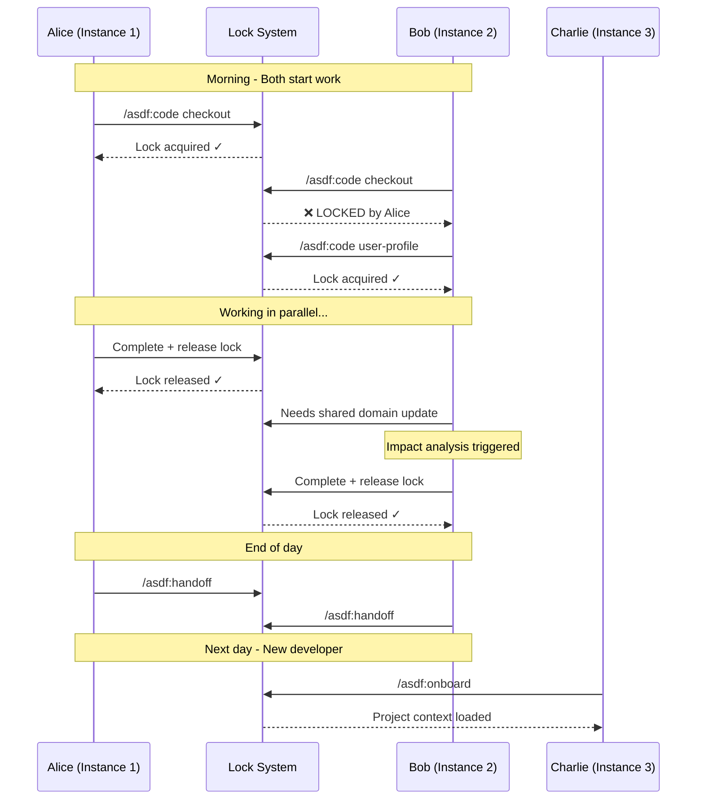

# Case Study 3: Team Collaboration

**Scenario:** 2 developers (Alice and Bob) using 2 Claude instances working on the same project simultaneously.

**Goal:** Demonstrate multi-instance coordination with locks, handoffs, and conflict resolution.

---

## Timeline Sequence



---

## Phase 1: Morning Standup

Both developers check the project status:

```
Alice: /asdf:onboard
```

**AI Response:**
```
Welcome to ShopFast!

## Project Overview
E-commerce platform | Phase 1 MVP

## Current Status
- Phase: 1 (MVP)
- Progress: 40% complete
- Features: 4/10 implemented

## Active Work
No features currently locked.

## How to Start
- Continue: /asdf:code [feature-path]
- New feature: /asdf:spec [name]
- Check roadmap: /asdf:roadmap

Ready to work? [status] [roadmap] [start]
```

```
Alice: I'll work on checkout today
Bob: I'll take user-profile
```

---

## Phase 2: Alice Starts Checkout

### Step 1: Acquire Lock

```
Alice: /asdf:code astraler-docs/03-features/251220-checkout/
```

**AI Response (Instance 1):**
```
EXECUTE MODE: Checkout

Loading spec: 251220-checkout v1.2.0
Status: Approved ✓

Dependency Check:
✓ Domain: cart — Implemented
✓ Domain: payments — Implemented
✓ Feature: shopping-cart — Implemented

Impact Analysis:
No breaking changes detected.

Acquiring lock...
✓ Lock acquired: 251220-checkout.lock
Instance: claude-alice-001
Task: Implementing FR-001 to FR-005

Proceeding with implementation...
```

Alice is now working on checkout with an exclusive lock.

---

## Phase 3: Bob Tries Same Feature

### Step 1: Lock Blocked

```
Bob: /asdf:code astraler-docs/03-features/251220-checkout/
```

**AI Response (Instance 2):**
```
🔒 FEATURE LOCKED

Feature: 251220-checkout
Locked by: claude-alice-001
Since: 251224 09:15
Working on: Implementing FR-001 to FR-005
Age: 12 minutes

Options:
- [wait] Check again in 5 minutes
- [force] Override lock (DANGER: may cause conflicts)
- [other] Work on different feature

What would you like to do?
```

```
Bob: other
```

### Step 2: Pick Different Feature

```
Bob: /asdf:code astraler-docs/03-features/251221-user-profile/
```

**AI Response (Instance 2):**
```
EXECUTE MODE: User Profile

Loading spec: 251221-user-profile v1.0.0
Status: Approved ✓

Dependency Check:
✓ Domain: auth — Implemented

Impact Analysis:
No breaking changes detected.

Acquiring lock...
✓ Lock acquired: 251221-user-profile.lock
Instance: claude-bob-002
Task: Implementing user profile feature

Proceeding with implementation...
```

Now both are working in parallel on different features.

---

## Phase 4: Parallel Work

### Current Lock State

```
04-operations/locks/
├── 251220-checkout.lock        # Alice
└── 251221-user-profile.lock    # Bob
```

### Alice's Progress

```
Alice is implementing:
- CheckoutController
- PaymentService integration
- Order confirmation flow
```

### Bob's Progress

```
Bob is implementing:
- ProfileController
- Avatar upload
- Account settings
```

---

## Phase 5: Alice Completes First

### Step 1: Implementation Done

```
Implementation Complete

Feature: 251220-checkout
Files created: 8
Tests: 12 generated

Acceptance Criteria Verification:
✓ AC-001: Guest checkout supported
✓ AC-002: Payment via Stripe
✓ AC-003: Order confirmation email
✓ AC-004: Receipt generation

Lock released: 251220-checkout.lock

Next: Run tests or start next feature
```

### Step 2: Alice Hands Off

```
Alice: /asdf:handoff
```

**AI Response:**
```
Session Handoff Created

## Session Summary
**Date:** 251224
**Instance:** claude-alice-001
**Duration:** 3 hours

### Completed
- [x] Checkout feature (251220-checkout) — DONE
- [x] 8 files created, 12 tests generated

### Technical Context
- Stripe webhook endpoint at /api/webhooks/stripe
- Order confirmation uses SendGrid template "order-confirm-v2"
- Guest checkout stores email in session, not User table

### Notes for Next Developer
- Payment retry logic not implemented (deferred to Phase 2)
- Consider rate limiting on checkout endpoint

Saved to: astraler-docs/04-operations/session-handoff.md
```

---

## Phase 6: Bob Needs Shared Update

### Step 1: Impact Analysis Triggered

Bob discovers he needs to update the shared `auth` domain:

```
Bob: I need to add "avatarUrl" to the User model
```

**AI Response:**
```
⚠️ IMPACT ANALYSIS

Change: Add avatarUrl to User entity (auth domain)

Breaking Changes Detected:

| Affected | Type | Impact | Severity |
|----------|------|--------|----------|
| 251220-checkout | Entity | User schema changed | LOW |
| 251222-notifications | Entity | User reference updated | LOW |

This change affects 2 other features.

Options:
- [review] Show detailed impact for each
- [proceed] Continue (update affected specs later)
- [abort] Cancel change

What would you like to do?
```

```
Bob: proceed
```

### Step 2: Update Domain with Lock

```
Acquiring spec lock for auth domain...
✓ Lock acquired: spec-locks/auth.lock

Updating auth domain to v1.2.0:
- Added: avatarUrl (String, optional) to User entity

Affected features flagged for sync:
- 251220-checkout (mark for review)
- 251222-notifications (mark for review)

Lock released: spec-locks/auth.lock
```

---

## Phase 7: Stale Lock Scenario

### Scenario: Alice's Instance Crashed

Next day, Charlie tries to work on checkout:

```
Charlie: /asdf:code astraler-docs/03-features/251220-checkout/
```

**AI Response:**
```
🔒 FEATURE LOCKED

Feature: 251220-checkout
Locked by: claude-alice-001
Since: 251224 09:15
Age: 18 hours ⚠️ STALE

This lock is older than 4 hours and may be abandoned.

Options:
- [wait] Check again in 5 minutes
- [force] Override lock (safe for stale locks)
- [other] Work on different feature

What would you like to do?
```

```
Charlie: force
```

**AI Response:**
```
Force override confirmed.

Logging to conflict-log.md:
| 251225 | 251220-checkout | claude-alice-001 | claude-charlie-003 | Stale lock (18h) |

Previous lock released.
New lock acquired: 251220-checkout.lock

⚠️ Check session-handoff.md for context from previous work.

Proceeding...
```

---

## Phase 8: Admin Unlock

### Alternative: Use `/asdf:unlock`

```
Charlie: /asdf:unlock 251220-checkout
```

**AI Response:**
```
Lock Found

| Field | Value |
|-------|-------|
| Lock | 251220-checkout |
| Type | Code |
| Locked by | claude-alice-001 |
| Since | 251224 09:15 |
| Age | 18 hours |
| Task | Implementing FR-001 to FR-005 |

Status: Stale (>4h) ✓

Options:
- [release] Force release this lock
- [cancel] Keep lock, exit
```

```
Charlie: release
```

**AI Response:**
```
Lock Released

Lock: 251220-checkout
Released: 251225 10:30
Logged to: conflict-log.md

⚠️ If the original instance is still active, they may encounter conflicts.
```

---

## Phase 9: End of Day Sync

Both developers run handoff:

### Bob's Handoff

```
Bob: /asdf:handoff
```

**AI Response:**
```
Session Handoff Created

## Session Summary
**Date:** 251224
**Instance:** claude-bob-002

### Completed
- [x] User profile feature (251221-user-profile) — DONE
- [x] Added avatarUrl to auth domain

### In Progress
None

### Impact Notes
- Auth domain updated to v1.2.0
- Checkout and notifications flagged for spec sync

### Technical Context
- Avatar uploads stored in S3 bucket "shopfast-avatars"
- Max file size: 5MB
- Supported formats: jpg, png, webp

Saved to: astraler-docs/04-operations/session-handoff.md
```

---

## Phase 10: Next Day Onboarding

### New Developer Joins

```
Dave: /asdf:onboard
```

**AI Response:**
```
Welcome to ShopFast!

## Project Overview
E-commerce platform for small businesses
Tech: Node.js, React, PostgreSQL, Stripe

## Current Status
- Phase: 1 (MVP)
- Progress: 60% complete
- Features: 6/10 implemented

## Recent Activity (from handoffs)
- 251224: Checkout feature completed (Alice)
- 251224: User profile completed (Bob)
- 251224: Auth domain updated (avatarUrl added)

## Active Work
| Feature | Status | Locked |
|---------|--------|--------|
| checkout | Implemented | No |
| user-profile | Implemented | No |
| notifications | In Progress | No |

## Pending Syncs
- 251220-checkout: Needs spec sync (auth domain changed)
- 251222-notifications: Needs spec sync (auth domain changed)

## How to Start
1. Fix pending syncs: /asdf:sync checkout
2. Continue next feature: /asdf:code notifications
3. Or start new: /asdf:spec [feature-name]

[status] [roadmap] [start]
```

---

## Lock File Examples

### Code Lock

```yaml
# 04-operations/locks/251220-checkout.lock
instance_id: claude-alice-001
locked_at: 2024-12-24T09:15:00Z
task: "Implementing FR-001 to FR-005"
estimated_duration: 2h
contact: "Session #42"
```

### Spec Lock

```yaml
# 04-operations/spec-locks/auth.lock
instance_id: claude-bob-002
locked_at: 2024-12-24T14:30:00Z
task: "Updating User entity"
operation: UPDATE
```

### Conflict Log

```markdown
# Conflict Log

| Date | Lock | Original Instance | Released By | Reason |
|------|------|-------------------|-------------|--------|
| 251225 | 251220-checkout | claude-alice-001 | claude-charlie-003 | Stale lock (18h) |
```

---

## Key Takeaways

1. **Locks prevent conflicts** — Only one instance per feature/spec
2. **Choose different work** — When blocked, pick another feature
3. **Stale locks are safe to override** — After 4 hours
4. **Impact analysis warns** — Before shared changes
5. **Handoffs preserve context** — Mental + technical notes
6. **Onboard catches you up** — Read recent handoffs automatically

---

## Best Practices for Teams

| Practice | Benefit |
|----------|---------|
| Small features | Shorter lock times |
| Frequent handoffs | Better context transfer |
| Check locks first | Avoid wasted work |
| Use `/asdf:onboard` daily | Stay updated |
| Document breaking changes | Help teammates |
| Review conflict log | Understand patterns |
