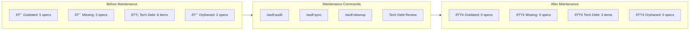
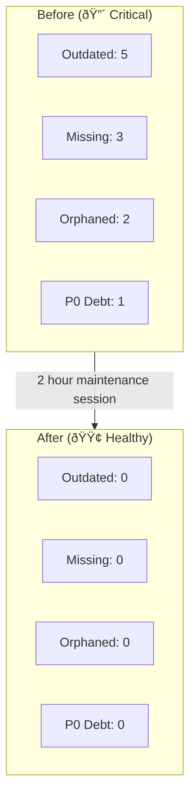

# Case Study 4: Maintenance Workflow

**Scenario:** ShopFast has been running for 3 months. Specs have drifted, tech debt accumulated, and project health is degraded.

**Goal:** Use maintenance commands to restore project health from red to green.

---

## Health Transformation



---

## Initial State: Project Health Check

### Step 1: Run `/asdf:report all`

```
You: /asdf:report all
```

**AI Response:**
```
PROJECT HEALTH REPORT: ShopFast

Generated: 251224
Phase: 2 (Growth)

## Overview
┌─────────────────┬───────┬────────┬───────â”
│ Indicator       │ Value │ Status │ Trend │
├─────────────────┼───────┼────────┼───────┤
│ Specs up-to-date│ 60%   │ 🔴     │ ↓     │
│ Missing specs   │ 3     │ 🔴     │ ↑     │
│ Orphaned specs  │ 2     │ 🔴     │ →     │
│ Tech debt       │ 8     │ 🟡     │ ↑     │
│ Test coverage   │ 65%   │ 🟡     │ →     │
│ Active blockers │ 1     │ 🟡     │ →     │
└─────────────────┴───────┴────────┴───────┘

Overall: 🔴 CRITICAL - Needs immediate attention

## Feature Status
| Feature | Progress | Last Updated | Status |
|---------|----------|--------------|--------|
| checkout | 100% | 60 days ago | âš ï¸ Stale |
| user-profile | 100% | 45 days ago | âš ï¸ Stale |
| notifications | 80% | 5 days ago | 🟢 Active |
| inventory | 100% | 90 days ago | 🔴 Very Stale |
| analytics | 30% | 30 days ago | 🟡 Aging |

## Recommendations
1. Run /asdf:audit for detailed issues
2. Sync 5 outdated specs
3. Clean up 2 orphaned specs
4. Address P0 tech debt items
```

---

## Phase 1: Detailed Audit

### Step 1: Run `/asdf:audit`

```
You: /asdf:audit
```

**AI Response:**
```
SPEC AUDIT REPORT

Scanning codebase vs documentation...

## Outdated Specs (5)
Code changed but spec not updated

| Spec | Last Spec Update | Code Changes | Gap |
|------|------------------|--------------|-----|
| 251220-checkout | 60 days | 12 commits | 🔴 |
| 251221-user-profile | 45 days | 8 commits | 🔴 |
| 251015-inventory | 90 days | 23 commits | 🔴 |
| auth domain | 30 days | 5 commits | 🟡 |
| payments domain | 40 days | 7 commits | 🟡 |

## Missing Specs (3)
Code exists but no spec

| Code Location | Type | Suggestion |
|---------------|------|------------|
| src/services/ReportService.js | Feature | Create 03-features/YYMMDD-reporting/ |
| src/controllers/WebhookController.js | Feature | Create 03-features/YYMMDD-webhooks/ |
| src/middleware/rateLimit.js | Standard | Add to 01-system-core/02-standards/ |

## Orphaned Specs (2)
Spec exists but code deleted

| Spec | Expected Code | Status |
|------|---------------|--------|
| 251101-legacy-auth | src/services/LegacyAuth.js | Deleted |
| 251105-temp-promotion | src/features/promotion/ | Deleted |

## Tech Debt Summary
- P0 (Critical): 1 item
- P1 (High): 3 items
- P2 (Medium): 4 items

Options:
- [fix-all] Address all issues (guided workflow)
- [fix-outdated] Sync outdated specs only
- [fix-missing] Create missing specs only
- [fix-orphaned] Clean up orphaned specs
- [details] Show detailed analysis
- [cancel] Exit
```

---

## Phase 2: Fix Outdated Specs

### Step 1: Sync Outdated Specs

```
You: fix-outdated
```

**AI Response:**
```
SYNC WORKFLOW: Outdated Specs

Starting with highest priority (oldest gap)...

---

## 1/5: 251015-inventory (90 days outdated)

Analyzing code changes...

Changes detected:
| File | Changes | Impact |
|------|---------|--------|
| InventoryService.js | +reserveStock(), +releaseStock() | New methods |
| Inventory.js model | +reservedQty field | Schema change |
| routes/inventory.js | +POST /reserve endpoint | New API |

Sync Preview:
- Add FR-008: Reserve stock for pending orders
- Add FR-009: Release stock on order cancel
- Update API contract with /reserve endpoint
- Update data model with reservedQty field

Options:
- [confirm] Apply sync, update spec to v1.3.0
- [feedback] Adjust sync preview
- [skip] Skip this spec, continue to next
```

```
You: confirm
```

**AI Response:**
```
✓ Synced 251015-inventory to v1.3.0

Changelog entry added:
- 251224: Reverse sync - Added stock reservation (FR-008, FR-009)

Continuing to next...

---

## 2/5: 251220-checkout (60 days outdated)
...
```

### Step 2: Complete All Syncs

After confirming all 5 syncs:

```
Outdated Specs: 5 → 0 ✓

All outdated specs have been synced.

Summary:
| Spec | Old Version | New Version |
|------|-------------|-------------|
| 251015-inventory | v1.2.0 | v1.3.0 |
| 251220-checkout | v1.2.0 | v1.4.0 |
| 251221-user-profile | v1.0.0 | v1.2.0 |
| auth domain | v1.1.0 | v1.2.0 |
| payments domain | v1.0.0 | v1.1.0 |

Next: Address missing specs? (yes/no)
```

---

## Phase 3: Create Missing Specs

### Step 1: Generate Missing Specs

```
You: yes
```

**AI Response:**
```
MISSING SPECS WORKFLOW

---

## 1/3: ReportService.js

Analyzing code to generate spec...

Discovered:
- Service: Report generation
- Methods: generateSalesReport(), generateInventoryReport()
- Output: PDF, CSV formats
- Schedule: Daily automated reports

Draft spec: 251224-reporting v1.0.0

| Section | Content |
|---------|---------|
| Overview | Automated report generation |
| FR-001 | Generate sales reports (daily) |
| FR-002 | Generate inventory reports (weekly) |
| FR-003 | Export to PDF/CSV |
| API | GET /reports/:type, POST /reports/schedule |

Options:
- [confirm] Create spec
- [feedback] Adjust draft
- [skip] Skip, create manually later
```

```
You: confirm
```

### Step 2: Complete All Missing

```
Missing Specs: 3 → 0 ✓

Created:
- 251224-reporting/spec.md (v1.0.0)
- 251224-webhooks/spec.md (v1.0.0)
- Updated code-standards.md with rate limiting docs

Next: Clean up orphaned specs? (yes/no)
```

---

## Phase 4: Clean Up Orphaned Specs

### Step 1: Review Orphaned Specs

```
You: yes
```

**AI Response:**
```
CLEANUP WORKFLOW: Orphaned Specs

---

## 1/2: 251101-legacy-auth

Spec: Authentication using legacy session system
Expected code: src/services/LegacyAuth.js
Status: Code deleted (migrated to JWT)

This spec is orphaned because:
- Legacy auth was replaced by JWT auth in commit abc123
- Code deleted 45 days ago
- No references in current codebase

Options:
- [archive] Move to 04-operations/archived/ (recommended)
- [delete] Permanently delete
- [keep] Keep spec (not recommended)
```

```
You: archive
```

**AI Response:**
```
Archived: 251101-legacy-auth

Created:
- 04-operations/archived/251101-legacy-auth/spec.md
- 04-operations/archived/251101-legacy-auth/tombstone.md

Tombstone contents:
| Field | Value |
|-------|-------|
| Archived | 251224 |
| Reason | Code deleted (migrated to JWT) |
| Replacement | 251220-user-auth |

Continuing to next...

---

## 2/2: 251105-temp-promotion
...
```

### Step 2: Cleanup Complete

```
Orphaned Specs: 2 → 0 ✓

Archived:
- 251101-legacy-auth → archived/251101-legacy-auth/
- 251105-temp-promotion → archived/251105-temp-promotion/

Cleanup log updated: 04-operations/cleanup-log.md
```

---

## Phase 5: Review Tech Debt

### Step 1: Open Tech Debt Register

```
You: Show me the tech debt register
```

**AI Response:**
```markdown
# Tech Debt Register

> **Last Updated:** 251224
> **Total Items:** 8
> **Critical (P0):** 1
> **High (P1):** 3
> **Medium (P2):** 4

---

## P0 - Critical

| ID | Description | Impact | Effort | Created |
|----|-------------|--------|--------|---------|
| TD-001 | No rate limiting on checkout API | Security risk | M | 251115 |

## P1 - High

| ID | Description | Impact | Effort | Created |
|----|-------------|--------|--------|---------|
| TD-002 | N+1 queries in product listing | 200ms latency | S | 251120 |
| TD-003 | No retry logic for Stripe payments | Payment failures | M | 251125 |
| TD-004 | Missing index on orders.userId | Slow queries | S | 251201 |

## P2 - Medium

| ID | Description | Impact | Effort | Created |
|----|-------------|--------|--------|---------|
| TD-005 | Deprecated bcrypt version | Future security | S | 251101 |
| TD-006 | No pagination on admin reports | Memory issues | M | 251110 |
| TD-007 | Hardcoded email templates | Maintenance | L | 251115 |
| TD-008 | Missing error boundaries in React | UX on errors | M | 251120 |
```

### Step 2: Address Critical Tech Debt

```
You: Let's fix TD-001 first - the rate limiting issue
```

**AI Response:**
```
TD-001: No rate limiting on checkout API

Impact: Security risk - API vulnerable to abuse
Effort: M (4-8 hours)

This was already documented during missing specs workflow.
Rate limiting patterns added to code-standards.md.

Implementation needed:
1. Add express-rate-limit middleware
2. Configure: 100 requests/15min for checkout
3. Return 429 Too Many Requests when exceeded

Would you like to:
- [spec] Create a tech-debt-fix spec
- [code] Implement directly (simple fix)
- [defer] Keep in backlog
```

```
You: code
```

**AI Response:**
```
Implementing rate limiting...

Files modified:
- src/middleware/rateLimit.js (created)
- src/routes/checkout.js (added middleware)
- src/app.js (global rate limit)

Rate limits configured:
| Endpoint | Limit | Window |
|----------|-------|--------|
| /api/checkout | 100 req | 15 min |
| /api/* (global) | 1000 req | 15 min |

Tests added:
- rateLimit.test.js (3 tests)

TD-001 resolved. Moving to "Resolved" section.

Updated tech-debt.md:
- P0 items: 1 → 0 ✓
- Total items: 8 → 7
```

---

## Phase 6: Final Health Check

### Step 1: Run Report Again

```
You: /asdf:report all
```

**AI Response:**
```
PROJECT HEALTH REPORT: ShopFast

Generated: 251224 (post-maintenance)
Phase: 2 (Growth)

## Overview
┌─────────────────┬───────┬────────┬───────â”
│ Indicator       │ Value │ Status │ Trend │
├─────────────────┼───────┼────────┼───────┤
│ Specs up-to-date│ 100%  │ 🟢     │ ↑     │
│ Missing specs   │ 0     │ 🟢     │ ↓     │
│ Orphaned specs  │ 0     │ 🟢     │ ↓     │
│ Tech debt       │ 7     │ 🟡     │ ↓     │
│ Test coverage   │ 68%   │ 🟡     │ ↑     │
│ Active blockers │ 0     │ 🟢     │ ↓     │
└─────────────────┴───────┴────────┴───────┘

Overall: 🟢 HEALTHY

## Improvements This Session
| Metric | Before | After | Change |
|--------|--------|-------|--------|
| Outdated specs | 5 | 0 | -5 ✓ |
| Missing specs | 3 | 0 | -3 ✓ |
| Orphaned specs | 2 | 0 | -2 ✓ |
| P0 tech debt | 1 | 0 | -1 ✓ |
| Total tech debt | 8 | 7 | -1 |

## Recommendations
1. Continue addressing P1 tech debt (3 items)
2. Increase test coverage to 80%
3. Schedule weekly /asdf:audit
```

---

## Maintenance Schedule

### Recommended Cadence

| Task | Frequency | Command |
|------|-----------|---------|
| Health check | Weekly | `/asdf:report all` |
| Spec audit | Weekly | `/asdf:audit` |
| Tech debt review | Bi-weekly | Review tech-debt.md |
| Full cleanup | Monthly | `/asdf:cleanup` |
| Orphan check | Monthly | Part of audit |

---

## Before vs After Summary



---

## Key Takeaways

1. **Audit first** — Understand the full picture before fixing
2. **Prioritize by risk** — P0 tech debt and security issues first
3. **Archive, don't delete** — Preserve history for orphaned specs
4. **Automate checks** — Weekly audit prevents drift
5. **Track progress** — Before/after metrics show value

---

## Maintenance Commands Summary

| Command | Purpose | When to Use |
|---------|---------|-------------|
| `/asdf:report all` | Project health dashboard | Weekly check |
| `/asdf:audit` | Detailed spec health analysis | Weekly or after sprints |
| `/asdf:sync` | Update specs from code | After implementations |
| `/asdf:cleanup` | Remove orphaned specs | Monthly or after migrations |
| Tech debt review | Prioritize and fix debt | Bi-weekly |
