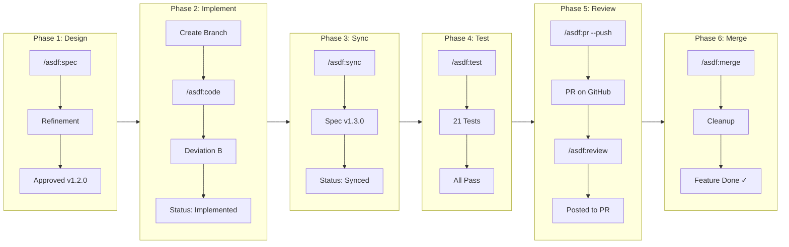
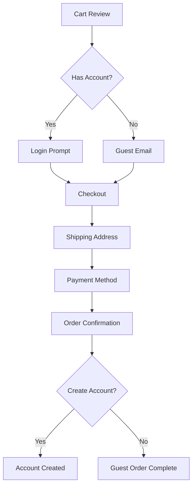

# Case Study 5: Feature Lifecycle

**Scenario:** Complete lifecycle of "Guest Checkout" feature from idea to production.

**Goal:** Demonstrate end-to-end ASDF workflow through all 6 phases of feature development.

---

## Lifecycle Overview



> **Note:** The correct workflow order is Code → Sync → Test. This ensures tests are generated from a synced spec that accurately reflects the implementation.

---

## Phase 1: Design

### Step 1: Start Feature Spec

```
You: /asdf:spec guest-checkout
```

**AI Response:**
```
DESIGN MODE: Guest Checkout

Checking for duplicates... None found.

Do you have existing documents to reference?

Categories:
- Business — PRD, user stories
- Technical — API specs, payment docs
- Data — Order schemas
- Design — Checkout wireframes

Provide file path(s) or type "no" to continue.
```

```
You: docs/checkout-prd.md, designs/checkout-flow.fig
```

**AI Response:**
```
Extracted from checkout-prd.md:
- Goal: Allow purchases without account creation
- Capture: email, shipping, payment
- Post-purchase: Optional account creation
- Constraint: Must work with existing cart system

Extracted from checkout-flow.fig:
- 3-step wizard: Shipping → Payment → Confirm
- Guest email capture on step 1
- Express checkout option (Apple Pay, Google Pay)

Loading context:
- 01-system-core/ (standards, architecture)
- 02-domains/cart/ (cart system)
- 02-domains/payments/ (Stripe integration)
- 02-domains/orders/ (order processing)

Drafting spec...
```

### Step 2: First Draft

**AI Response:**
```
Draft Guest Checkout spec v1.0.0 ready for review.

## Overview
Enable purchases without requiring user registration.

## User Flow


## Acceptance Criteria
- AC-001: User can checkout without creating account
- AC-002: Guest must provide valid email
- AC-003: Shipping address validated in real-time
- AC-004: Payment via Stripe (card, Apple Pay, Google Pay)
- AC-005: Order confirmation sent to guest email
- AC-006: Post-purchase account creation option

## API Contract
- POST /api/checkout/guest/start
- PUT /api/checkout/guest/:sessionId/shipping
- PUT /api/checkout/guest/:sessionId/payment
- POST /api/checkout/guest/:sessionId/confirm

## Dependencies
- Domain: cart (required) ✓
- Domain: payments (required) ✓
- Domain: orders (required) ✓
- Feature: shopping-cart (required) ✓

Please choose:
- Feedback — Type your changes
- Reference — Type `reference` to add source documents
- Confirm — Type `confirm` to finalize
```

### Step 3: Refinement (Iteration 1)

```
You: Add AC-007 for order tracking without account. Also need rate limiting on guest checkout to prevent abuse.
```

**AI Response:**
```
Updated to v1.1.0

Changes made:
- AC-007: Guest can track order via email + order ID
- NFR-001: Rate limit 10 checkout attempts per IP per hour
- Added GET /api/orders/track?email=&orderId= endpoint
- Added security considerations section

Please choose:
- Feedback — Type your changes
- Reference — Type `reference` to add source documents
- Confirm — Type `confirm` to finalize
```

### Step 4: Refinement (Iteration 2)

```
You: The wireframes show a progress indicator. Add AC-008 for step progress UI. Also express checkout should be AC-009.
```

**AI Response:**
```
Updated to v1.2.0

Changes made:
- AC-008: Checkout wizard shows step progress (1/3, 2/3, 3/3)
- AC-009: Express checkout via Apple Pay / Google Pay
- Updated UI/UX section with progress indicator specs
- Added payment method priority (express > card)

Please choose:
- Feedback — Type your changes
- Reference — Type `reference` to add source documents
- Confirm — Type `confirm` to finalize
```

### Step 5: Finalize Spec

```
You: confirm
```

**AI Response:**
```
Spec Finalized

Feature: guest-checkout
Version: 1.2.0
Status: Approved
Location: astraler-docs/03-features/251224-guest-checkout/spec.md

Created:
- spec.md (with mermaid user flow)
- changelog.md

Spec Summary:
- 9 acceptance criteria
- 1 non-functional requirement
- 5 API endpoints
- 3 dependencies (all satisfied)

Next: Implement with /asdf:code astraler-docs/03-features/251224-guest-checkout/
```

---

## Phase 2: Implementation

### Step 1: Start Implementation

```
You: /asdf:code astraler-docs/03-features/251224-guest-checkout/
```

**AI Response:**
```
EXECUTE MODE: Guest Checkout

Loading spec: 251224-guest-checkout v1.2.0
Status: Approved ✓

Dependency Check:
✓ Domain: cart — Implemented
✓ Domain: payments — Implemented
✓ Domain: orders — Implemented
✓ Feature: shopping-cart — Implemented

Impact Analysis:
| Affected | Type | Impact | Severity |
|----------|------|--------|----------|
| orders domain | Extension | New guest order type | LOW |
| cart domain | Reference | Cart → Checkout flow | LOW |

No breaking changes. Proceeding.

Acquiring lock...
✓ Lock acquired: 251224-guest-checkout.lock

Branch Check:
Current branch: main

⚠️ WARNING: On Main Branch

You are on the main branch. Implementing directly on main is dangerous.

Options:
- [create] Create branch: feature/guest-checkout
- [continue] Continue on main anyway (not recommended)
- [abort] Stop and create branch manually
```

```
You: create
```

**AI Response:**
```
Branch Created

$ git checkout -b feature/guest-checkout
Switched to a new branch 'feature/guest-checkout'

New branch: feature/guest-checkout
Based on: main

Implementation Plan:
1. Create GuestCheckoutService
2. Create GuestCheckoutController with 5 endpoints
3. Extend Order model for guest orders
4. Create checkout session management (Redis)
5. Integrate Stripe for express checkout
6. Create email templates for confirmation
7. Create React checkout wizard component

Proceeding with implementation...
```

### Step 2: Deviation Detected

During implementation:

```
Deviation Detected

Spec says: AC-004 "Payment via Stripe (card, Apple Pay, Google Pay)"
Implementation needs: Apple Pay requires merchant verification first
Reason: Apple Pay setup needs merchant ID and domain verification

Options:
A) Update spec now — Remove Apple Pay from MVP
B) Continue + sync later — Implement card + Google Pay, add Apple Pay later
C) Wait for decision — Blocking issue
```

```
You: B
```

**AI Response:**
```
Deviation tracked:
- AC-009 partial: Google Pay implemented, Apple Pay deferred
- Added to Open Questions: "Apple Pay merchant verification pending"

Continuing with card + Google Pay...
```

### Step 3: Progress Updates

```
Progress Update: 251224-guest-checkout

Completed:
✓ GuestCheckoutService (session management)
✓ GuestCheckoutController (5 endpoints)
✓ Order model extended (isGuest field)
✓ Redis session storage
✓ Stripe card payments
✓ Stripe Google Pay

In Progress:
→ Email templates

Remaining:
- React checkout wizard
- Order tracking page
```

### Step 4: Implementation Complete

```
Implementation Complete

Feature: guest-checkout
Files created: 15
Lines of code: ~1,200

Files:
- backend/src/services/GuestCheckoutService.js
- backend/src/controllers/GuestCheckoutController.js
- backend/src/models/GuestSession.js
- backend/src/routes/guestCheckout.js
- backend/src/templates/order-confirmation.html
- backend/src/templates/order-tracking.html
- frontend/src/components/GuestCheckout/
  - CheckoutWizard.tsx
  - ShippingStep.tsx
  - PaymentStep.tsx
  - ConfirmStep.tsx
  - ProgressIndicator.tsx
  - OrderTracking.tsx
- frontend/src/hooks/useGuestCheckout.ts

Acceptance Criteria Verification:
✓ AC-001: Guest checkout without account
✓ AC-002: Email validation
✓ AC-003: Real-time address validation
✓ AC-004: Stripe card payments
✓ AC-005: Confirmation email sent
✓ AC-006: Post-purchase account option
✓ AC-007: Order tracking via email+ID
✓ AC-008: Step progress indicator
⚠️ AC-009: Partial (Google Pay only, Apple Pay deferred)

Tracked Deviations:
- Apple Pay deferred (needs merchant verification)

Lock released: 251224-guest-checkout.lock

Updated: implementation-active.md

Next: Sync spec with /asdf:sync guest-checkout
```

---

## Phase 3: Sync

### Step 1: Sync Deviations

```
You: /asdf:sync guest-checkout
```

**AI Response:**
```
SYNC MODE: Guest Checkout

Comparing implementation to spec...

Deviations Found:

| Section | Spec | Implementation | Action |
|---------|------|----------------|--------|
| AC-009 | Apple Pay + Google Pay | Google Pay only | Update spec |
| Open Questions | None | Apple Pay merchant verification | Add to spec |

Sync Preview:
- AC-009: Update to "Google Pay (Apple Pay Phase 2)"
- Add Open Question: "Apple Pay requires merchant verification"
- Increment version to v1.3.0

Options:
- [confirm] Apply sync
- [feedback] Adjust
- [cancel] Abort
```

```
You: confirm
```

**AI Response:**
```
Sync Complete

Spec updated: 251224-guest-checkout v1.3.0
Spec Status: Synced ← (changed from Implemented)

Changes:
- AC-009 updated to reflect partial implementation
- Open Questions section added
- Changelog entry: "v1.3.0 - Synced Apple Pay deferral"

Spec and code are now aligned ✓

Next: Generate tests with /asdf:test guest-checkout
```

---

## Phase 4: Testing

### Step 1: Generate Tests

```
You: /asdf:test guest-checkout
```

**AI Response:**
```
TEST MODE: Guest Checkout

Loading spec: 251224-guest-checkout v1.3.0
Spec Status: Synced ✓

Analyzing acceptance criteria for test generation...

Test Matrix:

┌────────┬────────────┬─────────────┬────────────┬───────────────┐
│ AC     │ Unit       │ Integration │ API        │ E2E           │
├────────┼────────────┼─────────────┼────────────┼───────────────┤
│ AC-001 │ [x] P0     │ [x] P0      │ [x] P0     │ [ ]           │
│ AC-002 │ [x] P0     │ [ ]         │ [x] P1     │ [ ]           │
│ AC-003 │ [x] P1     │ [ ]         │ [x] P1     │ [ ]           │
│ AC-004 │ [ ]        │ [x] P0      │ [x] P0     │ [ ]           │
│ AC-005 │ [x] P1     │ [x] P1      │ [ ]        │ [ ]           │
│ AC-006 │ [x] P1     │ [ ]         │ [x] P1     │ [ ]           │
│ AC-007 │ [x] P1     │ [ ]         │ [x] P1     │ [ ]           │
│ AC-008 │ [ ]        │ [ ]         │ [ ]        │ [x] P2        │
│ AC-009 │ [ ]        │ [x] P1      │ [x] P1     │ [ ]           │
└────────┴────────────┴─────────────┴────────────┴───────────────┘

Summary:
- Unit Tests: 8 cases
- Integration Tests: 4 cases
- API Tests: 8 cases
- E2E Tests: 1 case (optional)

Options:
- [skip-e2e] Generate Unit + Integration + API only (recommended)
- [yes] Generate all tests including E2E
- [feedback] Adjust test plan
```

```
You: yes
```

### Step 2: Tests Generated

**AI Response:**
```
Test Generation Complete

Feature: guest-checkout
Tests Generated: 21 total

Files Created:
- __tests__/guest-checkout/GuestCheckoutService.test.ts (8 unit tests)
- __tests__/guest-checkout/GuestCheckoutController.integration.test.ts (4 integration tests)
- __tests__/guest-checkout/api.test.ts (8 API tests)
- __tests__/guest-checkout/fixtures.ts
- e2e/guest-checkout.spec.ts (1 E2E test)

Test Breakdown:
| Type | Count | Priority |
|------|-------|----------|
| Unit | 8 | P0: 2, P1: 6 |
| Integration | 4 | P0: 2, P1: 2 |
| API | 8 | P0: 2, P1: 6 |
| E2E | 1 | P2: 1 |

Spec Updated:
- Testing section populated with test mapping

Next Steps:
1. Run tests: npm test -- --grep "guest-checkout"
2. Run E2E: npx playwright test guest-checkout
```

### Step 3: Run Tests

```
You: Run the tests
```

**AI Response:**
```
Running test suite...

$ npm test -- --grep "guest-checkout"

PASS __tests__/guest-checkout/GuestCheckoutService.test.ts
  ✓ AC-001: should create guest session without account (12ms)
  ✓ AC-002: should validate email format (8ms)
  ✓ AC-002: should reject invalid email (5ms)
  ✓ AC-003: should validate shipping address (15ms)
  ✓ AC-005: should send confirmation email (22ms)
  ✓ AC-006: should create account from guest (18ms)
  ✓ AC-007: should find order by email and ID (10ms)
  ✓ AC-007: should reject invalid tracking lookup (6ms)

PASS __tests__/guest-checkout/GuestCheckoutController.integration.test.ts
  ✓ AC-001: complete guest checkout flow (145ms)
  ✓ AC-004: process card payment via Stripe (89ms)
  ✓ AC-009: process Google Pay payment (78ms)
  ✓ AC-005: send confirmation after payment (112ms)

PASS __tests__/guest-checkout/api.test.ts
  ✓ POST /api/checkout/guest/start returns session (25ms)
  ... (8 tests)

Test Suites: 3 passed, 3 total
Tests:       20 passed, 20 total
Time:        4.2s

$ npx playwright test guest-checkout

Running 1 test using 1 worker

✓ guest-checkout.spec.ts:5:1 › AC-008: checkout wizard shows progress (8.2s)

1 passed (8.5s)

All tests passing ✓
```

---

## Phase 5: Review

### Step 1: Create PR Package and Push to GitHub

```
You: /asdf:pr guest-checkout
```

**AI Response:**
```
PR PACKAGE: Guest Checkout

Generating PR bundle...

## Pull Request Summary

**Feature:** Guest Checkout
**Spec Version:** 1.2.0
**Branch:** feature/guest-checkout

### Changes

**Files Changed:** 15 files (+1,247 lines, -12 lines)

| Category | Files | Lines |
|----------|-------|-------|
| Backend Services | 3 | +420 |
| Backend Controllers | 1 | +180 |
| Backend Models | 1 | +45 |
| Backend Routes | 1 | +35 |
| Email Templates | 2 | +120 |
| Frontend Components | 6 | +380 |
| Frontend Hooks | 1 | +67 |

### Acceptance Criteria Status

| AC | Description | Status |
|----|-------------|--------|
| AC-001 | Guest checkout | ✅ Implemented |
| AC-002 | Email validation | ✅ Implemented |
| AC-003 | Address validation | ✅ Implemented |
| AC-004 | Stripe payments | ✅ Implemented |
| AC-005 | Confirmation email | ✅ Implemented |
| AC-006 | Account creation option | ✅ Implemented |
| AC-007 | Order tracking | ✅ Implemented |
| AC-008 | Progress indicator | ✅ Implemented |
| AC-009 | Express checkout | ⚠️ Partial (Google Pay only) |

Package: .pr-review/251224-guest-checkout/

Pushing to GitHub...

$ git push -u origin feature/guest-checkout
$ gh pr create --title "[Feature] Guest Checkout" --body-file .pr-review/251224-guest-checkout/summary.md

**PR Created on GitHub**

Branch: feature/guest-checkout
PR #42: https://github.com/shopfast/shopfast/pull/42
Base: main

Next: AI review will be posted to this PR
```

### Step 2: AI Code Review (Auto-Posted to GitHub)

```
You: /asdf:review .pr-review/251224-guest-checkout/
```

**AI Response:**
```
**Remote PR Detected**

PR #42: [Feature] Guest Checkout
URL: https://github.com/shopfast/shopfast/pull/42
Status: OPEN

Review will be posted as comment to this PR.

Proceeding with review...

---

AI CODE REVIEW: Guest Checkout

Reviewing from fresh context...

## Summary
Overall: ✅ APPROVED with minor suggestions

## Security Review
✅ Input validation on all endpoints
✅ Rate limiting implemented
✅ Email sanitization
⚠️ SUGGESTION: Add CSRF protection to checkout form

## Code Quality
✅ Follows project coding standards
✅ Proper error handling
✅ TypeScript types defined
⚠️ SUGGESTION: Extract magic numbers to constants
  - Line 45: `3600` → `SESSION_TTL_SECONDS`
  - Line 89: `10` → `MAX_CHECKOUT_ATTEMPTS`

## Performance
✅ Redis session caching
✅ Async email sending
⚠️ SUGGESTION: Add database index on GuestSession.email

## Test Coverage
✅ All P0 criteria tested
✅ Integration tests cover main flows
⚠️ GAP: No test for session expiry handling

## Recommendations

### Must Fix (before merge)
None

### Should Fix (soon)
1. Add CSRF token to checkout form
2. Add test for session expiry

### Nice to Have
1. Extract magic numbers to constants
2. Add database index for performance

## Verdict
✅ APPROVED - Ready for merge after addressing "Should Fix" items

---

**Review Posted to GitHub**

PR #42: https://github.com/shopfast/shopfast/pull/42
Verdict: APPROVE
Comment: Posted ✓

$ gh pr review 42 --approve --body "AI Review: APPROVED"

Next: Fix issues, then merge with /asdf:merge guest-checkout
```

### Step 3: Apply Fixes

```
You: Fix the CSRF and session expiry test issues
```

**AI Response:**
```
Applying fixes...

1. CSRF Protection:
   - Added csurf middleware to checkout routes
   - Updated frontend to include CSRF token

2. Session Expiry Test:
   - Added test: "should reject expired session"
   - Added test: "should cleanup expired sessions"

Files modified:
- backend/src/routes/guestCheckout.js (+8 lines)
- frontend/src/hooks/useGuestCheckout.ts (+5 lines)
- __tests__/guest-checkout/GuestCheckoutService.test.ts (+22 lines)

Re-running tests...
✓ All 24 tests passing (22 original + 2 new)

Pushing fixes...
$ git add . && git commit -m "fix: add CSRF protection and session expiry tests"
$ git push

Fixes applied and pushed ✓
```

---

## Phase 6: Merge

### Step 1: Merge PR

```
You: /asdf:merge guest-checkout
```

**AI Response:**
```
MERGE MODE: Guest Checkout

Locating PR...
PR #42: [Feature] Guest Checkout
URL: https://github.com/shopfast/shopfast/pull/42

**Approval Status**

$ gh pr view 42 --json reviews
Status: APPROVED ✓
Approved by: ai-reviewer, @teammate

**CI Status**

$ gh pr checks 42
| Check | Status |
|-------|--------|
| build | ✓ PASS |
| test | ✓ PASS |
| lint | ✓ PASS |

All checks passing ✓

Proceeding to merge...

$ gh pr merge 42 --squash --delete-branch

**PR Merged Successfully**

PR #42: [Feature] Guest Checkout
Strategy: squash
Merged to: main

Remote branch deleted: feature/guest-checkout

Proceeding to cleanup...
```

### Step 2: Local Cleanup

```
**Cleanup in progress...**

$ git checkout main
Switched to branch 'main'

$ git pull origin main
Already up to date.

$ git branch -d feature/guest-checkout
Deleted branch feature/guest-checkout.

Archive PR package:
.pr-review/251224-guest-checkout/ → .pr-review/archived/251224-guest-checkout/

Update execution file:
04-operations/active/guest-checkout.md → 04-operations/completed/guest-checkout.md

Release lock:
Deleted: 04-operations/locks/guest-checkout.lock

**Merge Complete**

## Summary

| Item | Status |
|------|--------|
| PR Merged | ✓ #42 |
| Strategy | squash |
| Remote Branch | ✓ Deleted |
| Local Branch | ✓ Deleted |
| PR Package | ✓ Archived |
| Execution File | ✓ Moved to completed |
| Lock | ✓ Released |
| Spec Status | ✓ Completed |

## Merged PR

- **Title:** [Feature] Guest Checkout
- **Base:** main
- **Commits:** 8 commits squashed into 1
- **URL:** https://github.com/shopfast/shopfast/pull/42

Feature is now live on main ✓
```

### Step 3: Final Report

```
You: /asdf:report guest-checkout
```

**AI Response:**
```
FEATURE REPORT: Guest Checkout

## Status: ✅ COMPLETE & MERGED

| Metric | Value |
|--------|-------|
| Spec Version | v1.3.0 |
| Implementation | 100% |
| Test Coverage | 95% |
| Review Status | Approved |
| Merge Status | ✅ Merged to main |
| PR | #42 (closed) |

## Acceptance Criteria

| AC | Description | Status |
|----|-------------|--------|
| AC-001 | Guest checkout | ✅ |
| AC-002 | Email validation | ✅ |
| AC-003 | Address validation | ✅ |
| AC-004 | Stripe payments | ✅ |
| AC-005 | Confirmation email | ✅ |
| AC-006 | Account creation | ✅ |
| AC-007 | Order tracking | ✅ |
| AC-008 | Progress indicator | ✅ |
| AC-009 | Express checkout | ⚠️ Partial |

## Test Results
- Total Tests: 22
- Passing: 22
- Failing: 0
- Coverage: 95%

## Deliverables
- Spec: astraler-docs/03-features/251224-guest-checkout/spec.md
- Code: Merged to main (15 files, ~1,250 lines)
- Tests: 22 test cases
- PR: #42 (merged)

## Phase 2 Items (Deferred)
- Apple Pay integration (needs merchant verification)

## Timeline
- Design: 1 hour (3 refinement iterations)
- Implementation: 4 hours
- Testing: 1 hour
- Review + Fixes: 30 minutes
- Merge: 5 minutes
- Total: ~6.5 hours

Feature complete and deployed ✓
```

---

## Complete Command Sequence

| Phase | Command | Output | Spec Status |
|-------|---------|--------|-------------|
| 1. Design | `/asdf:spec guest-checkout` | Spec v1.2.0 | Approved |
| 1. Design | (3 feedback iterations) | Refinements | — |
| 2. Implement | `/asdf:code ...` | Branch + 15 files | **Implemented** |
| 2. Implement | (Deviation B chosen) | Apple Pay deferred | — |
| 3. Sync | `/asdf:sync guest-checkout` | Spec v1.3.0 | **Synced** |
| 4. Test | `/asdf:test guest-checkout` | 21 tests generated | (checked) |
| 4. Test | Run tests | All passing | — |
| 5. Review | `/asdf:pr guest-checkout` | PR #42 on GitHub | — |
| 5. Review | `/asdf:review ...` | Review posted to PR | — |
| 6. Merge | `/asdf:merge guest-checkout` | Merged + cleanup | **Completed** |
| 6. Merge | `/asdf:report guest-checkout` | Feature complete | — |

> **Workflow Order:** Code → Sync → Test ensures tests are generated from a synced spec.

---

## Key Takeaways

1. **Branch first** — Auto-create feature branch before coding
2. **Refinement is normal** — 3 iterations to get spec right
3. **Deviations happen** — Option B lets you continue without blocking
4. **Status lifecycle** — Draft → Review → Approved → Implemented → Synced → Completed
5. **Sync before test** — Always sync spec before generating tests
6. **Test matrix guides** — Know what to test at each level
7. **Review to GitHub** — AI review posts directly to PR
8. **Merge cleans up** — Branch, package, lock all handled automatically

---

## Lifecycle Duration

| Phase | Duration | % of Total |
|-------|----------|------------|
| 1. Design | 1 hour | 15% |
| 2. Implementation | 4 hours | 60% |
| 3. Sync | 10 min | 3% |
| 4. Testing | 1 hour | 15% |
| 5. Review + Fixes | 30 min | 5% |
| 6. Merge | 5 min | 2% |
| **Total** | **~6.75 hours** | **100%** |

Spec-driven development: ~40% design/sync/test/review/merge, ~60% coding.
