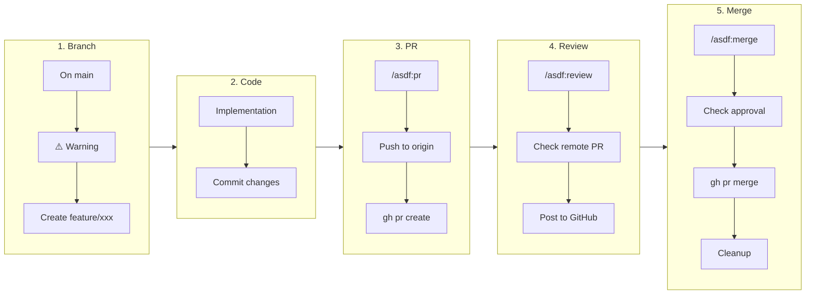
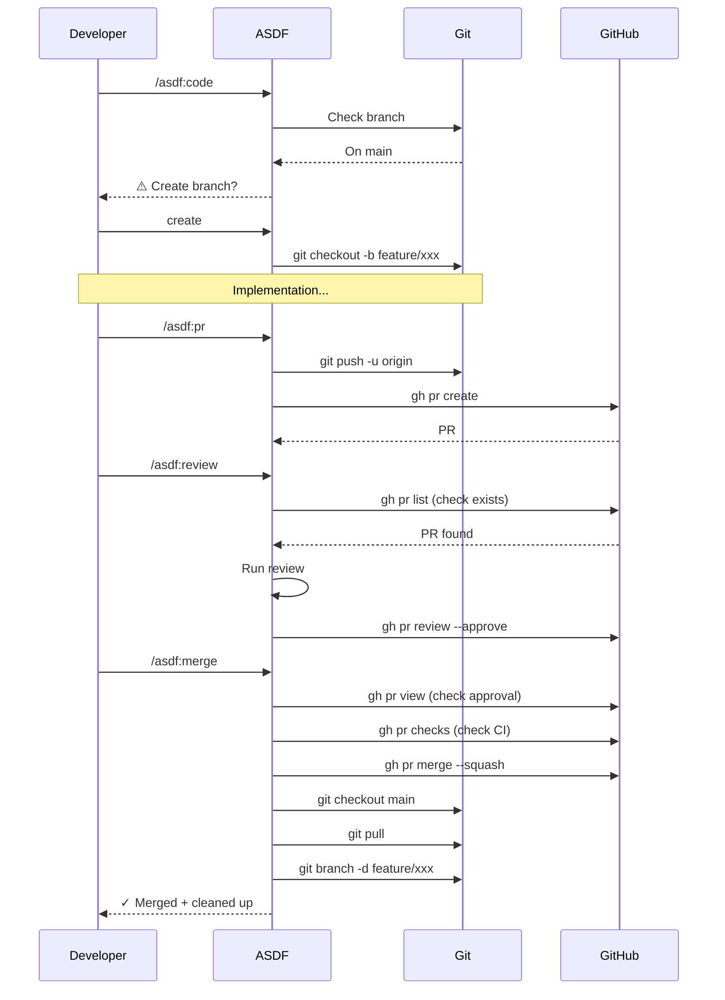

# Case Study 6: Git Workflow

**Scenario:** Complete PR lifecycle from branch creation to merge with automatic GitHub integration.

**Goal:** Demonstrate the v4.2 Git workflow features: branching, PR creation, AI review posting, and merge with cleanup.

---

## Git Workflow Overview



---

## Phase 1: Branch Creation

### Starting on Main Branch

When you start `/asdf:code` while on the main branch:

```
You: /asdf:code astraler-docs/03-features/251226-payment-retry/
```

**AI Response:**
```
EXECUTE MODE: Payment Retry

Loading spec: 251226-payment-retry v1.0.0
Status: Approved ✓

Acquiring lock...
✓ Lock acquired: 251226-payment-retry.lock

Branch Check:
Current branch: main

⚠️ WARNING: On Main Branch

You are on the main branch. Implementing directly on main is dangerous.

Recommended: Create a feature branch first.

Branch name suggestion: feature/payment-retry

Options:
- [create] Create branch and switch: git checkout -b feature/payment-retry
- [continue] Continue on main anyway (not recommended)
- [abort] Stop and create branch manually

What would you like to do?
```

### Creating the Branch

```
You: create
```

**AI Response:**
```
Branch Created

$ git checkout -b feature/payment-retry
Switched to a new branch 'feature/payment-retry'

New branch: feature/payment-retry
Based on: main

Proceeding to implementation...
```

---

## Phase 2: Implementation

After completing implementation:

```
Implementation Complete

Feature: payment-retry
Files created: 6
Lines of code: ~450

Files:
- backend/src/services/PaymentRetryService.js
- backend/src/jobs/retryPayment.job.js
- backend/src/config/retry.config.js
- backend/tests/paymentRetry.test.js
- frontend/src/components/PaymentStatus.tsx
- frontend/src/hooks/usePaymentStatus.ts

Lock released: 251226-payment-retry.lock

Next: Create PR with /asdf:pr payment-retry
```

---

## Phase 3: Create PR and Push

### Default: Push to GitHub

```
You: /asdf:pr payment-retry
```

**AI Response:**
```
PR PACKAGE: Payment Retry

Generating PR bundle...

**Package Created:** .pr-review/251226-payment-retry/

**Files Changed:** 6 files (+452 lines)

| Category | Files | Lines |
|----------|-------|-------|
| Backend Services | 2 | +280 |
| Backend Config | 1 | +45 |
| Backend Tests | 1 | +67 |
| Frontend | 2 | +60 |

Pushing to GitHub...

$ git push -u origin feature/payment-retry
Enumerating objects: 12, done.
Counting objects: 100% (12/12), done.
Writing objects: 100% (8/8), 3.2 KiB | 3.2 MiB/s, done.
To github.com:shopfast/shopfast.git
 * [new branch]      feature/payment-retry -> feature/payment-retry

$ gh pr create --title "[Feature] Payment Retry Logic" --body-file .pr-review/251226-payment-retry/summary.md --base main

**PR Created on GitHub**

Branch: feature/payment-retry
PR #47: https://github.com/shopfast/shopfast/pull/47
Base: main

**Next Steps:**
1. AI review: /asdf:review .pr-review/251226-payment-retry/
2. Wait for CI checks
3. After approval: /asdf:merge payment-retry
```

> **Note:** As of v2.1.0, `/asdf:pr` pushes to GitHub by default. Use `--local` flag to create package locally only.

### Option: Local Only (--local flag)

```
You: /asdf:pr payment-retry --local
```

**AI Response:**
```
PR PACKAGE: Payment Retry

Package created at: .pr-review/251226-payment-retry/

**PR Package Ready (Local Only)**

To push to GitHub later:
- Run: /asdf:pr payment-retry (without --local)
- Or manually:
  1. git push -u origin feature/payment-retry
  2. gh pr create --body-file .pr-review/251226-payment-retry/summary.md

**Next Steps:**
1. Review locally: cat .pr-review/251226-payment-retry/summary.md
2. AI review: /asdf:review .pr-review/251226-payment-retry/
```

---

## Phase 4: AI Review with GitHub Integration

### Remote PR Detected

```
You: /asdf:review .pr-review/251226-payment-retry/
```

**AI Response:**
```
Checking PR status...

**Remote PR Detected**

PR #47: [Feature] Payment Retry Logic
URL: https://github.com/shopfast/shopfast/pull/47
Status: OPEN

Review will be posted as comment to this PR.

Proceeding with review...
```

### Review Process

```
AI CODE REVIEW: Payment Retry

Reviewing from fresh context...

## Summary
Overall: ✅ APPROVED

## Spec Compliance: 5/5 ACs Passing

| AC | Description | Status |
|----|-------------|--------|
| AC-001 | Retry failed payments | ✅ PASS |
| AC-002 | Exponential backoff | ✅ PASS |
| AC-003 | Max 3 retries | ✅ PASS |
| AC-004 | Notify on final failure | ✅ PASS |
| AC-005 | Dashboard status | ✅ PASS |

## Security Review
✅ Payment tokens not logged
✅ Retry limits enforced
✅ Rate limiting on retry endpoint

## Code Quality
✅ Follows project standards
✅ Error handling complete
⚠️ SUGGESTION: Add JSDoc to PaymentRetryService

## Verdict
✅ APPROVED - Ready to merge
```

### Auto-Posted to GitHub

```
**Review Posted to GitHub**

PR #47: https://github.com/shopfast/shopfast/pull/47
Verdict: APPROVE
Comment: Posted ✓

$ gh pr review 47 --approve --body "AI Review: APPROVED

✅ All 5 acceptance criteria verified
✅ Security checks passed
✅ Code quality good

Minor suggestion: Add JSDoc to PaymentRetryService"

**Next Steps:**
- Ready to merge: /asdf:merge payment-retry
```

---

## Phase 5: Handling "PR Not Pushed" Warning

If you try to review before pushing:

```
You: /asdf:review .pr-review/251226-payment-retry/
```

**AI Response:**
```
Checking PR status...

$ gh pr list --head feature/payment-retry

**⚠️ WARNING: PR Not Pushed to Remote**

Local package exists at: .pr-review/251226-payment-retry/
But no PR found on GitHub for branch: feature/payment-retry

The review will be LOCAL ONLY. To post to GitHub:

1. Push changes: git push -u origin feature/payment-retry
2. Create PR: gh pr create
   Or use: /asdf:pr payment-retry --push
3. Re-run review: /asdf:review .pr-review/251226-payment-retry/

Options:
- [continue] Review locally (no GitHub comment)
- [abort] Stop and push PR first

What would you like to do?
```

```
You: abort
```

**AI Response:**
```
Review aborted.

To push and create PR: /asdf:pr payment-retry --push
```

---

## Phase 6: Merge with Full Cleanup

### Check Approval and CI

```
You: /asdf:merge payment-retry
```

**AI Response:**
```
MERGE MODE: Payment Retry

Locating PR...
PR #47: [Feature] Payment Retry Logic
URL: https://github.com/shopfast/shopfast/pull/47

**Approval Status**

$ gh pr view 47 --json reviews --jq '.reviews[-1].state'
Status: APPROVED ✓
Approved by: ai-reviewer

**CI Status**

$ gh pr checks 47 --json name,state,conclusion
| Check | Status | Conclusion |
|-------|--------|------------|
| build | ✓ | success |
| test | ✓ | success |
| lint | ✓ | success |
| security | ✓ | success |

All checks passing ✓

Merge strategy (from settings): squash

Options:
- [merge] Proceed with squash merge
- [strategy] Change merge strategy
- [abort] Cancel

What would you like to do?
```

### Execute Merge

```
You: merge
```

**AI Response:**
```
Executing merge...

$ gh pr merge 47 --squash --delete-branch

**PR Merged Successfully**

PR #47: [Feature] Payment Retry Logic
Strategy: squash
Merged to: main
Commit: abc123f "feat: add payment retry logic (#47)"

Remote branch deleted: feature/payment-retry
```

### Automatic Cleanup

```
**Local Cleanup in progress...**

1. Switch to main:
   $ git checkout main
   Switched to branch 'main'

2. Pull latest:
   $ git pull origin main
   Fast-forward

3. Delete local branch:
   $ git branch -d feature/payment-retry
   Deleted branch feature/payment-retry

4. Archive PR package:
   .pr-review/251226-payment-retry/ → .pr-review/archived/

5. Move execution file:
   04-operations/active/payment-retry.md → 04-operations/completed/

6. Release lock:
   Deleted: 04-operations/locks/payment-retry.lock (if exists)

**Merge Complete**

## Summary

| Item | Status |
|------|--------|
| PR Merged | ✓ #47 |
| Strategy | squash |
| Remote Branch | ✓ Deleted |
| Local Branch | ✓ Deleted |
| PR Package | ✓ Archived |
| Execution File | ✓ Completed |
| Lock | ✓ Released |

## Merged PR

- **Title:** [Feature] Payment Retry Logic
- **Commit:** abc123f
- **URL:** https://github.com/shopfast/shopfast/pull/47

Feature is now live on main ✓
```

---

## Handling Merge Blockers

### Not Approved

```
You: /asdf:merge payment-retry
```

**AI Response:**
```
**⚠️ PR Not Approved**

PR #47: [Feature] Payment Retry Logic
Status: CHANGES_REQUESTED

Last review: @teammate — Request changes
Comment: "Need to add error handling for network timeouts"

Options:
- [wait] Wait for approval
- [force] Merge anyway (not recommended)
- [review] Show review comments

What would you like to do?
```

### CI Failing

```
**❌ CI Checks Failing**

PR #47: [Feature] Payment Retry Logic

| Check | Status | Conclusion |
|-------|--------|------------|
| build | ✓ | success |
| test | ✗ | failure |
| lint | ✓ | success |

Failing check: test
Details: 2 test cases failed in paymentRetry.test.js

Options:
- [wait] Wait for fixes
- [details] View failure details
- [force] Merge anyway (DANGER)

What would you like to do?
```

### Merge Conflict

```
**❌ Merge Conflict**

PR #47 cannot be merged due to conflicts.

Conflicting files:
- backend/src/services/PaymentService.js
- backend/src/config/payment.config.js

Options:
- [resolve] Instructions for manual resolution
- [abort] Cancel merge

What would you like to do?
```

```
You: resolve
```

**AI Response:**
```
To resolve conflicts manually:

1. Update local branch:
   $ git fetch origin main
   $ git checkout feature/payment-retry
   $ git rebase origin/main

2. Resolve conflicts in your editor

3. Continue rebase:
   $ git add .
   $ git rebase --continue

4. Force push (safe for feature branches):
   $ git push --force-with-lease

5. Re-run merge:
   /asdf:merge payment-retry
```

---

## Configuration

### View Settings

```
You: /asdf:config
```

**AI Response:**
```
**ASDF Configuration**

File: 04-operations/settings.yaml

## Current Settings

### Git
| Setting | Value | Description |
|---------|-------|-------------|
| provider | github | Git hosting provider |
| default_branch | main | Default branch name |
| merge_strategy | squash | PR merge strategy |
| auto_delete_branch | true | Delete branch after merge |
| auto_post_review | true | Post review to PR |

### Locks
| Setting | Value | Description |
|---------|-------|-------------|
| timeout_hours | 4 | Hours before lock is stale |
| conflict_log | true | Log lock conflicts |
```

### Change Merge Strategy

```
You: /asdf:config git.merge_strategy merge
```

**AI Response:**
```
**Setting Updated**

| Setting | Old Value | New Value |
|---------|-----------|-----------|
| git.merge_strategy | squash | merge |

Saved to: 04-operations/settings.yaml

Future merges will create merge commits instead of squashing.
```

---

## Command Reference

| Command | Purpose |
|---------|---------|
| `/asdf:code [spec]` | Auto-creates branch if on main |
| `/asdf:pr [feature]` | Create PR package + push to GitHub (default) |
| `/asdf:pr [feature] --local` | Create PR package locally only |
| `/asdf:review [path]` | Review + auto-post to GitHub PR |
| `/asdf:merge [feature]` | Merge PR + full cleanup + set status to Completed |
| `/asdf:config` | View/edit Git settings |

---

## Git Workflow Diagram



---

## Key Takeaways

1. **Branch protection** — ASDF warns when coding on main
2. **Single command push** — `--push` flag handles push + PR creation
3. **Auto-post reviews** — Reviews go directly to GitHub PR
4. **Full merge cleanup** — Branches, packages, locks all cleaned
5. **Configurable** — Merge strategy, timeouts, auto-post all configurable
6. **GitHub CLI** — Uses `gh` for all GitHub operations

---

## Best Practices

| Practice | Benefit |
|----------|---------|
| Use default push | Single command for PR creation (v2.1.0+) |
| Use `--local` sparingly | Only when you need to review locally first |
| Review after CI passes | Avoid wasting time on failing PRs |
| Use squash merge | Clean git history |
| Configure settings | Team consistency |
| Archive PR packages | Preserve review history |
