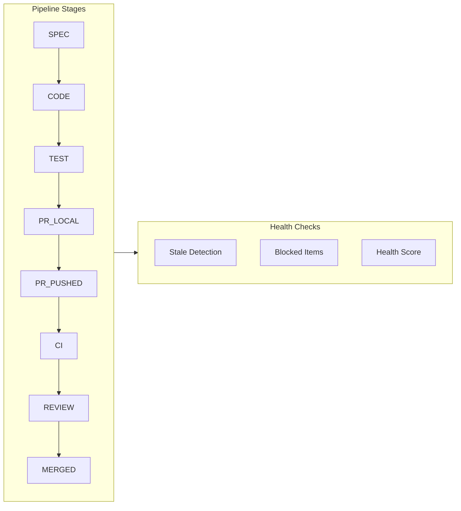

# Case Study 7: Pipeline Oversight

**Scenario:** Managing multiple features across different pipeline stages with health monitoring.

**Goal:** Demonstrate `/asdf:guardian` for full pipeline visibility and `/asdf:version` for toolkit versioning.

---

## Guardian Overview



---

## Scenario: Weekly Project Review

You're the tech lead reviewing project status on Monday morning. Multiple features are in various stages of development.

---

## Phase 1: Check Toolkit Version

```
You: /asdf:version
```

**AI Response:**
```
ASDF Toolkit v2.0.0
Astraler Spec-Driven Framework

Changelog:
───────────────────────────────────
v2.0.0 (Current)
  ├─ /asdf:guardian — Pipeline supervisor
  ├─ /asdf:version — Toolkit versioning
  ├─ Stale detection thresholds
  └─ Health score calculation

v1.2.0
  ├─ /asdf:merge — PR merge with cleanup
  ├─ /asdf:config — Settings management
  ├─ Auto-branch creation in /asdf:code
  └─ Auto-push in /asdf:pr --push
───────────────────────────────────

Documentation: case-studies/README.md
```

---

## Phase 2: Run Guardian Scan

```
You: /asdf:guardian
```

**AI Response:**
```
ASDF GUARDIAN — Pipeline Status
═══════════════════════════════════════════════════════════════════════

Health Score: 72% 🟡 Attention Needed
Active Features: 10 | Stale: 3 | Blocked: 1

PIPELINE VIEW
─────────────────────────────────────────────────────────────────────────
Stage      │ Feature                    │ Age    │ Status
─────────────────────────────────────────────────────────────────────────
SPEC       │ 251230-wishlist            │ 2d     │ ✓ Planning
           │ 251229-recommendations     │ 9d     │ 💤 Dormant
─────────────────────────────────────────────────────────────────────────
CODE       │ 251228-payment-retry       │ 1d     │ ✓ In Progress
           │ 251227-user-settings       │ 5d     │ ⚠️ Slow
─────────────────────────────────────────────────────────────────────────
TEST       │ 251226-checkout-v2         │ 1d     │ ✓ Testing
─────────────────────────────────────────────────────────────────────────
PR_LOCAL   │ 251225-inventory-alerts    │ 2d     │ ⚠️ Stale (not pushed)
─────────────────────────────────────────────────────────────────────────
PR_PUSHED  │ 251224-order-history       │ 1d     │ ✓ Awaiting Review
           │ 251223-discount-engine     │ 3d     │ ⚠️ Stale (not reviewed)
─────────────────────────────────────────────────────────────────────────
CI         │ 251222-guest-checkout      │ 2d     │ 🔴 Blocked (CI failing)
─────────────────────────────────────────────────────────────────────────
REVIEW     │ 251221-cart-persistence    │ 0d     │ ✓ Ready to Merge
─────────────────────────────────────────────────────────────────────────
MERGED     │ 251218-product-search      │ —      │ ✓ Complete
           │ 251215-user-auth           │ —      │ ✓ Complete
═══════════════════════════════════════════════════════════════════════

ALERTS (4)
─────────────────────────────────────────────────────────────────────────
💤 251229-recommendations  │ Dormant 9 days       │ Start or archive
⚠️  251225-inventory-alerts │ PR not pushed 2 days │ /asdf:pr --push
⚠️  251223-discount-engine  │ Not reviewed 3 days  │ Request review
🔴 251222-guest-checkout   │ CI failing 2 days    │ Fix failing tests
─────────────────────────────────────────────────────────────────────────

RECOMMENDATIONS
─────────────────────────────────────────────────────────────────────────
1. Merge approved PR: /asdf:merge cart-persistence
2. Push stale PR: /asdf:pr inventory-alerts --push
3. Fix CI: Check 251222-guest-checkout test failures
4. Request review for: 251223-discount-engine
5. Decide on dormant: 251229-recommendations (9 days idle)
─────────────────────────────────────────────────────────────────────────

Last scan: 2025-12-26 09:00:00
```

---

## Phase 3: Address Alerts

### 3.1 Merge Approved PR

```
You: /asdf:merge cart-persistence
```

**AI Response:**
```
MERGE MODE: Cart Persistence

PR #52: [Feature] Cart Persistence
Status: APPROVED ✓
CI: All checks passing ✓

Executing merge...
$ gh pr merge 52 --squash --delete-branch

✓ PR Merged
Commit: def456g "feat: add cart persistence (#52)"
Cleanup complete.
```

### 3.2 Push Stale PR

```
You: /asdf:pr inventory-alerts --push
```

**AI Response:**
```
PR PACKAGE: Inventory Alerts

Package exists at: .pr-review/251225-inventory-alerts/

Pushing to GitHub...
$ git push -u origin feature/inventory-alerts
$ gh pr create --title "[Feature] Inventory Alerts"

PR Created: #54
URL: https://github.com/shopfast/shopfast/pull/54
```

### 3.3 Check CI Failure

```
You: /asdf:guardian --stage CI
```

**AI Response:**
```
ASDF GUARDIAN — CI Stage Only
═══════════════════════════════════════════════════════════════════════

Stage: CI
Features: 1

─────────────────────────────────────────────────────────────────────────
Feature                    │ PR#  │ Age  │ CI Status
─────────────────────────────────────────────────────────────────────────
251222-guest-checkout      │ #50  │ 2d   │ 🔴 test: FAILED
─────────────────────────────────────────────────────────────────────────

Failing Check Details:
─────────────────────────────────────────────────────────────────────────
Check: test
Conclusion: failure
Message: "2 test cases failed in guestCheckout.test.js"

View details: gh pr checks 50 --web
─────────────────────────────────────────────────────────────────────────
```

---

## Phase 4: Filter Views

### Show Only Stale Items

```
You: /asdf:guardian --stale
```

**AI Response:**
```
ASDF GUARDIAN — Stale/Blocked Only
═══════════════════════════════════════════════════════════════════════

Stale: 3 | Blocked: 1

─────────────────────────────────────────────────────────────────────────
Feature                    │ Stage     │ Issue           │ Action
─────────────────────────────────────────────────────────────────────────
251229-recommendations     │ SPEC      │ Dormant 9d      │ Start/archive
251227-user-settings       │ CODE      │ Slow 5d         │ Check blockers
251223-discount-engine     │ PR_PUSHED │ Not reviewed 3d │ Request review
251222-guest-checkout      │ CI        │ Failing 2d      │ Fix tests
═══════════════════════════════════════════════════════════════════════
```

### JSON Output for Tooling

```
You: /asdf:guardian --json
```

**AI Response:**
```json
{
  "health_score": 72,
  "health_status": "attention_needed",
  "summary": {
    "active": 10,
    "stale": 3,
    "blocked": 1
  },
  "features": [
    {
      "name": "251230-wishlist",
      "stage": "SPEC",
      "age_days": 2,
      "status": "ok"
    },
    {
      "name": "251222-guest-checkout",
      "stage": "CI",
      "age_days": 2,
      "status": "blocked",
      "alert": "CI failing 2 days",
      "pr": {
        "number": 50,
        "ci_status": "failure"
      }
    }
  ]
}
```

---

## Stale Thresholds Reference

| Condition | Threshold | Alert |
|-----------|-----------|-------|
| PR not pushed | > 1 day | ⚠️ STALE |
| PR not reviewed | > 2 days | ⚠️ STALE |
| CI failing | > 1 day | 🔴 BLOCKED |
| Approved not merged | > 1 day | ⚠️ STALE |
| Spec without execution | > 7 days | 💤 DORMANT |
| Coding phase | > 3 days | ⚠️ SLOW |

---

## Health Score Calculation

```
Health Score = (Non-stale features / Total active features) × 100

Example:
- Total active: 10
- Stale/Blocked: 3
- Health = (10 - 3) / 10 × 100 = 70%

Ratings:
  90-100%: 🟢 Healthy
  70-89%:  🟡 Attention Needed
  50-69%:  🟠 At Risk
  < 50%:   🔴 Critical
```

---

## Command Reference

| Command | Purpose |
|---------|---------|
| `/asdf:guardian` | Full pipeline scan with health score |
| `/asdf:guardian --stale` | Show only stale/blocked features |
| `/asdf:guardian --stage [X]` | Filter by specific stage |
| `/asdf:guardian --json` | Output as JSON for tooling |
| `/asdf:version` | Show toolkit version and changelog |

---

## Integration with Other Commands

| Guardian Shows | Run Command |
|----------------|-------------|
| Dormant spec | `/asdf:code [spec]` or archive |
| Slow coding | Check blockers, continue work |
| PR not pushed | `/asdf:pr [feature] --push` |
| CI failing | Fix tests, push again |
| Not reviewed | Request review manually |
| Ready to merge | `/asdf:merge [feature]` |

---

## Best Practices

| Practice | Benefit |
|----------|---------|
| Run guardian weekly | Catch stale items early |
| Address blocked items first | Unblock pipeline |
| Archive dormant specs | Keep project focused |
| Use --json for dashboards | Integrate with tooling |
| Track health score trend | Measure team velocity |

---

## Key Takeaways

1. **Pipeline visibility** — See all features at every stage
2. **Stale detection** — Fixed thresholds catch stuck work
3. **Health scoring** — Quantify project status
4. **Actionable alerts** — Know exactly what to fix
5. **Flexible filtering** — Focus on specific stages or issues
