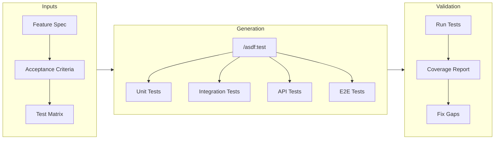
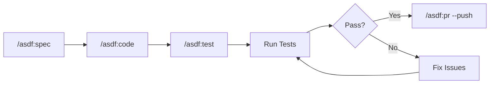

# Case Study 8: Testing Workflow

**Scenario:** Generating and managing tests for the "Order History" feature using spec-driven testing.

**Goal:** Demonstrate `/asdf:test` for test generation, test matrix understanding, and coverage tracking.

---

## Testing Overview



---

## Phase 1: Understanding Test Matrix

### Step 1: Review Feature Spec

```
You: Show me the order-history spec's acceptance criteria
```

**AI Response:**
```markdown
# Order History Feature

> Version: 1.1.0 | Status: Approved

## Acceptance Criteria

| AC | Description | Priority |
|----|-------------|----------|
| AC-001 | User can view list of past orders | P0 |
| AC-002 | Orders sorted by date (newest first) | P1 |
| AC-003 | Order details show items, totals, status | P0 |
| AC-004 | User can filter by date range | P1 |
| AC-005 | User can filter by status | P1 |
| AC-006 | Pagination (20 orders per page) | P1 |
| AC-007 | User can download invoice PDF | P2 |
| AC-008 | User can reorder from past order | P2 |
```

### Step 2: Understand Test Priorities

```
P0: Critical — Must have tests
P1: Important — Should have tests
P2: Nice to have — Optional tests
```

---

## Phase 2: Generate Tests

### Step 1: Run `/asdf:test`

```
You: /asdf:test order-history
```

**AI Response:**
```
TEST MODE: Order History

Loading spec: 251226-order-history v1.1.0

Analyzing acceptance criteria for test generation...

Test Matrix:

┌────────┬────────────┬─────────────┬────────────┬───────────────┐
│ AC     │ Unit       │ Integration │ API        │ E2E           │
├────────┼────────────┼─────────────┼────────────┼───────────────┤
│ AC-001 │ [x] P0     │ [x] P0      │ [x] P0     │ [ ]           │
│ AC-002 │ [x] P1     │ [ ]         │ [x] P1     │ [ ]           │
│ AC-003 │ [x] P0     │ [x] P0      │ [x] P0     │ [ ]           │
│ AC-004 │ [x] P1     │ [ ]         │ [x] P1     │ [ ]           │
│ AC-005 │ [x] P1     │ [ ]         │ [x] P1     │ [ ]           │
│ AC-006 │ [x] P1     │ [ ]         │ [x] P1     │ [ ]           │
│ AC-007 │ [ ]        │ [x] P2      │ [x] P2     │ [ ]           │
│ AC-008 │ [x] P2     │ [ ]         │ [x] P2     │ [x] P2        │
└────────┴────────────┴─────────────┴────────────┴───────────────┘

Legend:
[x] = Test will be generated
[ ] = Not applicable or skipped for this level

Summary:
- Unit Tests: 7 cases (P0: 2, P1: 4, P2: 1)
- Integration Tests: 3 cases (P0: 2, P2: 1)
- API Tests: 8 cases (P0: 2, P1: 4, P2: 2)
- E2E Tests: 1 case (P2: 1)

Options:
- [skip-e2e] Generate Unit + Integration + API only (recommended)
- [p0-only] Generate P0 tests only (minimal)
- [yes] Generate all tests including E2E
- [feedback] Adjust test plan
```

### Step 2: Choose Generation Option

```
You: yes
```

**AI Response:**
```
Generating tests...

Test Generation Complete

Feature: order-history
Tests Generated: 19 total

Files Created:
├── __tests__/order-history/
│   ├── OrderHistoryService.test.ts       (7 unit tests)
│   ├── OrderHistoryController.integration.test.ts (3 integration tests)
│   ├── api.test.ts                       (8 API tests)
│   └── fixtures.ts                       (test data)
└── e2e/
    └── order-history.spec.ts             (1 E2E test)

Test Breakdown:
| Type | Count | P0 | P1 | P2 |
|------|-------|----|----|----│
| Unit | 7 | 2 | 4 | 1 |
| Integration | 3 | 2 | 0 | 1 |
| API | 8 | 2 | 4 | 2 |
| E2E | 1 | 0 | 0 | 1 |
| Total | 19 | 6 | 8 | 5 |

Spec Updated:
- Testing section populated with test mapping
- Coverage targets: 80% minimum

Next: Run tests with npm test
```

---

## Phase 3: Understanding Generated Tests

### Unit Tests (7)

```typescript
// __tests__/order-history/OrderHistoryService.test.ts

describe('OrderHistoryService', () => {
  // AC-001: P0
  describe('getOrderHistory', () => {
    it('should return list of past orders for user', async () => {
      // Arrange
      const userId = 'user-123';
      const mockOrders = [createMockOrder(), createMockOrder()];
      mockOrderRepo.findByUserId.mockResolvedValue(mockOrders);

      // Act
      const result = await service.getOrderHistory(userId);

      // Assert
      expect(result).toHaveLength(2);
      expect(mockOrderRepo.findByUserId).toHaveBeenCalledWith(userId);
    });
  });

  // AC-002: P1
  describe('sorting', () => {
    it('should sort orders by date descending', async () => {
      // ...
    });
  });

  // AC-003: P0
  describe('getOrderDetails', () => {
    it('should return order with items, totals, and status', async () => {
      // ...
    });
  });

  // AC-004, AC-005: P1
  describe('filtering', () => {
    it('should filter by date range', async () => { /* ... */ });
    it('should filter by status', async () => { /* ... */ });
  });

  // AC-006: P1
  describe('pagination', () => {
    it('should paginate with 20 orders per page', async () => { /* ... */ });
  });

  // AC-008: P2
  describe('reorder', () => {
    it('should create new order from past order items', async () => { /* ... */ });
  });
});
```

### Integration Tests (3)

```typescript
// __tests__/order-history/OrderHistoryController.integration.test.ts

describe('OrderHistoryController Integration', () => {
  // AC-001: P0
  it('should fetch orders from database and return formatted response', async () => {
    // Uses real database connection
    const response = await request(app)
      .get('/api/orders')
      .set('Authorization', `Bearer ${testUserToken}`);

    expect(response.status).toBe(200);
    expect(response.body.orders).toBeInstanceOf(Array);
  });

  // AC-003: P0
  it('should return complete order details with items', async () => {
    const response = await request(app)
      .get(`/api/orders/${testOrderId}`)
      .set('Authorization', `Bearer ${testUserToken}`);

    expect(response.body).toHaveProperty('items');
    expect(response.body).toHaveProperty('total');
    expect(response.body).toHaveProperty('status');
  });

  // AC-007: P2
  it('should generate PDF invoice', async () => {
    const response = await request(app)
      .get(`/api/orders/${testOrderId}/invoice`)
      .set('Authorization', `Bearer ${testUserToken}`);

    expect(response.headers['content-type']).toBe('application/pdf');
  });
});
```

### API Tests (8)

```typescript
// __tests__/order-history/api.test.ts

describe('Order History API', () => {
  // AC-001: P0
  describe('GET /api/orders', () => {
    it('returns 200 with order list', async () => { /* ... */ });
    it('returns 401 without auth', async () => { /* ... */ });
  });

  // AC-002: P1
  describe('Sorting', () => {
    it('returns orders sorted by date desc', async () => { /* ... */ });
  });

  // AC-003: P0
  describe('GET /api/orders/:id', () => {
    it('returns order details', async () => { /* ... */ });
    it('returns 404 for non-existent order', async () => { /* ... */ });
  });

  // AC-004, AC-005: P1
  describe('Filtering', () => {
    it('filters by date range', async () => { /* ... */ });
    it('filters by status', async () => { /* ... */ });
  });

  // AC-006: P1
  describe('Pagination', () => {
    it('returns paginated results', async () => { /* ... */ });
  });
});
```

### E2E Test (1)

```typescript
// e2e/order-history.spec.ts

import { test, expect } from '@playwright/test';

test.describe('Order History', () => {
  // AC-008: P2 - Full user flow
  test('user can reorder from past order', async ({ page }) => {
    // Login
    await page.goto('/login');
    await page.fill('[name="email"]', 'test@example.com');
    await page.fill('[name="password"]', 'password');
    await page.click('button[type="submit"]');

    // Navigate to order history
    await page.click('text=My Orders');
    await expect(page.locator('.order-list')).toBeVisible();

    // Click reorder on first order
    await page.click('.order-item:first-child .reorder-btn');

    // Verify cart updated
    await expect(page.locator('.cart-count')).toHaveText('3');

    // Verify redirect to cart
    await expect(page).toHaveURL('/cart');
  });
});
```

---

## Phase 4: Run Tests

### Step 1: Run All Tests

```
You: Run the tests
```

**AI Response:**
```
Running test suite...

$ npm test -- --grep "order-history"

PASS __tests__/order-history/OrderHistoryService.test.ts
  OrderHistoryService
    getOrderHistory
      ✓ should return list of past orders for user (15ms)
    sorting
      ✓ should sort orders by date descending (8ms)
    getOrderDetails
      ✓ should return order with items, totals, and status (12ms)
    filtering
      ✓ should filter by date range (9ms)
      ✓ should filter by status (7ms)
    pagination
      ✓ should paginate with 20 orders per page (11ms)
    reorder
      ✓ should create new order from past order items (18ms)

PASS __tests__/order-history/OrderHistoryController.integration.test.ts
  OrderHistoryController Integration
    ✓ should fetch orders from database (145ms)
    ✓ should return complete order details (89ms)
    ✓ should generate PDF invoice (234ms)

PASS __tests__/order-history/api.test.ts
  Order History API
    GET /api/orders
      ✓ returns 200 with order list (45ms)
      ✓ returns 401 without auth (12ms)
    Sorting
      ✓ returns orders sorted by date desc (38ms)
    GET /api/orders/:id
      ✓ returns order details (42ms)
      ✓ returns 404 for non-existent order (15ms)
    Filtering
      ✓ filters by date range (48ms)
      ✓ filters by status (35ms)
    Pagination
      ✓ returns paginated results (52ms)

Test Suites: 3 passed, 3 total
Tests:       18 passed, 18 total
Time:        3.8s
```

### Step 2: Run E2E Tests

```
$ npx playwright test order-history

Running 1 test using 1 worker

✓ order-history.spec.ts:5:1 › user can reorder from past order (5.2s)

1 passed (5.5s)
```

### Step 3: Check Coverage

```
$ npm run coverage -- --grep "order-history"

-----------------------------|---------|----------|---------|---------|
File                         | % Stmts | % Branch | % Funcs | % Lines |
-----------------------------|---------|----------|---------|---------|
OrderHistoryService.ts       | 95.2    | 88.5     | 100     | 94.8    |
OrderHistoryController.ts    | 92.3    | 85.0     | 100     | 91.7    |
-----------------------------|---------|----------|---------|---------|
All files                    | 93.7    | 86.8     | 100     | 93.3    |
-----------------------------|---------|----------|---------|---------|

Coverage: 93.7% ✓ (target: 80%)
```

---

## Phase 5: Handle Test Failures

### Scenario: Test Failing

```
FAIL __tests__/order-history/OrderHistoryService.test.ts
  ✕ should paginate with 20 orders per page (15ms)

  Expected: 20
  Received: 10

  at Object.<anonymous> (OrderHistoryService.test.ts:45:23)
```

### Step 1: Analyze Failure

```
You: The pagination test is failing - expecting 20 but got 10
```

**AI Response:**
```
Analyzing test failure...

Spec says: AC-006 "Pagination (20 orders per page)"
Code has: DEFAULT_PAGE_SIZE = 10

This is a deviation from spec.

Options:
A) Fix code — Update DEFAULT_PAGE_SIZE to 20
B) Update spec — Change AC-006 to 10 per page
C) Investigate — Check if 10 was intentional
```

```
You: A
```

**AI Response:**
```
Fixing code...

File: src/config/pagination.ts
- const DEFAULT_PAGE_SIZE = 10;
+ const DEFAULT_PAGE_SIZE = 20;

Re-running test...
✓ should paginate with 20 orders per page (12ms)

All tests passing ✓
```

---

## Phase 6: Coverage Gaps

### Step 1: Identify Gaps

```
You: Check for missing test coverage
```

**AI Response:**
```
Coverage Analysis

## Covered ✓
- AC-001 to AC-006: All tested at appropriate levels
- AC-007: Integration test covers PDF generation
- AC-008: E2E test covers reorder flow

## Gaps Identified

| Gap | Type | Recommendation |
|-----|------|----------------|
| Error handling | Unit | Add tests for network errors |
| Edge cases | Unit | Add test for empty order history |
| Auth edge cases | API | Add test for expired token |

## Recommendations

1. Add unit test: "should return empty array for new user"
2. Add unit test: "should handle database timeout"
3. Add API test: "should return 401 for expired token"

Would you like to generate these additional tests?
```

```
You: yes
```

**AI Response:**
```
Additional Tests Generated

Files updated:
- __tests__/order-history/OrderHistoryService.test.ts (+2 tests)
- __tests__/order-history/api.test.ts (+1 test)

New tests:
✓ should return empty array for new user
✓ should handle database timeout gracefully
✓ should return 401 for expired token

Total tests: 19 → 22

Coverage improved: 93.7% → 96.2% ✓
```

---

## Test Matrix Reference

### When to Use Each Test Type

| Test Type | Speed | Scope | Use When |
|-----------|-------|-------|----------|
| Unit | Fast (ms) | Single function | Testing logic |
| Integration | Medium (100ms) | Multiple components | Testing connections |
| API | Medium (50ms) | HTTP endpoints | Testing contracts |
| E2E | Slow (5s) | Full user flow | Testing journeys |

### Priority Guidelines

| Priority | Coverage | When to Use |
|----------|----------|-------------|
| P0 | Must test | Core functionality |
| P1 | Should test | Important features |
| P2 | Nice to have | Optional, complex flows |

---

## Command Reference

| Command | Purpose |
|---------|---------|
| `/asdf:test [feature]` | Generate tests from spec |
| `/asdf:test [feature] --p0-only` | Generate only P0 tests |
| `/asdf:test [feature] --skip-e2e` | Skip E2E generation |
| `npm test -- --grep [feature]` | Run specific tests |
| `npm run coverage` | Check test coverage |
| `npx playwright test` | Run E2E tests |

---

## Key Takeaways

1. **Spec drives tests** — ACs map directly to test cases
2. **Test matrix guides** — Know what to test at each level
3. **Prioritize wisely** — P0 first, then P1, P2 optional
4. **Coverage targets** — Aim for 80%+ coverage
5. **Fix failures fast** — Investigate root cause before fixing
6. **Gap analysis** — Regular coverage checks catch missing tests

---

## Integration with Workflow



Tests are generated after implementation, run before PR creation.
