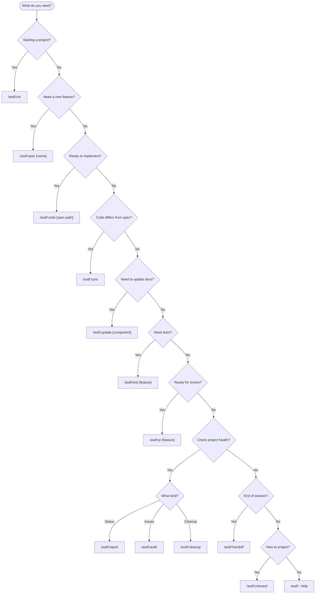

# Command Flow Diagram

**Purpose:** Help users know which command to use when.

---

## Decision Flowchart



---

## Quick Reference

### By Situation

| Situation | Command |
|-----------|---------|
| Starting new project | `/asdf:init` |
| Adding ASDF to existing code | `/asdf:init` (option B) |
| Planning new feature | `/asdf:spec [name]` |
| Implementing feature | `/asdf:code [spec-path]` |
| Generating tests | `/asdf:test [feature]` |
| Code changed, spec outdated | `/asdf:sync` |
| Updating documentation | `/asdf:update [component]` |
| Creating pull request | `/asdf:pr [feature]` |
| Getting code reviewed | `/asdf:review [path]` |
| Checking project status | `/asdf:report [feature\|all]` |
| Finding spec issues | `/asdf:audit` |
| Removing unused specs | `/asdf:cleanup` |
| Ending work session | `/asdf:handoff` |
| Starting work session | `/asdf:onboard` |
| Lock stuck | `/asdf:unlock [name]` |
| Need help | `/asdf` |

---

## By Development Phase

```mermaid
flowchart LR
    subgraph Plan["Planning"]
        A["/asdf:init"]
        B["/asdf:spec"]
        C["/asdf:update"]
    end

    subgraph Build["Building"]
        D["/asdf:code"]
        E["/asdf:test"]
    end

    subgraph Review["Reviewing"]
        F["/asdf:pr"]
        G["/asdf:review"]
        H["/asdf:sync"]
    end

    subgraph Maintain["Maintaining"]
        I["/asdf:report"]
        J["/asdf:audit"]
        K["/asdf:cleanup"]
    end

    subgraph Session["Session"]
        L["/asdf:onboard"]
        M["/asdf:handoff"]
        N["/asdf:unlock"]
    end

    Plan --> Build --> Review --> Maintain
    Session -.-> Plan
    Session -.-> Build
```



---

## Command Categories

### Spec Creation
| Command | Purpose |
|---------|---------|
| `/asdf:init` | Initialize project structure |
| `/asdf:spec [name]` | Create feature specification |
| `/asdf:update [path]` | Update existing documentation |

### Implementation
| Command | Purpose |
|---------|---------|
| `/asdf:code [spec]` | Implement from specification |
| `/asdf:test [feature]` | Generate test suites |
| `/asdf:sync` | Sync spec with code changes |

### Review
| Command | Purpose |
|---------|---------|
| `/asdf:pr [feature]` | Create PR package |
| `/asdf:review [path]` | AI code review |

### Project Management
| Command | Purpose |
|---------|---------|
| `/asdf:report [target]` | Progress reports |
| `/asdf:audit` | Spec health check |
| `/asdf:cleanup` | Remove unused specs |
| `/asdf:roadmap` | Phase management |
| `/asdf:status` | Project heartbeat |

### Session
| Command | Purpose |
|---------|---------|
| `/asdf:onboard` | Quick project tour |
| `/asdf:handoff` | Session notes |
| `/asdf:unlock [name]` | Release stuck locks |

---

## Common Workflows

### New Feature (Full Cycle)
```
/asdf:spec → /asdf:code → /asdf:test → /asdf:pr → /asdf:review → /asdf:sync
```

### Quick Bug Fix
```
/asdf:code → /asdf:test → /asdf:sync
```

### Weekly Maintenance
```
/asdf:report all → /asdf:audit → /asdf:cleanup
```

### Daily Start/End
```
Start: /asdf:onboard
End: /asdf:handoff
```
