# Context Loading Diagram

**Purpose:** Visualize the hierarchy of context loading in ASDF.

---

## Loading Hierarchy

---

## Loading Order

```mermaid
sequenceDiagram
    participant AI as Claude Instance
    participant T1 as 01-system-core
    participant T2 as 02-domains
    participant T3 as 03-features
    participant T4 as 04-operations

    AI->>T1: 1. Load global rules
    T1-->>AI: Architecture, standards, design

    AI->>T2: 2. Load relevant domain
    T2-->>AI: Business rules, entities

    AI->>T3: 3. Load specific feature
    T3-->>AI: Requirements, API contracts

    AI->>T4: 4. Check session state
    T4-->>AI: Last handoff, active work

    Note over AI: Context fully loaded ✓
```

---

## What Gets Loaded Per Command

### `/asdf:init`

**Loads:** Templates and structure references

### `/asdf:spec [feature]`

**Loads:** Full hierarchy to understand context

### `/asdf:code [spec]`

**Loads:** Standards + dependencies + spec + lock state

### `/asdf:sync`

**Loads:** Spec only, then scans code

### `/asdf:test [feature]`

**Loads:** Spec + testing standards

### `/asdf:report`

**Loads:** All features + operations for aggregation

### `/asdf:onboard`

**Loads:** Status + handoff + active locks

---

## Context by Tier

### Tier 1: System Core
**What it contains:**
- Architecture decisions (ADRs)
- Tech stack definitions
- Coding standards
- Design system
- Project status

**When to load:** Always first, for any command

### Tier 2: Domains
**What it contains:**
- Entity definitions
- Business rules
- Domain-specific APIs
- Cross-feature logic

**When to load:** When working on features that use the domain

### Tier 3: Features
**What it contains:**
- Acceptance criteria
- User flows
- API contracts
- UI/UX requirements
- Dependencies

**When to load:** When implementing specific feature

### Tier 4: Operations
**What it contains:**
- Session handoff notes
- Active implementations
- Tech debt register
- Lock files
- Changelogs

**When to load:** For state awareness and continuity

---

## Dependency Resolution

---

## Example: Loading for Checkout Feature

---

## Loading Performance Tips

| Tip | Benefit |
|-----|---------|
| Load relevant domains only | Faster context |
| Check session-handoff first | Know prior state |
| Skip unchanged system-core | Efficiency |
| Cache frequently used specs | Speed |

---

## Context Freshness

| Source | Freshness Check |
|--------|-----------------|
| System Core | Rarely changes |
| Domains | Check on dependency load |
| Features | Always load latest |
| Operations | Always load latest |
