# Mode Transitions Diagram

**Purpose:** Show how ASDF operating modes connect and transition.

---

## Mode State Diagram

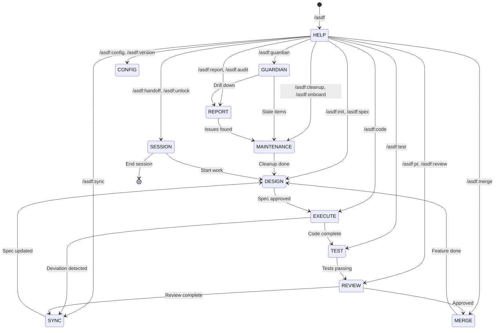

---

## Mode Details

### DESIGN MODE
**Commands:** `/asdf:init`, `/asdf:spec`, `/asdf:update`

**Purpose:** Create and refine specifications

**Flow:**
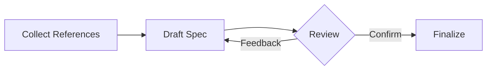

**Transitions:**
- → EXECUTE: After spec approved
- → DESIGN: On feedback loop

---

### EXECUTE MODE
**Commands:** `/asdf:code`

**Purpose:** Implement code from specifications

**Flow:**
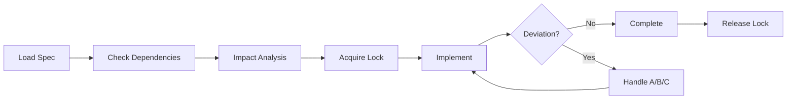

**Transitions:**
- → TEST: After implementation complete
- → SYNC: If deviation option B chosen

---

### SYNC MODE
**Commands:** `/asdf:sync`

**Purpose:** Reconcile code reality with spec documentation

**Flow:**
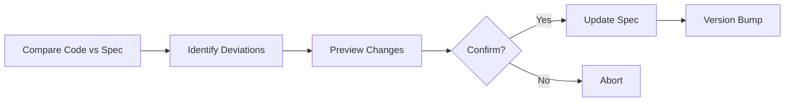

**Transitions:**
- → DESIGN: Spec now reflects code
- → EXECUTE: Continue with aligned spec

---

### TEST MODE
**Commands:** `/asdf:test`

**Purpose:** Generate test suites from specifications

**Flow:**
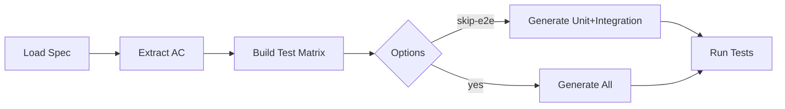

**Transitions:**
- → REVIEW: After tests passing
- → EXECUTE: If tests fail, fix code

---

### REVIEW MODE
**Commands:** `/asdf:pr`, `/asdf:review`

**Purpose:** Create PR packages and perform code review

**Flow:**
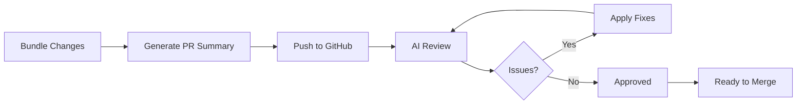

**Transitions:**
- → MERGE: After PR approved
- → SYNC: After review complete
- → EXECUTE: If fixes needed

---

### MERGE MODE
**Commands:** `/asdf:merge`

**Purpose:** Merge approved PRs with automatic cleanup

**Flow:**
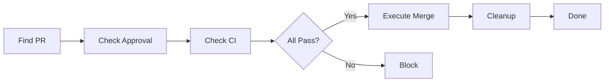

**Transitions:**
- → DESIGN: Feature complete, start next
- → EXECUTE: If fixes needed before merge

---

### GUARDIAN MODE
**Commands:** `/asdf:guardian`

**Purpose:** Full pipeline scan with health monitoring

**Flow:**
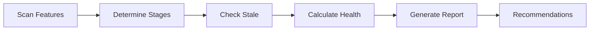

**Transitions:**
- → REPORT: Drill down for details
- → MAINTENANCE: Address stale items
- → MERGE: Ready-to-merge items found

---

### CONFIG MODE
**Commands:** `/asdf:config`, `/asdf:version`

**Purpose:** View/edit settings and toolkit version

**Flow:**
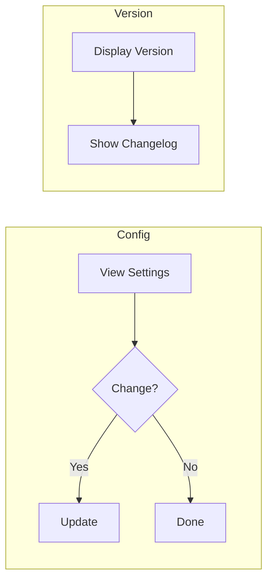

**Transitions:**
- → Any Mode: After configuration

---

### REPORT MODE
**Commands:** `/asdf:report`, `/asdf:audit`

**Purpose:** Generate progress reports and detect issues

**Flow:**
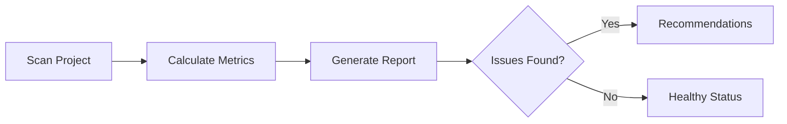

**Transitions:**
- → MAINTENANCE: If issues found
- → EXECUTE: Continue normal work

---

### MAINTENANCE MODE
**Commands:** `/asdf:cleanup`, `/asdf:onboard`

**Purpose:** Project health maintenance and onboarding

**Flow:**
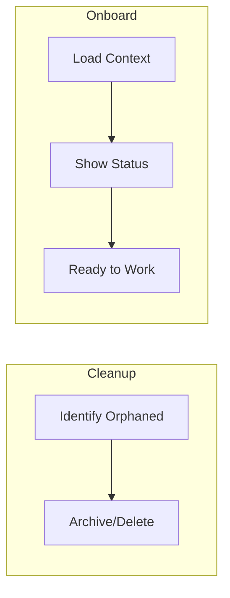

**Transitions:**
- → DESIGN: After onboarding
- → EXECUTE: Ready to work

---

### SESSION MODE
**Commands:** `/asdf:handoff`, `/asdf:unlock`

**Purpose:** Session management and lock handling

**Flow:**
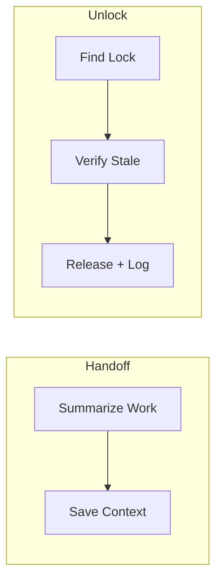

**Transitions:**
- → End: Session complete
- → Any Mode: After unlock

---

## Typical Mode Sequences

### Feature Development (Full Cycle)
```
DESIGN → EXECUTE → TEST → REVIEW → SYNC → MERGE → DONE
```

### Quick Feature
```
DESIGN → EXECUTE → TEST → REVIEW(--push) → MERGE
```

### Maintenance Sprint
```
GUARDIAN → REPORT → MAINTENANCE → SYNC → GUARDIAN
```

### Weekly Health Check
```
GUARDIAN → REPORT → AUDIT → CLEANUP
```

### Bug Fix
```
EXECUTE → TEST → REVIEW(--push) → MERGE
```

### Team Handoff
```
SESSION(handoff) → ... → SESSION(onboard) → GUARDIAN → EXECUTE
```

---

## Mode Compatibility

| From Mode | Can Transition To |
|-----------|-------------------|
| DESIGN | EXECUTE, DESIGN (loop) |
| EXECUTE | TEST, SYNC, EXECUTE (loop) |
| SYNC | DESIGN, EXECUTE |
| TEST | REVIEW, EXECUTE |
| REVIEW | MERGE, SYNC, EXECUTE |
| MERGE | DESIGN, GUARDIAN |
| GUARDIAN | REPORT, MAINTENANCE, MERGE |
| REPORT | MAINTENANCE, Any |
| MAINTENANCE | DESIGN, EXECUTE |
| CONFIG | Any |
| SESSION | Any, End |
