# Multi-Instance Diagram

**Purpose:** Visualize the lock mechanism for parallel work.

---

## Lock Sequence Diagram


---

## Lock File Structure


---

## Lock Types

### Code Lock
**Location:** `04-operations/locks/[feature].lock`
**Created by:** `/asdf:code`
**Released by:** Completion or `/asdf:handoff`

```yaml
# Example: 04-operations/locks/251224-checkout.lock
instance_id: claude-alice-001
locked_at: 2024-12-24T09:15:00Z
task: "Implementing FR-001 to FR-005"
estimated_duration: 2h
contact: "Session #42"
```

### Spec Lock
**Location:** `04-operations/spec-locks/[name].lock`
**Created by:** `/asdf:spec`, `/asdf:update`
**Released by:** Confirmation or cancel

```yaml
# Example: 04-operations/spec-locks/auth.lock
instance_id: claude-bob-002
locked_at: 2024-12-24T14:30:00Z
task: "Updating User entity"
operation: UPDATE
```

---

## Lock States


---

## Conflict Resolution Flow


---

## Parallel Work Patterns

### Pattern 1: Different Features


### Pattern 2: Sequential on Same Feature


### Pattern 3: Stale Lock Override

```mermaid
gantt
    title Stale Lock Override
    dateFormat HH:mm
    axisFormat %H:%M

    section Instance 1 (crashed)
    inventory (locked)    :active, 09:00, 1h
    CRASH                 :crit, 10:00, 18h

    section Instance 2 (next day)
    detect stale          :milestone, 04:00, 0h
    override + continue   :active, 04:00, 2h
```


---

## Best Practices

| Practice | Reason |
|----------|--------|
| Work on different features | Avoid blocking |
| Small features | Shorter lock times |
| Frequent handoffs | Release locks regularly |
| Check locks first | Don't start blocked work |
| Use `/asdf:onboard` | See active locks |

---

## Lock Commands

| Command | Action |
|---------|--------|
| `/asdf:code` | Acquires code lock |
| `/asdf:spec` | Acquires spec lock |
| `/asdf:update` | Acquires spec lock |
| `/asdf:handoff` | Releases held locks |
| `/asdf:unlock [name]` | Admin force release |

---

## Conflict Log Format

```markdown
# Conflict Log

| Date | Lock | Original Instance | Released By | Reason |
|------|------|-------------------|-------------|--------|
| 251225 | inventory | claude-alice-001 | claude-bob-002 | Stale (18h) |
| 251224 | checkout | claude-x-003 | claude-y-004 | Force override |
```
