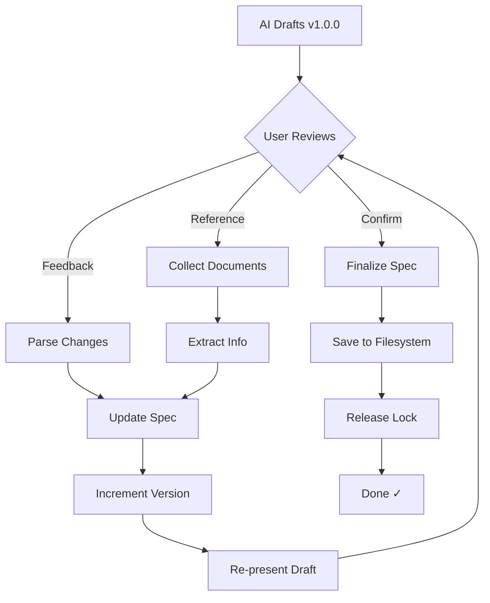
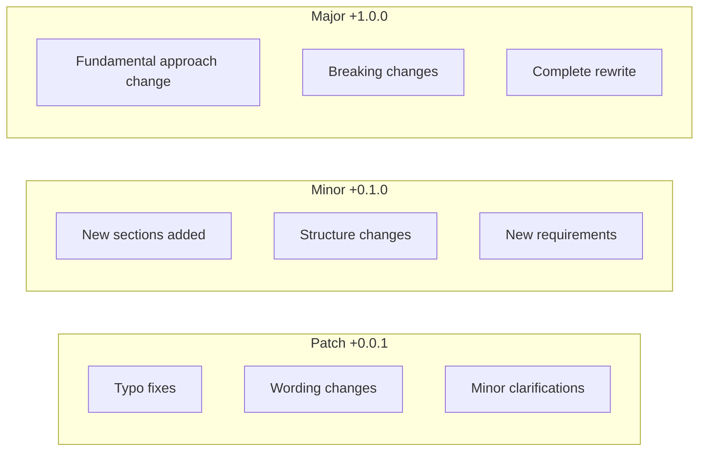
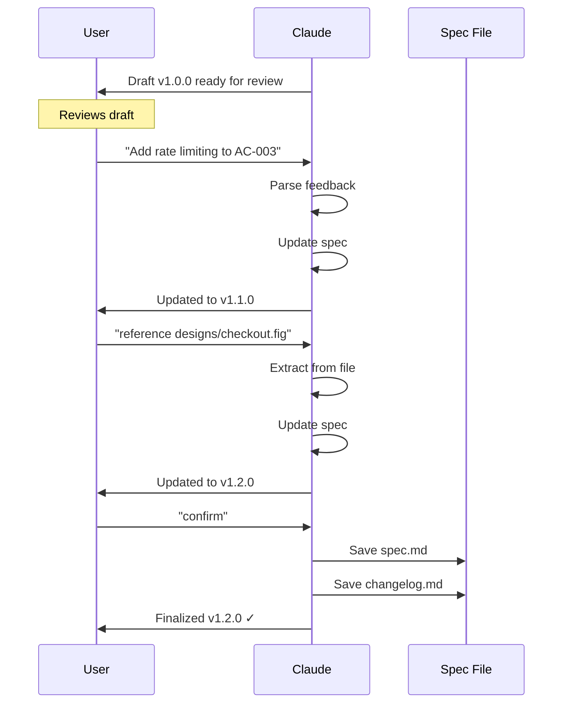
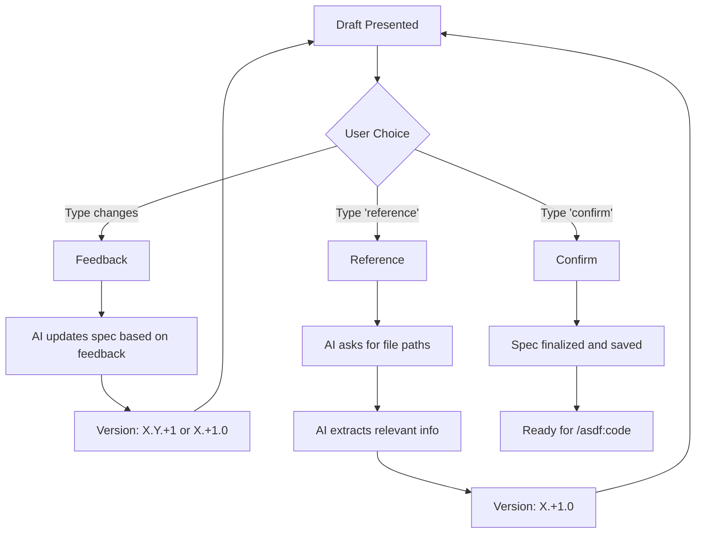
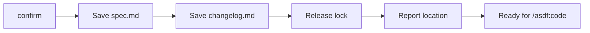

# Refinement Loop Diagram

**Purpose:** Visualize the draft → feedback → confirm cycle in ASDF.

---

## Core Loop



---

## Version Increment Rules



---

## Refinement Sequence



---

## User Options



---

## Example Refinement Session

### Initial Draft (v1.0.0)
```
You: /asdf:spec checkout
AI: Draft checkout spec v1.0.0 ready for review.

## Acceptance Criteria
- AC-001: User can checkout with cart items
- AC-002: User can enter shipping address
- AC-003: User can pay with credit card

Please choose:
- Feedback — Type your changes
- Reference — Type `reference` to add source documents
- Confirm — Type `confirm` to finalize
```

### Feedback 1 → v1.1.0
```
You: Add guest checkout option and Apple Pay support
AI: Updated to v1.1.0

Changes made:
- AC-001: Updated to include guest checkout
- AC-004: Added Apple Pay payment option
- Updated user flow diagram

Please choose: ...
```

### Reference → v1.2.0
```
You: reference
AI: Provide file path(s) to reference documents.

You: docs/payment-requirements.pdf
AI: Extracted from payment-requirements.pdf:
- Stripe integration required
- 3D Secure for EU customers
- Refund policy details

Updated to v1.2.0

Changes made:
- Added Stripe as payment processor
- Added 3D Secure requirement (NFR-001)
- Added refund section

Please choose: ...
```

### Feedback 2 → v1.3.0
```
You: The refund window should be 30 days, not 14
AI: Updated to v1.3.0

Changes made:
- Refund policy: Updated window from 14 to 30 days

Please choose: ...
```

### Confirm
```
You: confirm
AI: Spec Finalized

Feature: checkout
Version: 1.3.0
Status: Approved
Location: astraler-docs/03-features/251224-checkout/spec.md
```

---

## Changelog Generation

Each refinement creates a changelog entry:

```markdown
# Changelog: checkout

## v1.3.0 (251224)
- Refund policy: 30 days (was 14)

## v1.2.0 (251224)
- Added Stripe integration (from payment-requirements.pdf)
- Added 3D Secure requirement
- Added refund section

## v1.1.0 (251224)
- Added guest checkout option
- Added Apple Pay payment

## v1.0.0 (251224)
- Initial draft
```

---

## Refinement Best Practices

| Practice | Benefit |
|----------|---------|
| Be specific in feedback | Clearer updates |
| Reference early | Incorporate docs upfront |
| Review before confirm | Catch issues early |
| Small iterations | Track changes easily |
| Check open questions | Resolve before confirm |

---

## Common Refinement Patterns

### Adding Requirements
```
"Add AC-005 for email notification after purchase"
```

### Modifying Existing
```
"Change AC-002 to require real-time address validation"
```

### Removing Scope
```
"Remove AC-004, we'll do that in Phase 2"
```

### Adding Constraints
```
"Add NFR: Page load must be under 2 seconds"
```

### Clarifying Details
```
"AC-001 should specify that guest email is required"
```

---

## Loop Termination

The loop ends when:

1. User types `confirm`
2. AI saves spec to filesystem
3. Lock is released (if held)
4. Next command available


