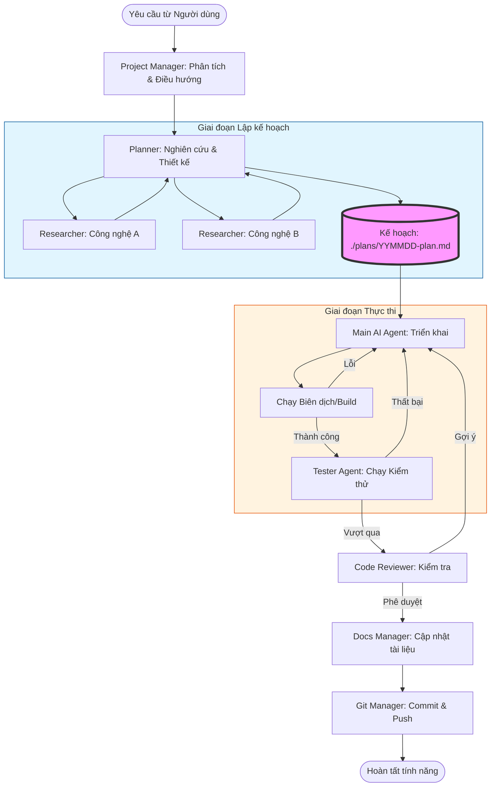

# Kiến trúc Quy trình làm việc (Workflow)

Framework `claudekit-engineer` tuân thủ một quy trình làm việc nghiêm ngặt, dựa trên tài liệu nhằm đảm bảo sự phối hợp giữa các agent và tính minh bạch cho nhà phát triển (con người).

## Vòng lặp Kỹ thuật Chính

Hệ thống vận hành theo cơ chế "Chain of Agents", nơi mỗi kết quả của agent trước là đầu vào cho agent sau.

## Công cụ (Tools) & Kỹ năng (Skills) hỗ trợ

Trong mỗi bước, các agent sử dụng các MCP server mạnh mẽ để mở rộng khả năng:

- **Khám phá mã nguồn**: `grep`, `fd`, `view_file_outline`.
- **Nghiên cứu tài liệu**: `context7` (đọc API docs), `search_google`, `review-website` (chuyển HTML sang Markdown).
- **Phân tích hình ảnh**: `ai-multimodal` (cho UI/UX).
- **Tư duy phản biện**: `sequential-thinking` (chia nhỏ vấn đề phức tạp thành các bước tư duy tuần tự).

## Mô hình Giao tiếp dựa trên Tệp (File-based AI Communication)

Các agent giao tiếp chủ yếu thông qua hệ thống tệp tin thay vì chỉ chat, giúp bảo tồn context:

1.  **Shared Memory**: File `task.md` trong thư mục artifacts lưu trạng thái hiện tại của toàn bộ process.
2.  **Handoff Reports**: Các report được lưu lại với định dạng: `YYMMDD-from-agent-A-to-agent-B-task-report.md`.
3.  **Audit Trail**: Mọi quyết định được ghi lại trong `./plans/`, giúp con người có thể "quay ngược thời gian" để hiểu tại sao một tính năng được triển khai theo cách đó.

## Các Nguyên tắc Phát triển (The Golden Rules)

Framework thực thi các nguyên tắc này thông qua `development-rules.md`:
1.  **KISS & YANGI**: Code Reviewer sẽ từ chối các đoạn mã quá phức tạp hoặc "làm trước cho tương lai".
2.  **File Size Limit**: Tự động cảnh báo nếu file vượt quá 200 dòng để duy trì tính mô-đun.
3.  **Real Code Only**: Tuyệt đối không sử dụng mock data hoặc simulation trừ khi không còn cách nào khác.
