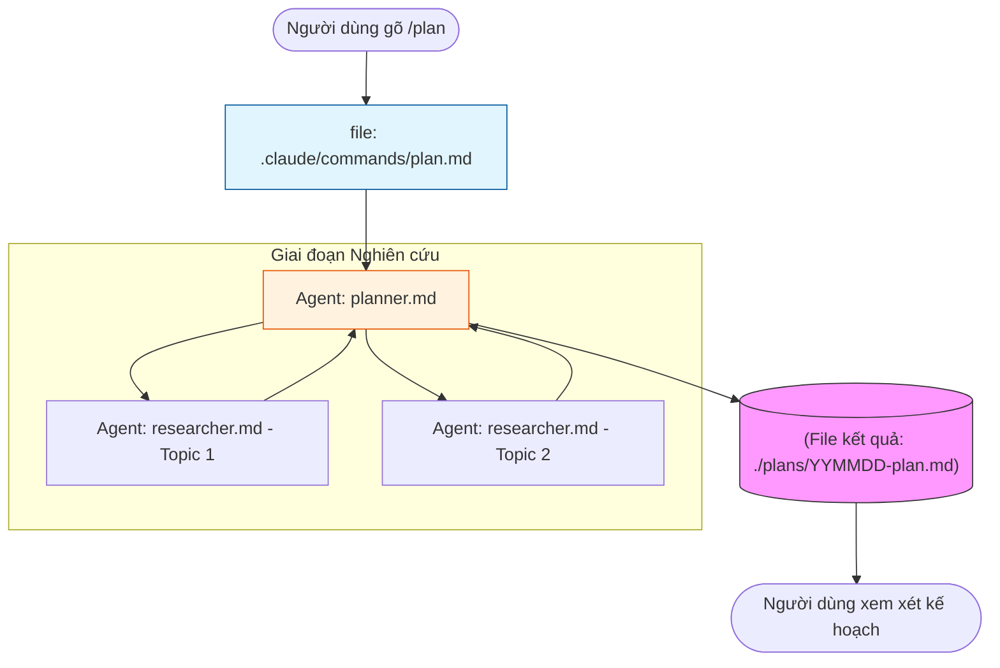
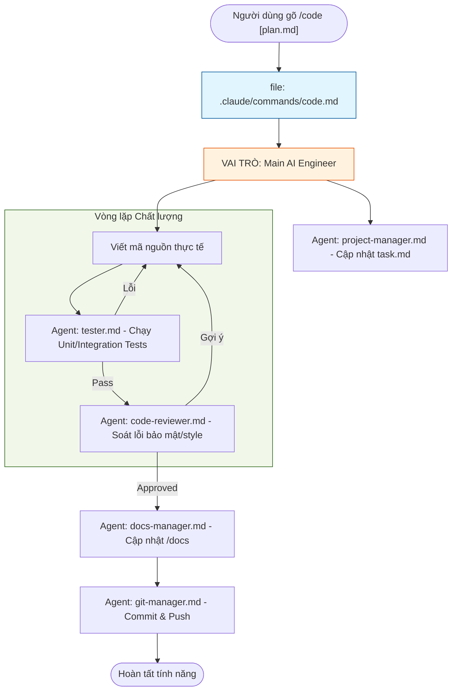
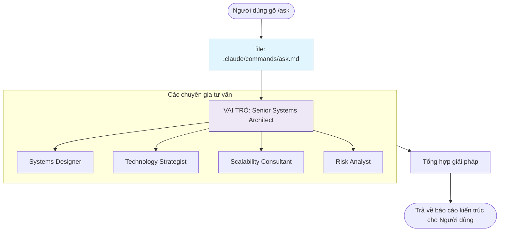
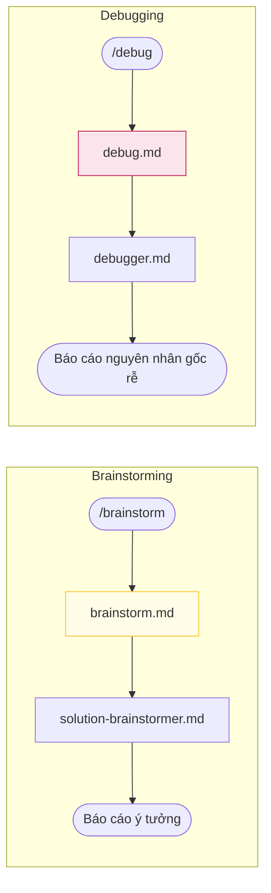

# Biểu đồ Trực quan hóa Workflow (Visual Workflows)

Tài liệu này giúp bạn hiểu "bên dưới nắp capo" framework sẽ gọi những file nào và các agent nào khi bạn sử dụng các Slash Command.

## 1. Luồng Lập kế hoạch (`/plan`)

Khi bạn gõ lệnh `/plan`, hệ thống kích hoạt quy trình nghiên cứu và thiết kế.

## 2. Luồng Thực thi Code (`/code`)

Đây là luồng phức tạp nhất, điều phối nhiều agent để biến kế hoạch thành mã nguồn hoàn chỉnh.

## 3. Luồng Tư vấn Kiến trúc (`/ask`)

Sử dụng khi bạn cần tư vấn thay vì viết code.

## 4. Luồng Lên ý tưởng (`/brainstorm`) và Gỡ lỗi (`/debug`)

---
> [!TIP]
> **Điểm mấu chốt**: Các file trong `.claude/commands/` đóng vai trò là "người điều phối", chúng định nghĩa luật chơi và cách các Agent trong `.opencode/agent/` phải phối hợp với nhau.
