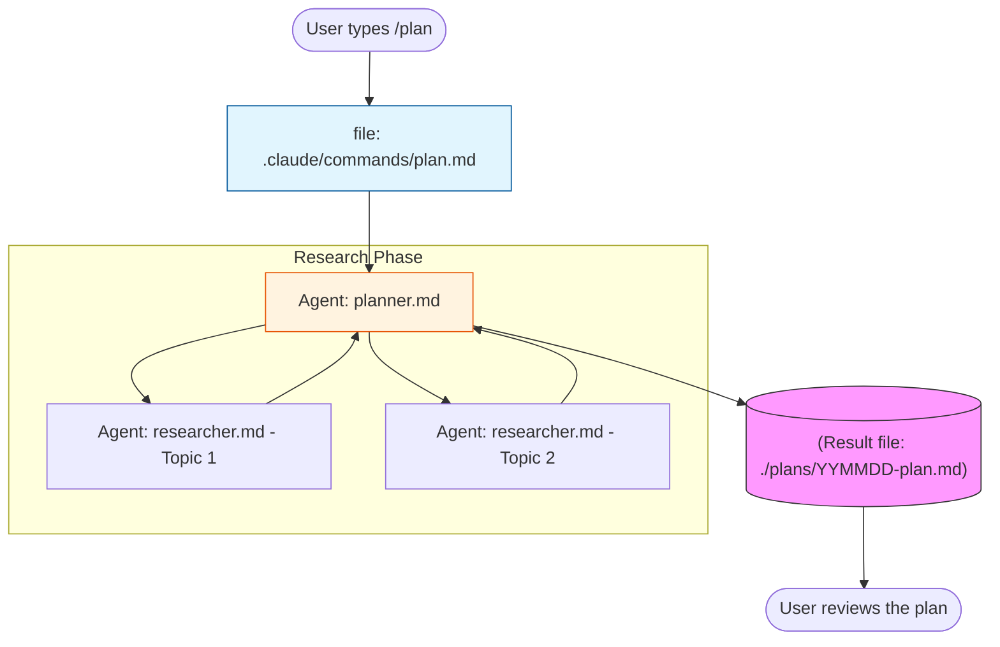
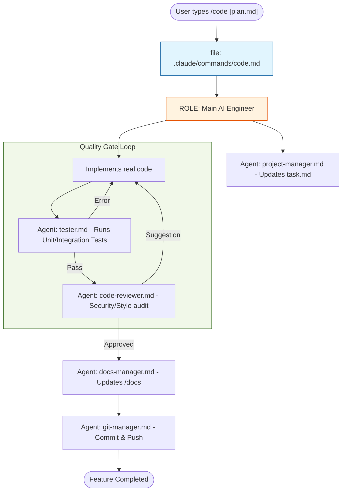
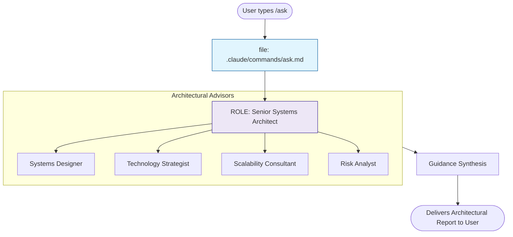
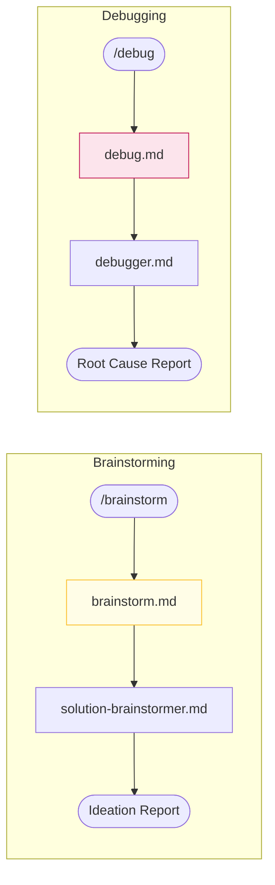

# Visual Workflow Diagrams

These diagrams visualize the file calls and agent interactions triggered by major Slash Commands.

## 1. Planning Workflow (`/plan`)

Triggered for research and initial design.

## 2. Coding Workflow (`/code`)

Synthesizes the plan into a complete implementation with quality gates.

## 3. Architecture Consultation (`/ask`)

High-level design and strategic advice.

## 4. Brainstorm (`/brainstorm`) & Debug (`/debug`)

---
> [!TIP]
> **Key Takeaway**: File-based communication ensures that the "intent" captured in `/plan` is strictly followed by the `/code` loop, with explicit validation at every step.
